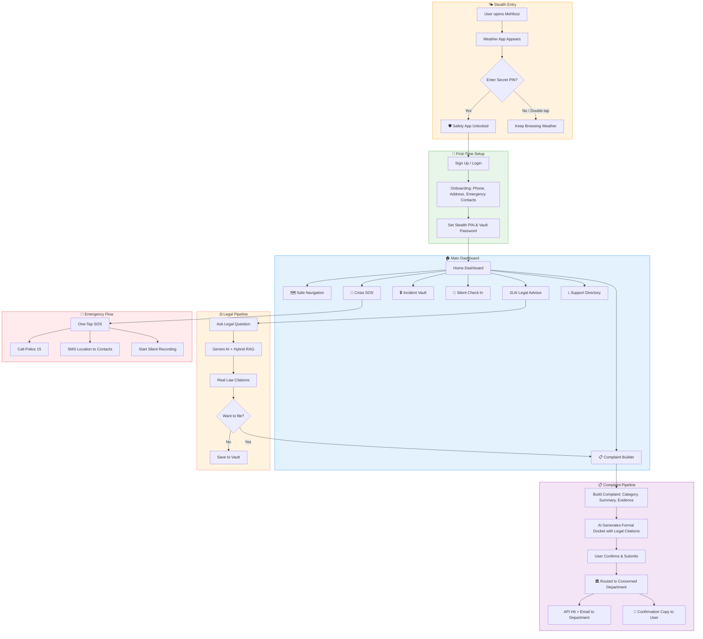
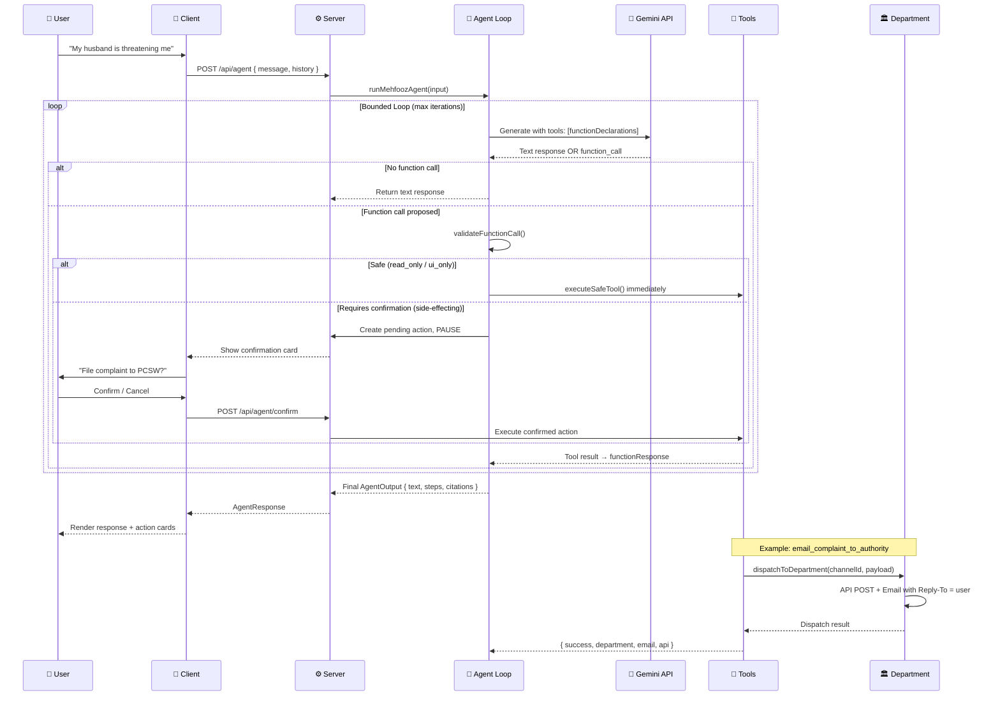
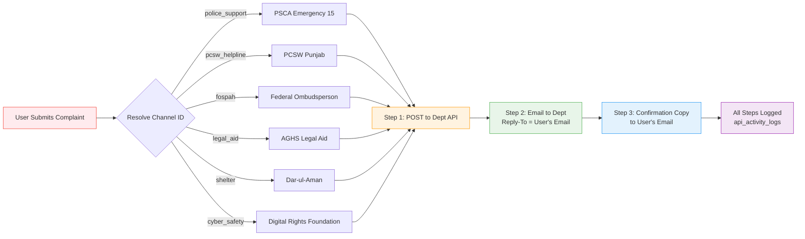

<div align="center">

<!-- ═══════════════════════════════════════════════════════════════════════ -->
<!-- ANIMATED HEADER                                                        -->
<!-- ═══════════════════════════════════════════════════════════════════════ -->


<br>

<!-- ── Status Badges ─────────────────────────────────────────────────── -->
<a href="https://mehfooz-legal-navigator.vercel.app">
  
</a>


<a href="https://github.com/MudassarAbrar/MehfoozAi/issues">
  
</a>


<br><br>

**مehfooz — محفوظ** | A privacy-first women's safety & legal assistant for Punjab, Pakistan

*Opens as a weather app. Protects like a guardian.*

<a href="https://mehfooz-legal-navigator.vercel.app"><strong>🚀 Try Live Demo</strong></a> •
<a href="#-what-mehfooz-does"><strong>📖 Learn More</strong></a> •
<a href="#-quick-start"><strong>⚡ Quick Start</strong></a> •
<a href="#-team"><strong>👥 Team</strong></a>

<br><br>

</div>

---

## 📑 Table of Contents

- [What Mehfooz Does](#-what-mehfooz-does)
- [The Problem We Solve](#-the-problem-we-solve)
- [User Flow](#-user-flow)
- [Six Safety Pillars](#-six-safety-pillars)
- [System Architecture](#-system-architecture)
- [Agentic AI System](#-agentic-ai-system)
- [Department Routing — How Complaints Reach Authorities](#-department-routing--how-complaints-reach-authorities)
- [API Reference](#-api-reference)
- [Tech Stack](#-tech-stack)
- [Project Structure](#-project-structure)
- [Quick Start](#-quick-start)
- [Environment Variables](#-environment-variables)
- [Deployment](#-deployment)
- [Team](#-team)
- [Contact & Socials](#-contact--socials)

---

## 🛡️ What Mehfooz Does

Mehfooz (مehfooz — "protected" in Urdu) is a **mobile web application** designed for women in Punjab, Pakistan. It provides a complete safety ecosystem disguised as a weather app — so anyone looking at your phone sees a beautiful weather interface, not a safety tool.

**Enter your secret PIN → the real app appears.**

| Feature | What It Does |
|---|---|
| 🌤️ **Stealth Weather Cover** | Opens as a weather app. No one knows it's your safety shield. |
| 🗺️ **Safe Corridor Navigation** | Finds the safest walking route — well-lit streets, CCTV zones, busy areas. |
| ⚖️ **AI Legal Advisor** | Ask legal questions in English or Urdu. Get real Punjab law citations. |
| 🔒 **Zero-Knowledge Vault** | Record evidence (voice, photos, timelines) encrypted on YOUR phone. |
| 📍 **Silent Check-In** | Set a journey timer. If you don't arrive, contacts get your live location. |
| 🚨 **One-Tap SOS** | Calls Police 15 + SMS your location to trusted contacts simultaneously. |
| 📋 **Complaint Builder** | Generates formal police complaints with legal citations, routed to the right department. |
| 📴 **100% Offline Mode** | Emergency numbers, legal rights, and SOS work with zero internet. |

---

## 💔 The Problem We Solve

> **52% of women in Pakistan experience some form of violence in their lifetime.** *(National Assembly of Pakistan, 2018)*

Women in Punjab face a dangerous gap between **threats** and **help**:

```
┌──────────────────────────────────────────────────────────────────────┐
│  THE GAP                                                              │
│                                                                       │
│  🚫 Street harassment      →  "Who do I call?"                       │
│  🚫 Domestic violence       →  "What are my legal rights?"            │
│  🚫 Cyber bullying          →  "How do I file a complaint?"           │
│  🚫 Walking home at night   →  "Is this route safe?"                  │
│  🚫 No internet / signal    →  "Emergency services are unreachable"   │
│  🚫 Abuser has your phone   →  "All my evidence is gone"              │
│                                                                       │
│  Mehfooz bridges this gap. One app. Six pillars. Zero compromise.    │
└──────────────────────────────────────────────────────────────────────┘
```

### Use Cases

| Scenario | How Mehfooz Helps |
|---|---|
| Walking home late at night | Safe Corridor Navigation finds well-lit, camera-covered routes |
| Receiving threatening messages | AI Legal Advisor explains PECA 2016 cyber harassment protections |
| Domestic violence at home | One-tap SOS to Police 15 + silent audio recording |
| Evidence at risk of deletion | Zero-Knowledge Vault encrypts photos & voice with your PIN |
| No mobile data / signal dropped | Offline mode — cached helplines, legal articles, SMS SOS still work |
| Need to file a police complaint | Complaint Builder generates formal docket, routes to the right department |
| Traveling alone — family worried | Silent Check-In auto-alerts contacts if you don't arrive on time |
| Abuser finds your phone | App looks like a weather widget — PIN unlocks the real features |

---

## 🔄 User Flow



---

## 🏛️ Six Safety Pillars

| # | Pillar | Module | Description |
|---|---|---|---|
| 1 | 🌤️ Stealth Cover | `WeatherCover.tsx` | Authentic weather interface — PIN unlocks the safety ecosystem |
| 2 | 🗺️ Safe Navigation | `SafeNavigation.tsx` | Leaflet/OSM maps with safety-scored pedestrian corridors |
| 3 | ⚖️ Legal Advisor | `LegalAssistant.tsx` | Voice-enabled AI chat grounded on 34 Punjab protection laws |
| 4 | 🔒 Incident Vault | `IncidentVault.tsx` | AES-GCM-256 encrypted evidence locker (voice, photos, timelines) |
| 5 | 📍 Silent Check-In | `SilentCheckIn.tsx` | Destination timer — auto-alerts contacts if you don't arrive |
| 6 | 🚨 Crisis SOS | `CrisisModal.tsx` | One-tap dispatch to Police 15, PCSW 1043, Rescue 1122 |

---

## 🏗️ System Architecture

```mermaid
graph TB
    subgraph CLIENT["📱 Client — React 19 SPA"]
        direction TB
        UI[React Components<br/>Tailwind CSS v4 + motion/react]
        VOICE[Web Speech API<br/>SpeechRecognition + SpeechSynthesis]
        CRYPTO[Web Crypto API<br/>AES-GCM-256 Vault]
        MAP[Leaflet + OpenStreetMap<br/>Safe Corridor Routing]
        PWA[PWA Service Worker<br/>Offline Cache + Icons]
        STATE[ChatStateProvider<br/>Cross-Tab Conversation Persistence]
    end

    subgraph SERVER["⚙️ Server — Express on Vercel Serverless"]
        direction TB
        API[Express API Routes<br/>/api/orchestrate, /api/complaint-handoff, ...]
        AGENT[Gemini AI Agent<br/>Function-Calling Loop<br/>Bounded Execution + Confirmation Gates]
        RAG[Hybrid Retriever<br/>60% Gemini Embeddings + 40% Keyword Scoring]
        DEPT[Department Router<br/>9 Departments → API + Email Dispatch]
        AUTH[Supabase Auth<br/>JWT + RLS User Context]
        EMAIL[Resend Email SDK<br/>XSS-Escaped Complaint Templates]
        SMS[Twilio SMS<br/>Emergency Dispatch]
        CHECKIN[Check-In Monitor<br/>Supabase pg_cron Edge Function]
        SECURITY[Helmet + Rate Limiting<br/>CSP + Input Sanitization]
    end

    subgraph EXTERNAL["🌐 External Services"]
        direction TB
        GEMINI[Google Gemini API<br/>gemini-2.5-flash + gemini-embedding-2]
        SUPABASE[(Supabase<br/>PostgreSQL + RLS + Edge Functions)]
        RESEND[Resend<br/>Transactional Email]
        TWILIO[Twilio<br/>SMS Gateway]
        OSM[OpenStreetMap / Nominatim<br/>Geocoding + Routing]
    end

    CLIENT -->|HTTPS| SERVER
    API --> GEMINI
    API --> SUPABASE
    API --> RESEND
    API --> TWILIO
    AGENT --> GEMINI
    RAG --> GEMINI
    DEPT --> EMAIL
    DEPT --> RESEND
    CHECKIN --> SUPABASE
    MAP --> OSM
    UI --> MAP
    UI --> VOICE
    UI --> CRYPTO

    style CLIENT fill:#E3F2FD,stroke:#1C2C34,color:#333
    style SERVER fill:#FFF3E0,stroke:#FC7454,color:#333
    style EXTERNAL fill:#E8F5E9,stroke:#4CAF50,color:#333
```



---

## 🤖 Agentic AI System

Mehfooz uses a **bounded function-calling agent loop** powered by Google Gemini. Unlike a simple chatbot, the agent can propose actions, validate them against safety policies, and execute through a confirmation gate.



### Agent Tool Categories

| Policy | Tools | Execution |
|---|---|---|
| `read_only` | `search_legal_corpus`, `get_helpline_info` | Auto-execute, no confirmation needed |
| `ui_only` | `open_vault`, `navigate_to_tab` | Auto-execute (client-side only) |
| `requires_confirmation` | `email_complaint_to_authority`, `send_sos_sms`, `trigger_check_in` | **PAUSE → User confirms → Execute** |

### Safety Invariants

- ✅ Side-effecting tools **NEVER** execute without user confirmation
- ✅ Timeout via `Promise.race` with `GEMINI_AGENT_TIMEOUT_MS`
- ✅ Model fallback chain: primary → fallbacks on failure
- ✅ Never duplicate side effects on retry
- ✅ Every tool call logged to `api_activity_logs`

---

## 🏛️ Department Routing — How Complaints Reach Authorities

When a user submits a complaint, Mehfooz doesn't just email one inbox. It **routes to the actually concerned department**:



### Registered Departments

| Channel | Department | Email | API | Phone |
|---|---|---|---|---|
| `police_support` | Punjab Safe Cities Authority (PSCA) | `complaint@psca.gop.pk` | `psca.gop.pk/api/complaints` | 15 |
| `pcsw_helpline` | Punjab Commission on Status of Women | `complaint@pcsw.punjab.gov.pk` | `pcsw.punjab.gov.pk/api/complaints` | 1043 |
| `fospah` | Federal Ombudsperson (Harassment) | `complaint@mohtasib.gov.pk` | `mohtasib.gov.pk/api/complaints` | +92 51 9202078 |
| `workplace_ombudsperson` | Ombudsperson Punjab | `complaint@ombudspersonpunjab.gov.pk` | `ombudspersonpunjab.gov.pk/api/complaints` | +92 42 99205027 |
| `legal_aid` | AGHS Legal Aid Cell | `aghslegalaid@gmail.com` | — | +92 42 35763234 |
| `shelter` | Dar-ul-Aman (Social Welfare) | `darulaman@socialwelfare.punjab.gov.pk` | — | 1043 |
| `social_welfare` | Punjab Social Welfare & Bait-ul-Maal | `info@baitulmal.punjab.gov.pk` | — | +92 42 99230091 |
| `counselling` | Rozan Emotional Health | `info@rozan.org` | — | 0800-22444 |
| `cyber_safety` | Digital Rights Foundation | `helpdesk@digitalrightsfoundation.pk` | — | 0800-39393 |

---

## 📡 API Reference

All API routes are served from the Express server at `/api/*`:

| Method | Endpoint | Description | Rate Limit |
|---|---|---|---|
| `GET` | `/api/health` | System health — Gemini, Supabase, embeddings, SMS, email status | — |
| `POST` | `/api/orchestrate` | Hybrid RAG legal query (embeddings + keyword scoring) | 30 req / 5 min |
| `POST` | `/api/agent` | AI agent conversation — function-calling loop with tool execution | 30 req / 5 min |
| `POST` | `/api/agent/confirm` | Confirm a pending agent action (side-effecting tools) | 20 req / 10 min |
| `POST` | `/api/agent/cancel` | Cancel a pending agent action | 20 req / 10 min |
| `POST` | `/api/complaint-handoff` | Submit complaint — department routing + email + user copy | 20 req / 10 min |
| `POST` | `/api/mock-handoff` | Simulated complaint dispatch (no auth required) | 20 req / 10 min |
| `POST` | `/api/sms` | Send emergency SMS via Twilio | 20 req / 10 min |
| `POST` | `/api/check-in/start` | Start a silent destination check-in timer | 30 req / 15 min |
| `POST` | `/api/check-in/complete` | Complete (check in at destination) | 30 req / 15 min |
| `GET` | `/api/check-in/status/:id` | Get check-in status by ID | 60 req / 15 min |
| `GET` | `/api/activity-logs` | Get API activity logs for the dashboard | 30 req / 15 min |

### Security Layers

```
Request → [Rate Limiter] → [Helmet Headers] → [Input Sanitizer] → [Supabase JWT Auth] → Handler
                                                                    ↓
                                                          [RLS User Context]
```

- **Helmet**: CSP (enforced in production), X-Content-Type-Options, Referrer-Policy, Permissions-Policy
- **Rate Limiting**: Per-route `express-rate-limit` (global + specific)
- **Input Sanitization**: Null-byte filtering, script injection detection
- **Auth**: Supabase JWT verification with Row-Level Security (RLS)
- **Query Hardening**: Simple `querystring` parser (no `qs` DoS surface)

---

## 🧰 Tech Stack

<div align="center">

### Frontend


### Backend


### AI & Data


### Services


</div>

---

## 📁 Project Structure

```
MehfoozAi/
├── 📱 src/                          # Client-side React SPA
│   ├── components/
│   │   ├── common/                  # Shared: Logo, Social Links, Offline Indicator, UI primitives
│   │   ├── landing/                 # Landing page art: AbstractArt, PhoneMockupShowcase
│   │   ├── ui/                      # Primitive components: Button, Card, Badge, StarRating
│   │   ├── weather/                 # Weather cover art: LandscapeIllustration, WeatherIcons
│   │   ├── LegalAssistant.tsx       # ⚖️ AI Legal Advisor (voice-enabled, stateful chat)
│   │   ├── ComplaintBuilder.tsx     # 📋 Multi-step complaint form with department routing
│   │   ├── IncidentVault.tsx        # 🔒 AES-GCM-256 encrypted evidence locker
│   │   ├── SafeNavigation.tsx       # 🗺️ Leaflet/OSM safe corridor maps
│   │   ├── SilentCheckIn.tsx        # 📍 Destination timer with auto-alert
│   │   ├── WeatherCover.tsx         # 🌤️ Stealth weather disguise + PIN unlock
│   │   ├── CrisisModal.tsx          # 🚨 Emergency SOS modal
│   │   ├── HomeDashboard.tsx        # 🏠 Main dashboard with quick actions
│   │   ├── TrackingDashboard.tsx    # 📊 Complaint status tracking
│   │   ├── SupportDirectory.tsx     # 📞 Punjab helplines & support orgs
│   │   └── ...                      # AuthModal, OnboardingModal, Navigation, etc.
│   ├── data/
│   │   ├── legalCorpus.ts           # 34 Punjab protection laws (bilingual)
│   │   ├── supportDirectory.ts      # Official helpline & org directory
│   │   └── lahoreLocations.ts       # Pre-indexed safe haven locations
│   ├── hooks/                       # useOnlineStatus, usePWAInstall
│   ├── utils/
│   │   ├── chatState.tsx            # 🧠 React Context for AI conversation persistence
│   │   ├── orchestrator.ts          # Intent classification + RAG routing
│   │   ├── hybridRetriever.ts       # 60% Gemini embeddings + 40% keyword scoring
│   │   ├── auth.ts                  # Dual-mode auth (Supabase / localStorage)
│   │   ├── crypto.ts                # AES-GCM-256 encryption helpers
│   │   ├── dataService.ts           # Encrypted persistence layer
│   │   ├── supabase.ts              # Supabase client initialization
│   │   └── offlineEmergencyCache.ts # Pre-cache for zero-network incidents
│   ├── App.tsx                      # Root component + tab router + ChatStateProvider
│   ├── types.ts                     # All TypeScript interfaces & enums
│   └── index.css                    # Tailwind v4 + custom design tokens
│
├── ⚙️ server/                       # Server-side modules
│   ├── agent/
│   │   ├── runner.ts                # 🤖 Bounded Gemini function-calling loop
│   │   ├── executor.ts              # Safe tool execution dispatcher
│   │   ├── confirmation.ts          # Pending action create/confirm/cancel + dept dispatch
│   │   ├── context.ts               # Agent context builder (user, corpus, history)
│   │   ├── declarations.ts          # Gemini function declarations for all tools
│   │   ├── policies.ts              # Tool validation + policy enforcement
│   │   ├── systemPrompt.ts          # Agent system instruction builder
│   │   ├── dangerCheck.ts           # Immediate danger detection (crisis escalation)
│   │   ├── config.ts                # Agent configuration + model chain
│   │   ├── schemas.ts               # Agent input/output TypeScript schemas
│   │   └── errors.ts                # Agent error normalization
│   ├── departmentRouting.ts         # 🏛️ 9 departments → API + email dispatch
│   ├── email.ts                     # Resend SDK — XSS-escaped complaint templates
│   ├── sms.ts                       # Twilio SMS dispatch
│   ├── checkIns.ts                  # Check-in timer routes + Supabase integration
│   ├── apiActivity.ts               # API activity logging (in-memory + console)
│   ├── supabaseServer.ts            # Supabase admin client + JWT auth middleware
│   └── ...
│
├── server.ts                        # Express app root — all middleware + routes
├── api/index.ts                     # Vercel Serverless Function entry point
├── vercel.json                      # Vercel deployment config (rewrites + caching)
├── vite.config.ts                   # Vite + React + Tailwind + PWA config
├── tsconfig.json                    # TypeScript configuration
├── package.json                     # Dependencies + build scripts
└── supabase/
    ├── migrations/                  # SQL migrations (RLS, tables, indexes, edge functions)
    ├── functions/                   # Supabase Edge Functions (check-in-monitor)
    └── tests/                       # RLS verification tests
```

### Why This Structure?

| Decision | Rationale |
|---|---|
| **`src/components/` flat with sub-packages** | Each feature module is self-contained. `common/` and `ui/` hold shared primitives — no cross-feature coupling. |
| **`server/agent/` as a separate package** | The AI agent is a complex bounded loop with 10 files. Isolating it keeps the main `server.ts` readable and the agent independently testable. |
| **`server/departmentRouting.ts` separate from email** | Department routing (API + email) is a distinct concern from email dispatch. Separating them allows adding new departments without touching email templates. |
| **`src/utils/chatState.tsx` as React Context** | AI conversations must persist across tab switches (component unmount/remount). Lifting state to App-level Context solves this without a global store. |
| **`src/data/legalCorpus.ts` as a static file** | 34 bilingual legal articles are small enough to ship client-side. Enables the offline-first fallback when the server is unreachable. |
| **`api/index.ts` thin wrapper** | Vercel serverless expects a default export. This 18-line file re-exports the Express app — zero duplication between local dev and serverless deploy. |
| **Dual build: Vite (client) + esbuild (server)** | Vite handles React/Tailwind/PWA for the SPA. esbuild bundles the server into a single CJS file for production. Each tool does what it's best at. |

---

## ⚡ Quick Start

### Prerequisites

- **Node.js** >= 18
- **npm** >= 9
- A `.env` file (see below)

### 1. Clone & Install

```bash
git clone https://github.com/MudassarAbrar/MehfoozAi.git
cd MehfoozAi
npm install
```

### 2. Configure Environment

```bash
cp .env.example .env
# Edit .env with your credentials (see Environment Variables below)
```

### 3. Start Development Server

```bash
npm run dev
```

This starts **both** the Vite dev server (HMR for the React SPA) **and** the Express API server on `http://localhost:3000`.

### 4. Build for Production

```bash
npm run build        # Vite builds SPA → dist/  +  esbuild bundles server → dist/server.cjs
npm start            # Runs the production server
```

### 5. Type Check

```bash
npm run lint         # tsc --noEmit (zero errors = clean)
```

---

## 🔐 Environment Variables

| Variable | Required | Description |
|---|---|---|
| `GEMINI_API_KEY` | **Yes** | Google Gemini API key for AI agent + embeddings |
| `SUPABASE_URL` | Recommended | Supabase project URL (falls back to localStorage) |
| `SUPABASE_ANON_KEY` | Recommended | Supabase anonymous key |
| `VITE_SUPABASE_URL` | Recommended | Client-side Supabase URL |
| `VITE_SUPABASE_ANON_KEY` | Recommended | Client-side Supabase anon key |
| `RESEND_API_KEY` | For email | Resend API key for complaint email dispatch |
| `EMAIL_FROM` | For email | Verified sender email (e.g., `noreply@yourdomain.com`) |
| `COMPLAINT_RECIPIENT_EMAIL` | Fallback | Fallback complaint recipient (used when department routing fails) |
| `TWILIO_ACCOUNT_SID` | For SMS | Twilio account SID |
| `TWILIO_AUTH_TOKEN` | For SMS | Twilio auth token |
| `TWILIO_FROM_NUMBER` | For SMS | Twilio phone number for outbound SMS |

> **Graceful Degradation**: Mehfooz works without any external service configured. Without `GEMINI_API_KEY`, the local keyword-based legal engine activates. Without Supabase, localStorage handles auth and data. Without Resend/Twilio, dispatches are simulated with honest logging.

---

## 🚀 Deployment

Mehfooz is deployed to **Vercel** as a serverless application:

```bash
# Install Vercel CLI
npm install -g vercel

# Deploy to production
vercel --prod --yes
```

The `vercel.json` configuration:
- Builds the SPA with `npx vite build` → `dist/`
- Routes `/api/*` to the Express serverless function (`api/index.ts`)
- Rewrites all other routes to `index.html` (SPA client-side routing)
- Immutable cache headers for `/assets/*`

**Live**: [https://mehfooz-legal-navigator.vercel.app](https://mehfooz-legal-navigator.vercel.app)

---

<div align="center">

## 👥 Team

<br>

<table>
<tr>
<td align="center" width="33%">
<br>
<br><br>
<b>Mudassar Abrar</b><br>
<i>Lead Developer & Architect</i><br><br>
<a href="https://github.com/MudassarAbrar"></a>
<a href="https://www.linkedin.com/in/muhammad-mudassir-abrar-baig-65aa38338"></a>
<a href="https://x.com/MehfoozAii"></a>
</td>
<td align="center" width="33%">
<br>
<br><br>
<b>Rida Amir</b><br>
<i>Help Desk Support & Research</i><br><br>
<a href="mailto:ridaamircs@gmail.com"></a>
<a href="https://www.linkedin.com/company/mehfoozai"></a>
</td>
<td align="center" width="33%">
<br>
<br><br>
<b>Zainab Irfan</b><br>
<i>Help Desk Support & Research</i><br><br>
<a href="mailto:zainab.irfan2428@gmail.com"></a>
<a href="https://www.linkedin.com/company/mehfoozai"></a>
</td>
</tr>
</table>

</div>

---

## 📬 Contact & Socials

<div align="center">

<a href="https://x.com/MehfoozAii">
  
</a>
<a href="https://www.linkedin.com/company/mehfoozai">
  
</a>
<a href="https://instagram.com/mehfoozai">
  
</a>
<a href="mailto:mudassarabrarr@gmail.com">
  
</a>
<a href="https://mehfooz-legal-navigator.vercel.app">
  
</a>

</div>

---

<div align="center">

## ⚖️ Legal Corpus Coverage

Mehfooz's AI Legal Advisor is grounded on **34 real Punjab & Pakistan laws**:

| Category | Laws Covered |
|---|---|
| 🏠 Domestic Violence | PPWVA 2016, Protection against Harassment Act |
| 💻 Cyber Crime | PECA 2016, Digital Rights Foundation guidelines |
| 👩 Workplace | PCSW protections, Workplace Harassment Ombudsperson |
| 👶 Child Protection | Child Marriage Restraint Act, Child Protection Act |
| 🏡 Property & Family | Muslim Family Laws Ordinance, Family Courts Act |
| 🚨 Emergency | PPC sections on kidnapping, assault, criminal intimidation |
| 💪 Workers Rights | Domestic Workers Act, Home-Based Workers Act |
| 🧠 Mental Health | Mental Health Act, Disability Rights protections |

> **Zero hallucination policy**: Every legal citation includes the actual act name, section number, and jurisdiction. The hybrid retriever (60% semantic embeddings + 40% keyword scoring) ensures accuracy.

</div>

---

<div align="center">

<br>

**Built with ❤️ for the women of Punjab**

*Mehfooz — محفوظ — "Protected"*

<a href="https://mehfooz-legal-navigator.vercel.app">
  
</a>

<br>


</div>
