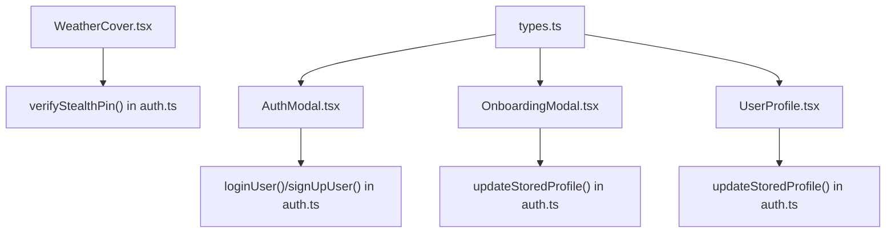
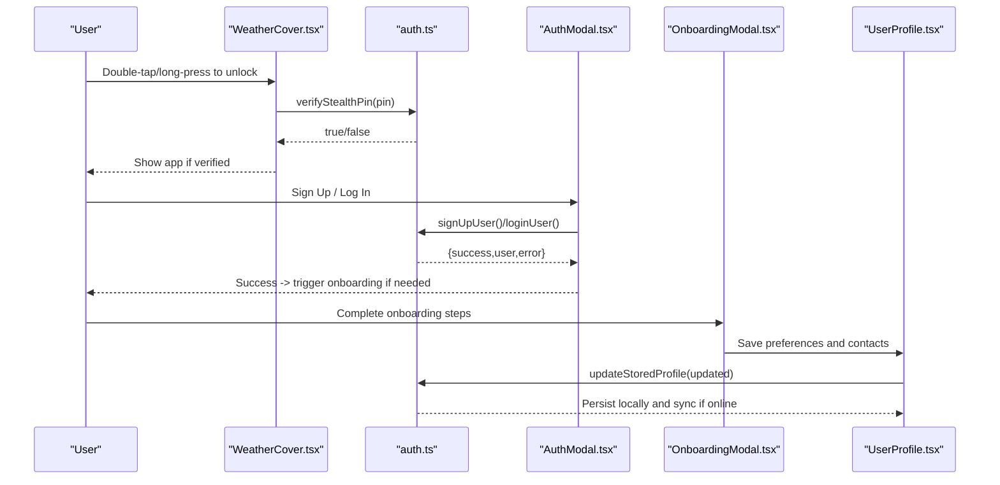
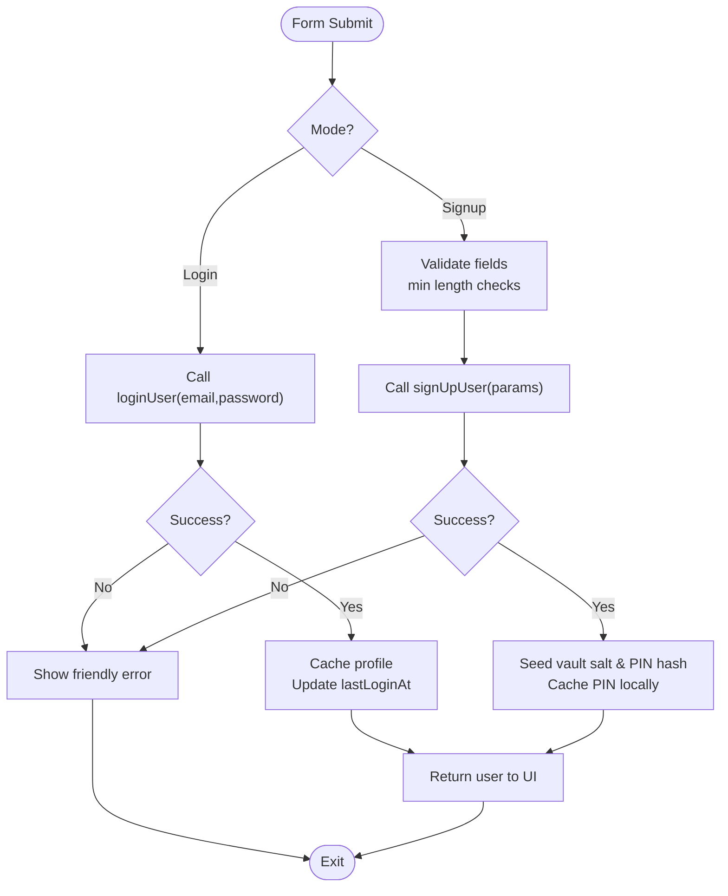
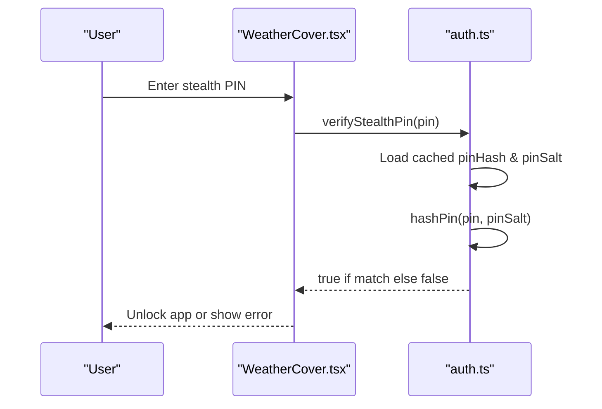
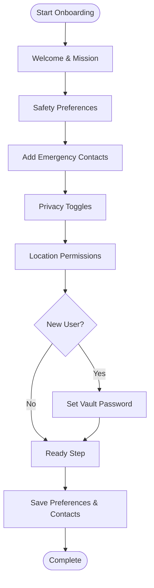
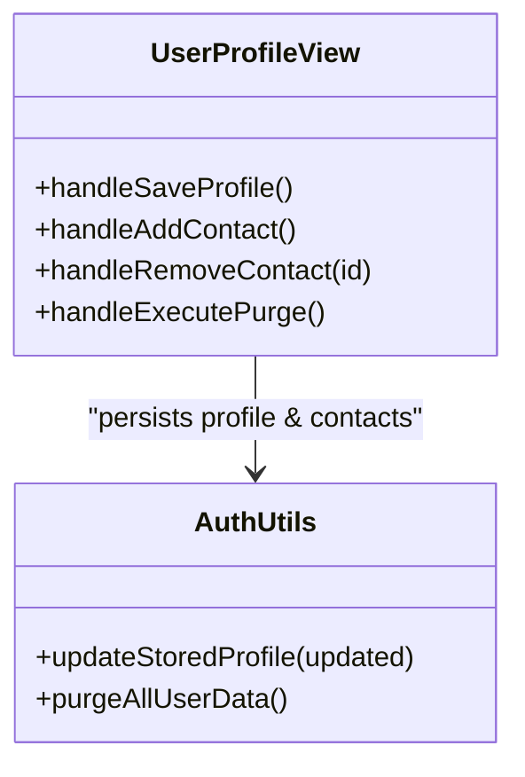
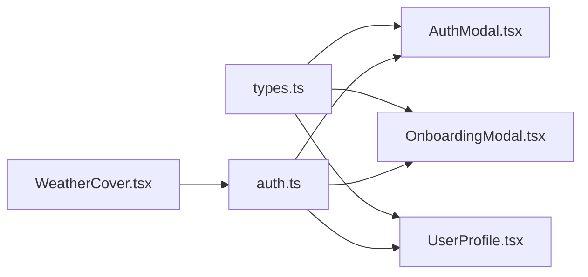

# Auth, Onboarding & User Profile

<cite>
**Referenced Files in This Document**
- [AuthModal.tsx](file://src/components/AuthModal.tsx)
- [OnboardingModal.tsx](file://src/components/OnboardingModal.tsx)
- [UserProfile.tsx](file://src/components/UserProfile.tsx)
- [auth.ts](file://src/utils/auth.ts)
- [types.ts](file://src/types.ts)
- [WeatherCover.tsx](file://src/components/WeatherCover.tsx)
</cite>

## Table of Contents
1. Introduction
2. Project Structure
3. Core Components
4. Architecture Overview
5. Detailed Component Analysis
6. Dependency Analysis
7. Performance Considerations
8. Troubleshooting Guide
9. Conclusion

## Introduction
This document explains the authentication flow, PIN-based access control, first-time onboarding, and user profile management for the application. It focuses on how users sign up or log in, how a stealth PIN unlocks the app from a weather cover screen, how new users complete an onboarding wizard, and how profiles and emergency contacts are managed securely. The system supports both a Supabase-backed mode (online) and a legacy offline mode using local storage, while preserving zero-knowledge principles: credentials and incident data remain encrypted on-device and never leave the browser unencrypted.

## Project Structure
The authentication and onboarding features are implemented across four primary files:
- Authentication UI and flows: AuthModal.tsx
- First-time onboarding wizard: OnboardingModal.tsx
- User profile editing and settings: UserProfile.tsx
- Authentication utilities and persistence: auth.ts
- Shared types used by all components: types.ts
- Weather cover that gates access via PIN: WeatherCover.tsx

**Diagram sources**
- [WeatherCover.tsx:40-45](file://src/components/WeatherCover.tsx#L40-L45)
- [auth.ts:394-425](file://src/utils/auth.ts#L394-L425)
- [auth.ts:545-597](file://src/utils/auth.ts#L545-L597)
- [auth.ts:599-725](file://src/utils/auth.ts#L599-L725)
- [auth.ts:762-777](file://src/utils/auth.ts#L762-L777)
- [types.ts:405-435](file://src/types.ts#L405-L435)

**Section sources**
- [AuthModal.tsx:1-440](file://src/components/AuthModal.tsx#L1-L440)
- [OnboardingModal.tsx:1-670](file://src/components/OnboardingModal.tsx#L1-L670)
- [UserProfile.tsx:1-469](file://src/components/UserProfile.tsx#L1-L469)
- [auth.ts:1-880](file://src/utils/auth.ts#L1-L880)
- [types.ts:405-435](file://src/types.ts#L405-L435)
- [WeatherCover.tsx:40-45](file://src/components/WeatherCover.tsx#L40-L45)

## Core Components
- AuthModal: Provides login/signup forms, demo mode entry, forgot password reset, and bilingual support. It calls auth utilities to authenticate or register users and surfaces friendly error messages.
- OnboardingModal: A step-by-step wizard for new users to set safety preferences, emergency contacts, privacy toggles, location permissions, and two passwords (app stealth PIN and vault password). For returning users, it shortens to essential steps.
- UserProfile: Allows editing personal details, district, phone, stealth PIN, discreet notifications, and managing emergency contacts. Saves changes locally and synchronizes to the backend when available. Includes an emergency purge action.
- auth.ts: Central authentication layer with dual-mode operation (Supabase vs legacy localStorage). Implements secure hashing, session handling, profile caching, PIN verification/reset, and profile synchronization.

**Section sources**
- [AuthModal.tsx:26-162](file://src/components/AuthModal.tsx#L26-L162)
- [OnboardingModal.tsx:44-214](file://src/components/OnboardingModal.tsx#L44-L214)
- [UserProfile.tsx:63-155](file://src/components/UserProfile.tsx#L63-L155)
- [auth.ts:77-79](file://src/utils/auth.ts#L77-L79)
- [auth.ts:394-425](file://src/utils/auth.ts#L394-L425)
- [auth.ts:545-725](file://src/utils/auth.ts#L545-L725)
- [auth.ts:762-792](file://src/utils/auth.ts#L762-L792)

## Architecture Overview
The system uses a layered approach:
- UI Layer: Modal components handle user interactions and present localized feedback.
- Utilities Layer: auth.ts encapsulates all authentication logic, including credential hashing, session management, profile caching, and PIN verification/reset.
- Storage Layer: LocalStorage is used for sessions, profile cache, and PIN hashes; Supabase is used when configured for persistent accounts and profile sync.
- Cover Layer: WeatherCover.tsx acts as a stealth gate requiring a valid stealth PIN to unlock the app.

**Diagram sources**
- [WeatherCover.tsx:40-45](file://src/components/WeatherCover.tsx#L40-L45)
- [auth.ts:394-425](file://src/utils/auth.ts#L394-L425)
- [auth.ts:545-597](file://src/utils/auth.ts#L545-L597)
- [auth.ts:599-725](file://src/utils/auth.ts#L599-L725)
- [auth.ts:762-777](file://src/utils/auth.ts#L762-L777)
- [AuthModal.tsx:118-162](file://src/components/AuthModal.tsx#L118-L162)
- [OnboardingModal.tsx:155-214](file://src/components/OnboardingModal.tsx#L155-L214)
- [UserProfile.tsx:120-149](file://src/components/UserProfile.tsx#L120-L149)

## Detailed Component Analysis

### Authentication Flow (AuthModal + auth.ts)
- Login: Validates email/password via Supabase or legacy store, updates lastLoginAt, caches profile, and returns user data to the UI.
- Signup: Creates account, enriches profile row, seeds vault salt and PIN hash, caches PIN locally, and returns user data.
- Forgot Password: Sends reset email via Supabase or returns a clear offline message.
- Error Handling: Maps backend errors to friendly messages and handles rate limits and confirmation states.

**Diagram sources**
- [AuthModal.tsx:118-162](file://src/components/AuthModal.tsx#L118-L162)
- [auth.ts:545-597](file://src/utils/auth.ts#L545-L597)
- [auth.ts:599-725](file://src/utils/auth.ts#L599-L725)

**Section sources**
- [AuthModal.tsx:118-162](file://src/components/AuthModal.tsx#L118-L162)
- [auth.ts:545-725](file://src/utils/auth.ts#L545-L725)

### PIN-Based Access Control (WeatherCover + auth.ts)
- The weather cover screen hides the real app until a correct stealth PIN is entered.
- PIN verification compares the entered PIN against a cached salted hash stored locally. If no PIN exists (guest mode), verification fails.
- Resetting the PIN requires matching the registered email and generates a new salt/hash pair.

**Diagram sources**
- [WeatherCover.tsx:40-45](file://src/components/WeatherCover.tsx#L40-L45)
- [auth.ts:394-425](file://src/utils/auth.ts#L394-L425)

**Section sources**
- [WeatherCover.tsx:40-45](file://src/components/WeatherCover.tsx#L40-L45)
- [auth.ts:394-425](file://src/utils/auth.ts#L394-L425)

### First-Time Onboarding (OnboardingModal)
- New-user flow includes eight steps: welcome, safety preferences, emergency contacts, privacy controls, location permissions, app password (stealth PIN), vault password, and completion.
- Returning users skip password setup and complete six steps.
- Validation ensures at least one emergency contact and matching password entries. Preferences and contacts are saved via updateStoredProfile.

**Diagram sources**
- [OnboardingModal.tsx:108-214](file://src/components/OnboardingModal.tsx#L108-L214)

**Section sources**
- [OnboardingModal.tsx:108-214](file://src/components/OnboardingModal.tsx#L108-L214)

### User Profile Management (UserProfile + auth.ts)
- Editable fields include full name, safe nickname, district, phone, stealth PIN, discreet notifications, and theme/language.
- Emergency contacts can be added or removed; saving persists locally and syncs to Supabase when available.
- Emergency purge clears all local data and logs out the user.

**Diagram sources**
- [UserProfile.tsx:120-155](file://src/components/UserProfile.tsx#L120-L155)
- [auth.ts:762-777](file://src/utils/auth.ts#L762-L777)

**Section sources**
- [UserProfile.tsx:120-155](file://src/components/UserProfile.tsx#L120-L155)
- [auth.ts:762-777](file://src/utils/auth.ts#L762-L777)

## Dependency Analysis
- Components depend on shared types for consistent data structures (e.g., UserProfile, PunjabDistrict, AppLanguage).
- AuthModal and UserProfile call into auth.ts for stateful operations (login, signup, profile updates, PIN verification/reset).
- OnboardingModal coordinates user preferences and contacts, then delegates persistence to auth.ts.
- WeatherCover depends on auth.ts for PIN verification to enforce stealth access.

**Diagram sources**
- [types.ts:405-435](file://src/types.ts#L405-L435)
- [AuthModal.tsx:23-24](file://src/components/AuthModal.tsx#L23-L24)
- [OnboardingModal.tsx:34-34](file://src/components/OnboardingModal.tsx#L34-L34)
- [UserProfile.tsx:31-32](file://src/components/UserProfile.tsx#L31-L32)
- [WeatherCover.tsx:40-45](file://src/components/WeatherCover.tsx#L40-L45)

**Section sources**
- [types.ts:405-435](file://src/types.ts#L405-L435)
- [AuthModal.tsx:23-24](file://src/components/AuthModal.tsx#L23-L24)
- [OnboardingModal.tsx:34-34](file://src/components/OnboardingModal.tsx#L34-L34)
- [UserProfile.tsx:31-32](file://src/components/UserProfile.tsx#L31-L32)
- [WeatherCover.tsx:40-45](file://src/components/WeatherCover.tsx#L40-L45)

## Performance Considerations
- Profile caching: auth.ts caches profiles locally to avoid repeated network requests and provide immediate UI responsiveness.
- Background sync: updateStoredProfile writes locally first and syncs to Supabase asynchronously, minimizing blocking operations.
- PIN verification: Uses pre-cached salted hashes to avoid server round-trips during unlock attempts.
- Rate limiting: Friendly error mapping prevents excessive retries and guides users to wait during rate-limited scenarios.

[No sources needed since this section provides general guidance]

## Troubleshooting Guide
- Invalid credentials: Friendly messages guide users to confirm emails or retry after delays.
- Email confirmation required: Signup may require email verification before login; the app informs users accordingly.
- Offline limitations: Password reset emails require Supabase configuration; otherwise, a clear offline message is shown.
- PIN mismatch: Verify that the entered PIN matches the stored salted hash; resetting requires matching the registered email.
- Emergency purge: Use the profile’s purge action to wipe local data and log out when necessary.

**Section sources**
- [auth.ts:313-321](file://src/utils/auth.ts#L313-L321)
- [auth.ts:779-792](file://src/utils/auth.ts#L779-L792)
- [auth.ts:394-425](file://src/utils/auth.ts#L394-L425)
- [UserProfile.tsx:151-155](file://src/components/UserProfile.tsx#L151-L155)

## Conclusion
The authentication, onboarding, and profile management layers work together to provide a secure, privacy-preserving experience. Users can sign up or log in, complete a guided onboarding to set preferences and contacts, manage their profile and stealth PIN, and unlock the app through a weather cover using a device-specific PIN. The system balances usability with strong security by storing only hashed secrets locally and syncing non-sensitive profile data when possible.

[No sources needed since this section summarizes without analyzing specific files]