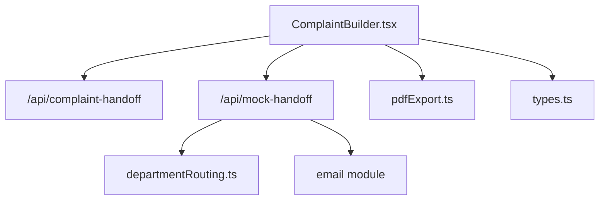
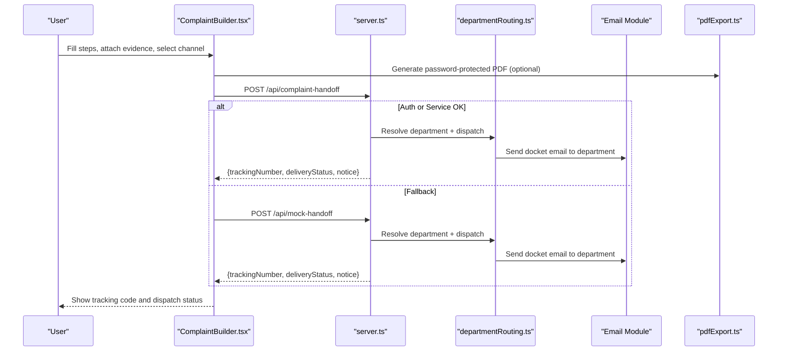
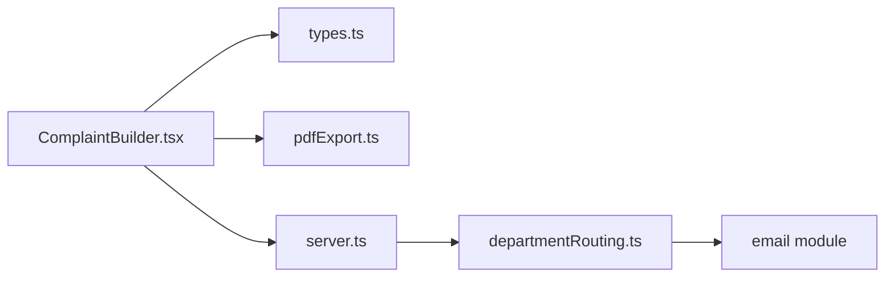

# Complaint Builder & Official Handoff

<cite>
**Referenced Files in This Document**
- [ComplaintBuilder.tsx](file://MehfoozAi/src/components/ComplaintBuilder.tsx)
- [server.ts](file://MehfoozAi/server.ts)
- [departmentRouting.ts](file://MehfoozAi/server/departmentRouting.ts)
- [pdfExport.ts](file://MehfoozAi/src/utils/pdfExport.ts)
- [types.ts](file://MehfoozAi/src/types.ts)
</cite>

## Table of Contents
1. [Introduction](#introduction)
2. [Project Structure](#project-structure)
3. [Core Components](#core-components)
4. [Architecture Overview](#architecture-overview)
5. [Detailed Component Analysis](#detailed-component-analysis)
6. [Dependency Analysis](#dependency-analysis)
7. [Performance Considerations](#performance-considerations)
8. [Troubleshooting Guide](#troubleshooting-guide)
9. [Conclusion](#conclusion)

## Introduction
This document explains the formal complaint letter generation and official handoff flow powered by the ComplaintBuilder component and the server-side /api/mock-handoff endpoint. It covers:
- Step-by-step intake, AI-assisted channel recommendation, structured summary generation, and consent gating
- PSCA tracking number assignment with district code routing
- Export formats (password-protected PDF dossier)
- Fallback behavior when live endpoints are unavailable

The system is designed for Punjab, Pakistan, grounded in relevant statutes and channels such as PSCA Emergency 15, Virtual Women Police Station, Provincial Ombudsperson, FIA Cyber Crime Wing, DWPC, and others.

## Project Structure
The complaint flow spans a React frontend component and Express server routes:
- Frontend: ComplaintBuilder orchestrates user input, evidence handling, draft synthesis, and handoff submission
- Server: /api/mock-handoff generates tracking numbers, resolves department contacts, dispatches emails, and returns status
- Utilities: pdfExport produces printer-friendly, password-protected legal dossiers
- Types: Shared interfaces define districts, categories, support channels, and draft structures

**Diagram sources**
- [ComplaintBuilder.tsx:582-717](file://MehfoozAi/src/components/ComplaintBuilder.tsx#L582-L717)
- [server.ts:787-881](file://MehfoozAi/server.ts#L787-L881)
- [departmentRouting.ts:170-295](file://MehfoozAi/server/departmentRouting.ts#L170-L295)
- [pdfExport.ts:136-403](file://MehfoozAi/src/utils/pdfExport.ts#L136-L403)
- [types.ts:131-220](file://MehfoozAi/src/types.ts#L131-L220)

**Section sources**
- [ComplaintBuilder.tsx:355-417](file://MehfoozAi/src/components/ComplaintBuilder.tsx#L355-L417)
- [server.ts:787-881](file://MehfoozAi/server.ts#L787-L881)
- [departmentRouting.ts:57-150](file://MehfoozAi/server/departmentRouting.ts#L57-L150)
- [pdfExport.ts:136-403](file://MehfoozAi/src/utils/pdfExport.ts#L136-L403)
- [types.ts:131-220](file://MehfoozAi/src/types.ts#L131-L220)

## Core Components
- ComplaintBuilder.tsx: Multi-step form that collects incident facts, supports AI channel recommendation, builds a structured petition text, attaches evidence, enforces explicit consent, and triggers handoff to official channels or mock fallback.
- /api/mock-handoff: Validates payload, assigns a PSCA-style tracking number using district code, resolves department contact, dispatches email(s), and returns delivery details.
- departmentRouting.ts: Maps support channel IDs to real department contacts and optional API endpoints; centralizes dispatch logic and logging.
- pdfExport.ts: Generates a formal, printer-ready, password-protected PDF dossier including statutory references, narrative, evidence inventory, and verification block.
- types.ts: Defines shared data models for districts, categories, support channels, and complaint drafts.

**Section sources**
- [ComplaintBuilder.tsx:355-717](file://MehfoozAi/src/components/ComplaintBuilder.tsx#L355-L717)
- [server.ts:787-881](file://MehfoozAi/server.ts#L787-L881)
- [departmentRouting.ts:57-295](file://MehfoozAi/server/departmentRouting.ts#L57-L295)
- [pdfExport.ts:136-403](file://MehfoozAi/src/utils/pdfExport.ts#L136-L403)
- [types.ts:131-220](file://MehfoozAi/src/types.ts#L131-L220)

## Architecture Overview
The end-to-end flow:
1. User completes steps in ComplaintBuilder (category, district, facts, preferred channel, evidence).
2. On consent, the client attempts /api/complaint-handoff; on auth failure or service unavailability, it falls back to /api/mock-handoff.
3. The server validates inputs, generates a unique tracking number based on district code, resolves the target department, dispatches via API/email, and sends a confirmation copy to the user.
4. Client persists the draft locally and displays the tracking reference and delivery notices.
5. Users can export a password-protected PDF at any time for offline submission.

**Diagram sources**
- [ComplaintBuilder.tsx:582-717](file://MehfoozAi/src/components/ComplaintBuilder.tsx#L582-L717)
- [server.ts:787-881](file://MehfoozAi/server.ts#L787-L881)
- [departmentRouting.ts:170-295](file://MehfoozAi/server/departmentRouting.ts#L170-L295)
- [pdfExport.ts:136-403](file://MehfoozAi/src/utils/pdfExport.ts#L136-L403)

## Detailed Component Analysis

### ComplaintBuilder.tsx: Intake, Synthesis, Consent, and Handoff
- Steps: Safety check, category selection, incident details, AI synthesis/review, consent and official channel handoff.
- Evidence: Supports drag-and-drop image upload with client-side compression and vault import; user approval toggles inclusion in the formal package.
- Channel Recommendation: Optional AI call to /api/recommend-channel; deterministic local fallback if network unavailable.
- Structured Summary: Auto-generated fact-based petition text with jurisdiction, chronology, and relief requested; fully editable before submission.
- Handoff: Attempts /api/complaint-handoff first; falls back to /api/mock-handoff on 401/503; constructs draft with PSCA-style reference and persists locally.

Key behaviors:
- District code routing: Uses selected district to build tracking codes like PSCA-{3-letter-district}-YYYY-{random}.
- Explicit consent required before handoff.
- Audit logs emitted for key actions (consent, photos attached, handoff executed).

**Section sources**
- [ComplaintBuilder.tsx:355-717](file://MehfoozAi/src/components/ComplaintBuilder.tsx#L355-L717)
- [ComplaintBuilder.tsx:801-1600](file://MehfoozAi/src/components/ComplaintBuilder.tsx#L801-L1600)

### /api/mock-handoff: Tracking Assignment, Routing, and Dispatch
Responsibilities:
- Input validation for complaintData and userEmail.
- District code extraction and tracking number generation: PSCA-{districtCode}-{year}-{random}.
- Department resolution via getDepartmentContact from departmentRouting.ts.
- Dispatch to department (API if configured) and email send; always attempt user confirmation copy.
- Return comprehensive response including tracking number, department info, delivery statuses, and notices.

Rate limiting:
- Enforced via handoff limiter (20 requests per 10 minutes per IP).

**Section sources**
- [server.ts:787-881](file://MehfoozAi/server.ts#L787-L881)
- [departmentRouting.ts:170-295](file://MehfoozAi/server/departmentRouting.ts#L170-L295)

### Department Routing: Mapping Channels to Authorities
- Central table maps each support channel ID to name, email, optional API endpoint, phone, website, and verification flag.
- getDepartmentContact resolves the correct authority; defaults to PSCA Emergency 15 if unknown.
- dispatchToDepartment performs:
  - Optional API call to department endpoint with timeout and logging
  - Email dispatch to department inbox (Reply-To set to user’s email)
  - Aggregates results and logs activity for dashboard visibility

**Section sources**
- [departmentRouting.ts:57-150](file://MehfoozAi/server/departmentRouting.ts#L57-L150)
- [departmentRouting.ts:170-295](file://MehfoozAi/server/departmentRouting.ts#L170-L295)

### PDF Export: Formal Legal Dossier
- Generates A4, printer-friendly pages with borders, headers, footers, and page numbers.
- Includes:
  - Authority heading based on selected channel
  - Case particulars (reference code, date, jurisdiction, legal subject)
  - Statutory framework citations
  - Statement of facts/narrative
  - Evidence inventory and vault record summaries
  - Prayer for relief and verification signature block
- Password protection: Optional encryption with user/owner passwords and restricted permissions.
- Output: Blob, base64, data URI, file name, page count; download only on explicit user action.

**Section sources**
- [pdfExport.ts:136-403](file://MehfoozAi/src/utils/pdfExport.ts#L136-L403)

### Data Models and Types
- IncidentCategory: Enumerates supported complaint types (domestic violence, workplace harassment, cyber blackmail, etc.).
- PunjabDistrict: List of districts used for routing and tracking codes.
- SupportChannelType: Identifies authorities/services (police_support, workplace_ombudsperson, fia_cybercrime, protection_committee, pcsw_helpline, legal_aid, shelter, social_welfare, counselling, other).
- ComplaintDraft: Captures all fields needed for drafting, routing, and persistence, including AI recommendations, attachments, consent flags, and tracking metadata.

**Section sources**
- [types.ts:84-220](file://MehfoozAi/src/types.ts#L84-L220)

## Dependency Analysis
- ComplaintBuilder depends on:
  - types.ts for domain models
  - pdfExport.ts for generating protected PDFs
  - server endpoints for AI recommendation and handoff
- server.ts depends on:
  - departmentRouting.ts for mapping channels to authorities
  - email module for sending docket and user copies
  - rate limiters and security middleware
- departmentRouting.ts depends on:
  - email module for dispatch
  - logging utilities for auditability

**Diagram sources**
- [ComplaintBuilder.tsx:355-717](file://MehfoozAi/src/components/ComplaintBuilder.tsx#L355-L717)
- [server.ts:787-881](file://MehfoozAi/server.ts#L787-L881)
- [departmentRouting.ts:170-295](file://MehfoozAi/server/departmentRouting.ts#L170-L295)
- [pdfExport.ts:136-403](file://MehfoozAi/src/utils/pdfExport.ts#L136-L403)
- [types.ts:131-220](file://MehfoozAi/src/types.ts#L131-L220)

**Section sources**
- [ComplaintBuilder.tsx:355-717](file://MehfoozAi/src/components/ComplaintBuilder.tsx#L355-L717)
- [server.ts:787-881](file://MehfoozAi/server.ts#L787-L881)
- [departmentRouting.ts:170-295](file://MehfoozAi/server/departmentRouting.ts#L170-L295)
- [pdfExport.ts:136-403](file://MehfoozAi/src/utils/pdfExport.ts#L136-L403)
- [types.ts:131-220](file://MehfoozAi/src/types.ts#L131-L220)

## Performance Considerations
- Image compression: Client-side canvas compression reduces payload size before inclusion in drafts/PDFs.
- Rate limiting: Global and handoff-specific limits protect backend stability and prevent abuse.
- Fallback paths: Deterministic local recommendation and mock handoff ensure continuity when services are down.
- PDF generation: On-demand generation avoids unnecessary processing; downloads are strictly user-initiated.

[No sources needed since this section provides general guidance]

## Troubleshooting Guide
Common issues and resolutions:
- Missing complaintData or userEmail: Ensure payload includes required fields; server returns specific error codes for invalid inputs.
- Authentication failures: If /api/complaint-handoff returns 401/503, the client automatically retries via /api/mock-handoff.
- Email not sent: Check whether email configuration is active; server responses include simulated vs dispatched notices.
- PDF not downloading: Downloads require explicit user action; use the provided button to generate and save the PDF.
- District code incorrect: Verify district selection; tracking codes derive from the first three letters of the district.

**Section sources**
- [server.ts:787-881](file://MehfoozAi/server.ts#L787-L881)
- [ComplaintBuilder.tsx:582-717](file://MehfoozAi/src/components/ComplaintBuilder.tsx#L582-L717)
- [pdfExport.ts:136-403](file://MehfoozAi/src/utils/pdfExport.ts#L136-L403)

## Conclusion
The ComplaintBuilder and /api/mock-handoff together provide a robust, privacy-preserving pathway to generate formal complaints, assign PSCA-style tracking numbers with district code routing, and export password-protected PDF dossiers. The system integrates AI-assisted channel recommendation, deterministic fallbacks, and secure email dispatch while maintaining clear user consent and transparent delivery status.

[No sources needed since this section summarizes without analyzing specific files]