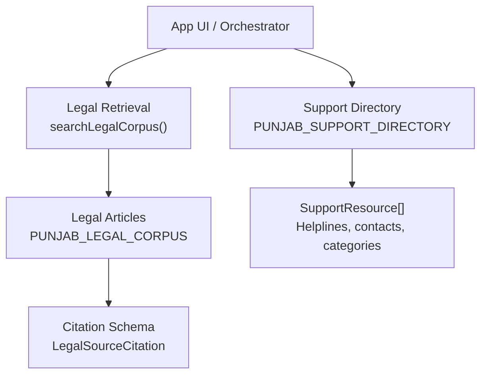
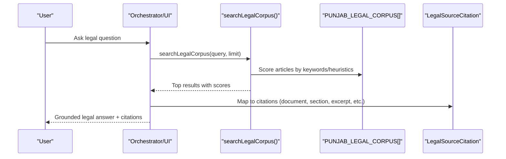
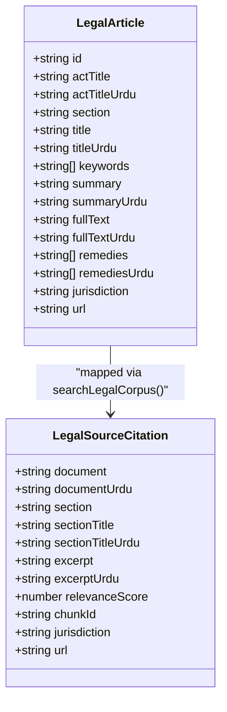
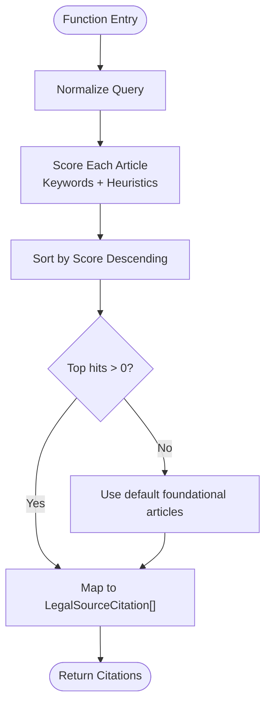
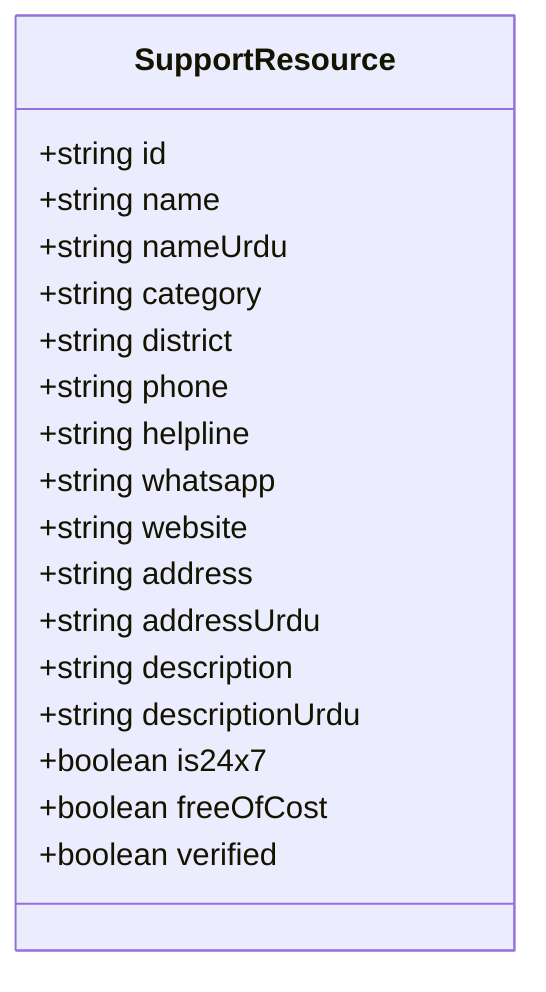
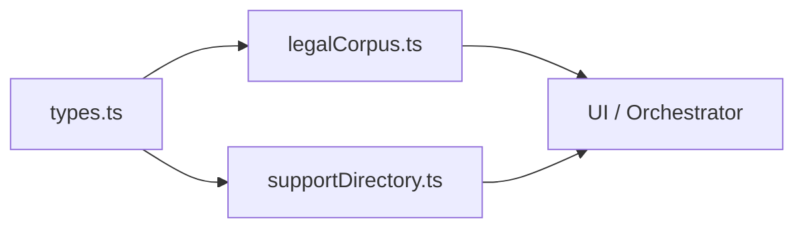

# Data Layer & Legal Corpus

<cite>
**Referenced Files in This Document**
- [legalCorpus.ts](file://src/data/legalCorpus.ts)
- [supportDirectory.ts](file://src/data/supportDirectory.ts)
- [types.ts](file://src/types.ts)
</cite>

## Table of Contents
1. [Introduction](#introduction)
2. [Project Structure](#project-structure)
3. [Core Components](#core-components)
4. [Architecture Overview](#architecture-overview)
5. [Detailed Component Analysis](#detailed-component-analysis)
6. [Dependency Analysis](#dependency-analysis)
7. [Performance Considerations](#performance-considerations)
8. [Troubleshooting Guide](#troubleshooting-guide)
9. [Conclusion](#conclusion)

## Introduction
This document explains the data layer for the legal knowledge base and support directory used by the application’s Punjab AI Legal Advisor and safety features. It covers:
- The statutory knowledge base structure and citation schema
- Support directory entry schema and helpline contact data model
- How these datasets integrate with the app’s legal retrieval and user-facing flows

The goal is to make the data contracts, content scope, and usage patterns clear for both developers and non-technical readers.

## Project Structure
At a high level, the data layer consists of two primary modules:
- A bilingual legal corpus of Punjab-specific statutes and guidance
- A curated directory of verified support resources (police, legal aid, shelters, counselling, cyber safety)

**Diagram sources**
- [legalCorpus.ts:26-825](file://src/data/legalCorpus.ts#L26-L825)
- [supportDirectory.ts:8-172](file://src/data/supportDirectory.ts#L8-L172)
- [types.ts:29-41](file://src/types.ts#L29-L41)
- [types.ts:443-460](file://src/types.ts#L443-L460)

**Section sources**
- [legalCorpus.ts:26-825](file://src/data/legalCorpus.ts#L26-L825)
- [supportDirectory.ts:8-172](file://src/data/supportDirectory.ts#L8-L172)
- [types.ts:29-41](file://src/types.ts#L29-L41)
- [types.ts:443-460](file://src/types.ts#L443-L460)

## Core Components
- Legal Corpus: A structured array of legal articles covering Punjab-specific laws and related guidance, each article containing bilingual titles, summaries, full text, remedies, jurisdiction, and optional URLs.
- Support Directory: A curated list of verified support resources across categories such as emergency, police, legal aid, shelter, workplace ombudsperson, cyber safety, and counselling. Each entry includes bilingual names, descriptions, helpline/phone/WhatsApp, website, address, and operational flags.
- Citation Schema: A standardized output shape for legal references returned by the retrieval function, including document title, section, excerpt, relevance score, chunk ID, jurisdiction, and URL.

Key responsibilities:
- Provide grounded, verifiable legal information for the RAG pipeline
- Offer safe, actionable helpline and resource contacts for users in distress
- Maintain consistent bilingual presentation and metadata for filtering and routing

**Section sources**
- [legalCorpus.ts:8-24](file://src/data/legalCorpus.ts#L8-L24)
- [legalCorpus.ts:26-825](file://src/data/legalCorpus.ts#L26-L825)
- [supportDirectory.ts:8-172](file://src/data/supportDirectory.ts#L8-L172)
- [types.ts:29-41](file://src/types.ts#L29-L41)
- [types.ts:443-460](file://src/types.ts#L443-L460)

## Architecture Overview
The legal retrieval flow uses keyword and heuristic scoring to return top-matching articles and map them into a citation schema suitable for display and downstream processing.

**Diagram sources**
- [legalCorpus.ts:760-825](file://src/data/legalCorpus.ts#L760-L825)
- [types.ts:29-41](file://src/types.ts#L29-L41)

## Detailed Component Analysis

### Legal Corpus Structure
Each article represents a focused legal topic with:
- Identifier and act title (English/Urdu)
- Section reference and title (English/Urdu)
- Keywords for matching
- Summary and full text (English/Urdu)
- Remedies available (English/Urdu)
- Jurisdiction and optional official URL

Content scope emphasizes Punjab-specific statutes and relevant national frameworks applicable in Punjab, including:
- PPWVA 2016 (protection orders, residence orders, monetary compensation, penalties)
- Workplace harassment law and Ombudsperson powers
- PPC provisions on intimidation and modesty offenses
- PECA provisions for cyberstalking and image-based blackmail
- Anti-honor killing amendments
- Anti-rape amendments (DNA testing, special courts, victim protection)
- Acid attack provisions
- Child marriage prohibition
- Dowry restrictions
- Muslim Family Laws Ordinance (marriage registration, polygamy restrictions, talaq procedure, dower/maintenance)
- Family Courts Act (jurisdiction, timelines, privacy)
- Guardians and Wards Act (custody, visiting rights)
- Anti-women practices (forced marriage, inheritance denial)
- Human trafficking protections
- Transgender rights
- Domestic workers’ rights
- Kidnapping/abduction provisions
- Inheritance rights under Islamic personal law
- Safe Cities Authority (PSCA) framework
- Maintenance provisions
- Home-based workers’ rights
- Child protection
- Mental health rights
- Disability rights
- Stalking and cyber-stalking

**Diagram sources**
- [legalCorpus.ts:8-24](file://src/data/legalCorpus.ts#L8-L24)
- [legalCorpus.ts:26-825](file://src/data/legalCorpus.ts#L26-L825)
- [types.ts:29-41](file://src/types.ts#L29-L41)

**Section sources**
- [legalCorpus.ts:8-24](file://src/data/legalCorpus.ts#L8-L24)
- [legalCorpus.ts:26-825](file://src/data/legalCorpus.ts#L26-L825)
- [types.ts:29-41](file://src/types.ts#L29-L41)

### Legal Retrieval Function
The retrieval function performs:
- Normalization of query input
- Keyword matching with weighted scoring
- Heuristic boosts for domain-specific queries (e.g., workplace, domestic violence, threats, cyber issues)
- Sorting by score and slicing to the requested limit
- Mapping results into the citation schema with normalized relevance scores and fallback defaults

**Diagram sources**
- [legalCorpus.ts:760-825](file://src/data/legalCorpus.ts#L760-L825)

**Section sources**
- [legalCorpus.ts:760-825](file://src/data/legalCorpus.ts#L760-L825)

### Support Directory Structure
Each support resource entry contains:
- Unique identifier and bilingual name
- Category (emergency, police, legal_aid, shelter, workplace_ombudsperson, cyber_safety, counselling)
- District coverage (All Punjab or specific district)
- Contact channels: helpline, phone, WhatsApp, website
- Address (English/Urdu)
- Description (English/Urdu)
- Operational flags: is24x7, freeOfCost, verified

Coverage highlights include:
- Emergency response (PSCA 15)
- Virtual Women Police Station
- PCSW Helpline 1043
- AGHS Legal Aid Cell
- DRF Cyber Harassment Helpline
- Dastak Charitable Trust shelter
- VAWC Multan
- Dar-ul-Aman shelters
- Office of the Ombudsperson (Workplace Harassment)
- Rozan Counselling Helpline

**Diagram sources**
- [supportDirectory.ts:8-172](file://src/data/supportDirectory.ts#L8-L172)
- [types.ts:443-460](file://src/types.ts#L443-L460)

**Section sources**
- [supportDirectory.ts:8-172](file://src/data/supportDirectory.ts#L8-L172)
- [types.ts:443-460](file://src/types.ts#L443-L460)

### Citation Schema
The citation schema standardizes how legal references are presented to users and consumed by downstream components:
- Document and section identifiers
- Excerpts in English and Urdu
- Relevance score for ranking
- Chunk ID linking back to the source article
- Jurisdiction and URL for verification

This ensures consistent grounding and traceability for all legal answers.

**Section sources**
- [types.ts:29-41](file://src/types.ts#L29-L41)
- [legalCorpus.ts:811-823](file://src/data/legalCorpus.ts#L811-L823)

## Dependency Analysis
- legalCorpus.ts depends on types.ts for the LegalSourceCitation interface used by the retrieval function’s output mapping.
- supportDirectory.ts depends on types.ts for the SupportResource interface that defines the shape of directory entries.
- Both data modules are pure data exports consumed by UI/orchestrator layers; they do not import runtime services.

**Diagram sources**
- [types.ts:29-41](file://src/types.ts#L29-L41)
- [types.ts:443-460](file://src/types.ts#L443-L460)
- [legalCorpus.ts:6-7](file://src/data/legalCorpus.ts#L6-L7)
- [supportDirectory.ts:6-7](file://src/data/supportDirectory.ts#L6-L7)

**Section sources**
- [legalCorpus.ts:6-7](file://src/data/legalCorpus.ts#L6-L7)
- [supportDirectory.ts:6-7](file://src/data/supportDirectory.ts#L6-L7)
- [types.ts:29-41](file://src/types.ts#L29-L41)
- [types.ts:443-460](file://src/types.ts#L443-L460)

## Performance Considerations
- The retrieval function uses simple string matching and heuristics; it is lightweight and suitable for client-side execution.
- Scoring is linear over the number of articles; given the corpus size, performance remains acceptable for typical query volumes.
- For large-scale deployments, consider precomputing embeddings or adding caching if latency becomes critical.

[No sources needed since this section provides general guidance]

## Troubleshooting Guide
Common issues and checks:
- No matches returned: Ensure the query includes relevant keywords present in the corpus; the function falls back to foundational articles when no specific hits are found.
- Incorrect jurisdiction: Verify that the article’s jurisdiction field aligns with the user’s location; most entries target Punjab or Pakistan/Punjab.
- Missing URLs: Some articles may not have an official URL; the mapping uses a default URL when absent.
- Outdated contacts: Validate support directory entries periodically; verify helplines, websites, and addresses for accuracy.

**Section sources**
- [legalCorpus.ts:760-825](file://src/data/legalCorpus.ts#L760-L825)
- [supportDirectory.ts:8-172](file://src/data/supportDirectory.ts#L8-L172)

## Conclusion
The data layer provides a robust, bilingual foundation for legal information and support resources tailored to women’s safety in Punjab. The legal corpus offers grounded, statute-backed content with a clear citation schema, while the support directory delivers verified, actionable helpline and service contacts. Together, they enable reliable, user-centric legal assistance and rapid access to help in emergencies.

[No sources needed since this section summarizes without analyzing specific files]