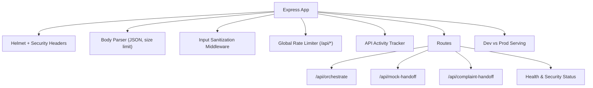
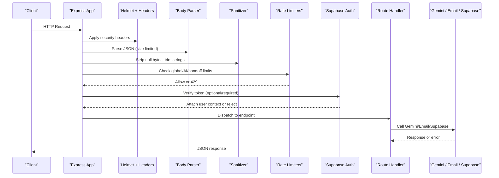
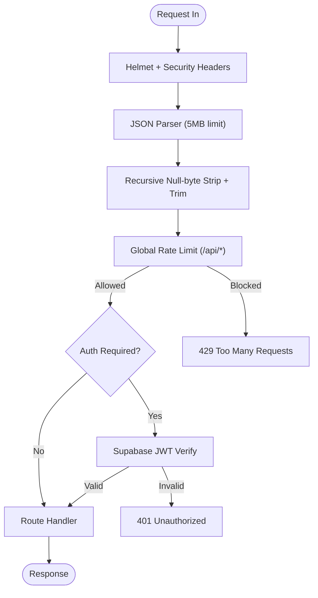
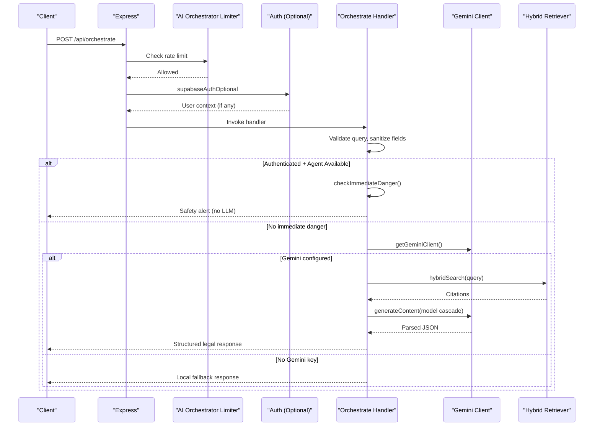
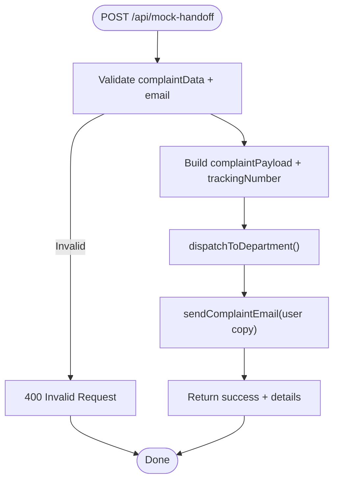
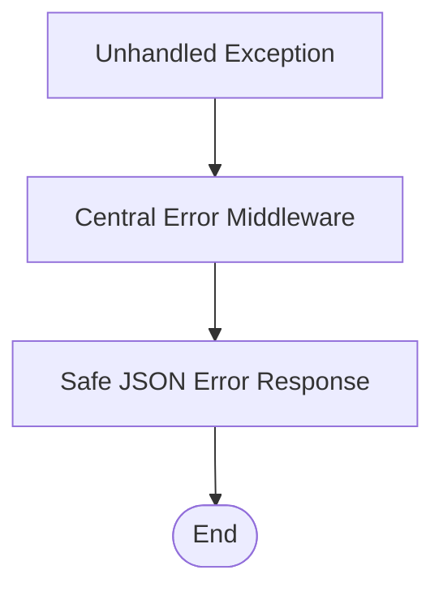
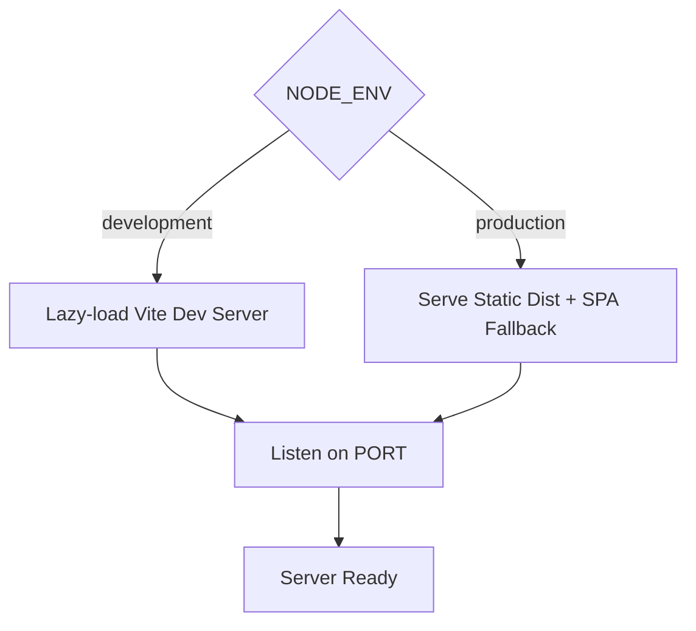
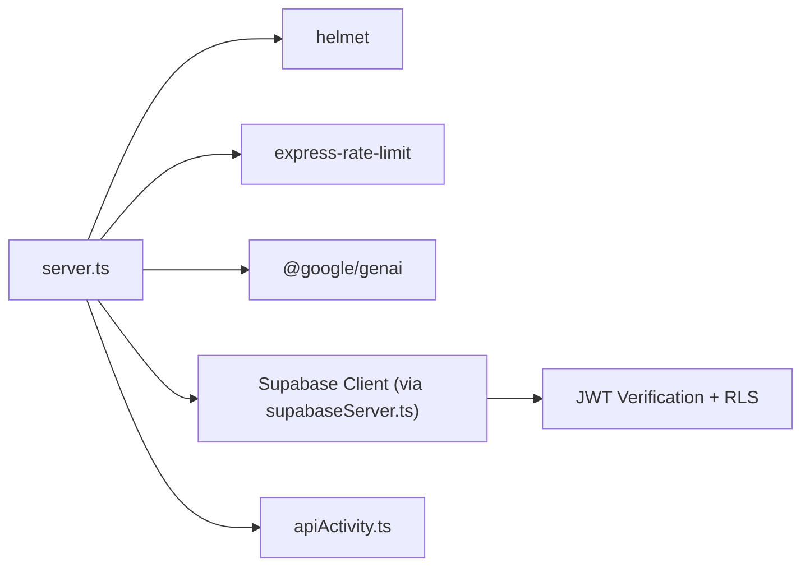

# Server & Security Layer

<cite>
**Referenced Files in This Document**
- [server.ts](file://server.ts)
- [supabaseServer.ts](file://server/supabaseServer.ts)
- [apiActivity.ts](file://server/apiActivity.ts)
</cite>

## Table of Contents
1. [Introduction](#introduction)
2. [Project Structure](#project-structure)
3. [Core Components](#core-components)
4. [Architecture Overview](#architecture-overview)
5. [Detailed Component Analysis](#detailed-component-analysis)
6. [Dependency Analysis](#dependency-analysis)
7. [Performance Considerations](#performance-considerations)
8. [Troubleshooting Guide](#troubleshooting-guide)
9. [Conclusion](#conclusion)

## Introduction
This document provides a deep dive into the Express server implementation that powers the backend for the privacy-preserving women’s safety application. It focuses on:
- The middleware stack (Helmet security headers, rate limiting, input sanitization)
- Key endpoints: /api/orchestrate and /api/mock-handoff
- Error handling strategy
- Production vs development behavior

The server is designed to be secure by default, resilient to abuse via rate limits, and robust against malformed or malicious payloads. It integrates optional Supabase authentication and Gemini-powered legal reasoning with deterministic fallbacks.

## Project Structure
At runtime, the server bootstraps an Express app, applies global security and parsing middleware, registers API routes, and starts serving either Vite dev assets or production static files.

**Diagram sources**
- [server.ts:42-130](file://server.ts#L42-L130)
- [server.ts:182-224](file://server.ts#L182-L224)
- [server.ts:227-406](file://server.ts#L227-L406)
- [server.ts:789-881](file://server.ts#L789-L881)
- [server.ts:958-1123](file://server.ts#L958-L1123)
- [server.ts:1141-1179](file://server.ts#L1141-L1179)

**Section sources**
- [server.ts:36-84](file://server.ts#L36-L84)
- [server.ts:1141-1179](file://server.ts#L1141-L1179)

## Core Components
- Helmet and explicit security headers: Enforces strict CSP in production; relaxes policy in development for Vite HMR and AI Studio iframe compatibility. Adds nosniff, XSS protection, referrer policy, and permissions policy.
- Input sanitization: Recursively strips null bytes and trims strings in JSON bodies to mitigate injection vectors.
- Rate limiting: Three-tier limits protect the API surface:
  - Global: 120 requests per 15 minutes per IP across /api/*
  - AI orchestrator: 30 requests per 5 minutes per IP
  - Handoff: 20 requests per 10 minutes per IP
- Authentication middleware: Optional or required Supabase JWT verification depending on route sensitivity.
- Health and security status endpoints: Expose operational posture without leaking sensitive details.

**Section sources**
- [server.ts:42-84](file://server.ts#L42-L84)
- [server.ts:86-130](file://server.ts#L86-L130)
- [server.ts:182-224](file://server.ts#L182-L224)
- [supabaseServer.ts:65-121](file://server/supabaseServer.ts#L65-L121)

## Architecture Overview
The request lifecycle flows through a layered middleware pipeline before reaching route handlers. Each layer enforces security, validates inputs, and controls throughput.

**Diagram sources**
- [server.ts:42-130](file://server.ts#L42-L130)
- [server.ts:227-406](file://server.ts#L227-L406)
- [server.ts:789-881](file://server.ts#L789-L881)
- [supabaseServer.ts:65-121](file://server/supabaseServer.ts#L65-L121)

## Detailed Component Analysis

### Express Middleware Stack
- Helmet configuration:
  - Production enforces strict CSP with allowlisted sources for fonts, styles, images, and map tiles. Development disables CSP to support HMR and iframes.
  - Additional headers: nosniff, XSS protection, strict referrer policy, and restrictive permissions policy.
- Query parser hardening: Switches from qs to Node’s simple querystring parser to avoid known DoS advisories.
- Body parsing: JSON parser with a 5MB payload limit.
- Input sanitization: Recursive sanitizer removes null bytes and trims string values in nested objects and arrays.
- Rate limiting:
  - Global limiter protects all /api/* endpoints.
  - AI orchestrator limiter protects LLM-heavy endpoints.
  - Handoff limiter protects complaint routing endpoints.
- API activity tracking: Logs every /api/* request after completion, including method, target service inference, and status.

**Diagram sources**
- [server.ts:42-130](file://server.ts#L42-L130)
- [server.ts:182-224](file://server.ts#L182-L224)
- [server.ts:1130-1139](file://server.ts#L1130-L1139)
- [apiActivity.ts:168-196](file://server/apiActivity.ts#L168-L196)

**Section sources**
- [server.ts:42-130](file://server.ts#L42-L130)
- [server.ts:1130-1139](file://server.ts#L1130-L1139)
- [apiActivity.ts:168-196](file://server/apiActivity.ts#L168-L196)

### /api/orchestrate Endpoint
Purpose: Grounded legal information assistant powered by Gemini with deterministic fallbacks and agent fast paths.

Key behaviors:
- Strict input validation:
  - Requires a string query; rejects non-string or missing values.
  - Caps query length at 3,000 characters.
  - Normalizes language to 'en' or 'ur'; truncates intent and citations safely.
- Authentication:
  - Optional Supabase auth; when present, enables agent fast path and conversation features.
- Agent fast path:
  - Immediate danger check short-circuits to safety guidance without calling LLM.
  - If authenticated and agent available, delegates to function-calling loop and returns structured responses.
- Gemini orchestration:
  - Uses hybrid retriever to fetch grounded Punjab legal citations.
  - Tries multiple candidate models in order for resilience and cost efficiency.
  - Returns structured JSON with bilingual summaries, legal concepts, support options, confidence, and disclaimer flags.
- Fallbacks:
  - If no Gemini key or model calls fail, returns a deterministic local fallback indicating offline grounding mode.

**Diagram sources**
- [server.ts:227-406](file://server.ts#L227-L406)
- [server.ts:161-179](file://server.ts#L161-L179)

**Section sources**
- [server.ts:227-406](file://server.ts#L227-L406)

### /api/mock-handoff Endpoint
Purpose: Routes a complaint to the appropriate department via email and optional API dispatch, then sends a confirmation copy to the user.

Key behaviors:
- Validation:
  - Requires complaintData object; extracts and sanitizes district code and user email.
  - Generates a unique tracking number per complaint.
- Department resolution:
  - Maps requested support channel to department contact and dispatch logic.
- Dispatch flow:
  - Attempts department dispatch (API + email).
  - Independently sends a confirmation copy to the user’s email.
- Response:
  - Includes tracking number, department details, delivery statuses, and jurisdiction info.

**Diagram sources**
- [server.ts:789-881](file://server.ts#L789-L881)

**Section sources**
- [server.ts:789-881](file://server.ts#L789-L881)

### Error Handling Strategy
- Centralized error middleware:
  - Catches unhandled errors, logs them, and returns a safe generic message with a stable error code.
  - Prevents stack trace leaks and ensures consistent error shape.
- Route-level error handling:
  - Orchestrate and handoff routes catch exceptions and return structured errors with codes.
  - Agent-related routes normalize errors using shared utilities and map to appropriate HTTP status codes.

**Diagram sources**
- [server.ts:1130-1139](file://server.ts#L1130-L1139)

**Section sources**
- [server.ts:1130-1139](file://server.ts#L1130-L1139)

### Production vs Development Mode
- Development:
  - CSP disabled to support Vite HMR and AI Studio iframe embedding.
  - Vite dev server loaded lazily only in non-production environments.
- Production:
  - Strict CSP enforced with allowlisted domains for fonts, styles, images, and map tiles.
  - Static assets served from dist directory; SPA fallback to index.html.
  - Hybrid retriever embeddings initialized if Gemini key is present.

**Diagram sources**
- [server.ts:42-67](file://server.ts#L42-L67)
- [server.ts:1141-1179](file://server.ts#L1141-L1179)

**Section sources**
- [server.ts:42-67](file://server.ts#L42-L67)
- [server.ts:1141-1179](file://server.ts#L1141-L1179)

## Dependency Analysis
- Core dependencies:
  - express: Web framework
  - helmet: Security headers
  - express-rate-limit: Rate limiting
  - @google/genai: Gemini client for legal reasoning
  - dotenv: Environment variable loading
  - crypto: Tracking number generation
- Supabase integration:
  - Optional authentication and user-scoped clients for data access with Row Level Security.
- Activity logging:
  - Tracks API usage and infers target services based on endpoint patterns.

**Diagram sources**
- [server.ts:6-29](file://server.ts#L6-L29)
- [server.ts:161-179](file://server.ts#L161-L179)
- [supabaseServer.ts:20-57](file://server/supabaseServer.ts#L20-L57)
- [apiActivity.ts:168-196](file://server/apiActivity.ts#L168-L196)

**Section sources**
- [server.ts:6-29](file://server.ts#L6-L29)
- [supabaseServer.ts:20-57](file://server/supabaseServer.ts#L20-L57)
- [apiActivity.ts:168-196](file://server/apiActivity.ts#L168-L196)

## Performance Considerations
- Model fallback chain:
  - Tries multiple Gemini models in order to balance cost and reliability.
- Hybrid retriever:
  - Combines embeddings with keyword scoring to improve relevance while minimizing LLM calls.
- Rate limiting:
  - Protects against quota abuse and reduces load spikes.
- Lazy initialization:
  - Vite dev server loaded only in development to reduce cold start overhead.
  - Gemini client instantiated once and reused.

[No sources needed since this section provides general guidance]

## Troubleshooting Guide
Common issues and diagnostics:
- 429 Too Many Requests:
  - Indicates hitting global, AI orchestrator, or handoff rate limits. Reduce request frequency or implement retry with backoff.
- 401 Unauthorized:
  - Missing or invalid Supabase token on protected routes. Ensure Authorization header includes a valid Bearer token.
- 400 Validation Errors:
  - Missing or malformed fields like query or complaintData. Validate payloads on the client side.
- Internal Server Error:
  - Central error middleware returns a safe message. Check server logs for detailed stack traces.

Operational checks:
- Health endpoint: Confirms server status, integrations, and security posture.
- Security status endpoint: Shows active protections and rate limits.

**Section sources**
- [server.ts:182-224](file://server.ts#L182-L224)
- [server.ts:1130-1139](file://server.ts#L1130-L1139)

## Conclusion
The server implements a defense-in-depth strategy:
- Strong security headers and input sanitization
- Multi-layer rate limiting tailored to sensitive endpoints
- Optional but robust Supabase authentication with RLS-aware clients
- Resilient AI orchestration with deterministic fallbacks
- Clear separation between development and production behaviors

This design ensures reliable, secure operation while protecting users and resources under load or adversarial conditions.

[No sources needed since this section summarizes without analyzing specific files]