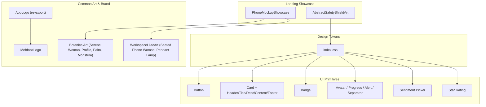
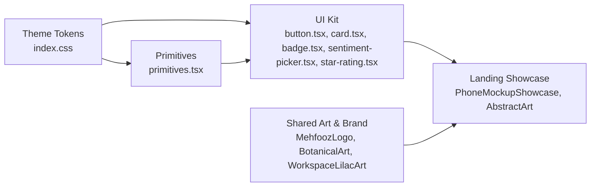
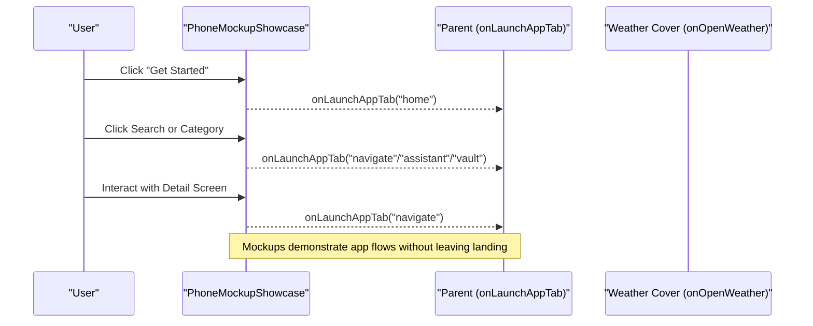
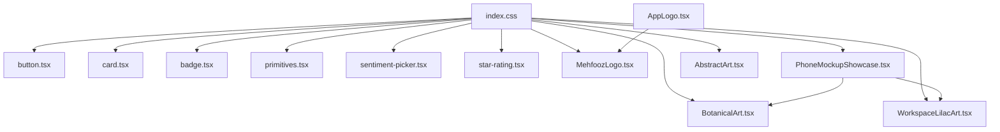

# UI Primitives & Shared Components

<cite>
**Referenced Files in This Document**
- [index.css](file://src/index.css)
- [primitives.tsx](file://src/components/ui/primitives.tsx)
- [button.tsx](file://src/components/ui/button.tsx)
- [card.tsx](file://src/components/ui/card.tsx)
- [badge.tsx](file://src/components/ui/badge.tsx)
- [sentiment-picker.tsx](file://src/components/ui/sentiment-picker.tsx)
- [star-rating.tsx](file://src/components/ui/star-rating.tsx)
- [AppLogo.tsx](file://src/components/common/AppLogo.tsx)
- [MehfoozLogo.tsx](file://src/components/common/MehfoozLogo.tsx)
- [BotanicalArt.tsx](file://src/components/common/BotanicalArt.tsx)
- [WorkspaceLilacArt.tsx](file://src/components/common/WorkspaceLilacArt.tsx)
- [PhoneMockupShowcase.tsx](file://src/components/landing/PhoneMockupShowcase.tsx)
- [AbstractArt.tsx](file://src/components/landing/AbstractArt.tsx)
</cite>

## Table of Contents
1. [Introduction](#introduction)
2. [Project Structure](#project-structure)
3. [Core Components](#core-components)
4. [Architecture Overview](#architecture-overview)
5. [Detailed Component Analysis](#detailed-component-analysis)
6. [Dependency Analysis](#dependency-analysis)
7. [Performance Considerations](#performance-considerations)
8. [Troubleshooting Guide](#troubleshooting-guide)
9. [Conclusion](#conclusion)

## Introduction
This document describes the design tokens, reusable UI primitives, shared SVG art assets, and landing page showcase components used across the application. It focuses on:
- Design tokens and theme configuration for consistent visuals
- Reusable UI primitives (buttons, cards, badges, alerts, avatars, progress, separators)
- Brand and botanical SVG illustrations
- A phone mockup showcase that demonstrates key app screens
- Abstract animated art for hero sections

The goal is to provide a clear reference for developers to compose consistent, accessible, and performant interfaces while maintaining the project’s serene aesthetic and safety-focused messaging.

## Project Structure
The relevant code is organized into three primary areas:
- components/ui: Atomic UI primitives with Tailwind-based styling
- components/common: Branding, logo, and reusable SVG artwork
- components/landing: Marketing and showcase components including a phone mockup

**Diagram sources**
- [index.css:5-17](file://src/index.css#L5-L17)
- [button.tsx:8-46](file://src/components/ui/button.tsx#L8-L46)
- [card.tsx:8-70](file://src/components/ui/card.tsx#L8-L70)
- [badge.tsx:8-38](file://src/components/ui/badge.tsx#L8-L38)
- [primitives.tsx:8-115](file://src/components/ui/primitives.tsx#L8-L115)
- [sentiment-picker.tsx:19-116](file://src/components/ui/sentiment-picker.tsx#L19-L116)
- [star-rating.tsx:9-58](file://src/components/ui/star-rating.tsx#L9-L58)
- [MehfoozLogo.tsx:9-323](file://src/components/common/MehfoozLogo.tsx#L9-L323)
- [AppLogo.tsx:9-17](file://src/components/common/AppLogo.tsx#L9-L17)
- [BotanicalArt.tsx:8-201](file://src/components/common/BotanicalArt.tsx#L8-L201)
- [WorkspaceLilacArt.tsx:8-195](file://src/components/common/WorkspaceLilacArt.tsx#L8-L195)
- [PhoneMockupShowcase.tsx:36-380](file://src/components/landing/PhoneMockupShowcase.tsx#L36-L380)
- [AbstractArt.tsx:9-153](file://src/components/landing/AbstractArt.tsx#L9-L153)

**Section sources**
- [index.css:5-17](file://src/index.css#L5-L17)
- [button.tsx:8-46](file://src/components/ui/button.tsx#L8-L46)
- [card.tsx:8-70](file://src/components/ui/card.tsx#L8-L70)
- [badge.tsx:8-38](file://src/components/ui/badge.tsx#L8-L38)
- [primitives.tsx:8-115](file://src/components/ui/primitives.tsx#L8-L115)
- [sentiment-picker.tsx:19-116](file://src/components/ui/sentiment-picker.tsx#L19-L116)
- [star-rating.tsx:9-58](file://src/components/ui/star-rating.tsx#L9-L58)
- [MehfoozLogo.tsx:9-323](file://src/components/common/MehfoozLogo.tsx#L9-L323)
- [AppLogo.tsx:9-17](file://src/components/common/AppLogo.tsx#L9-L17)
- [BotanicalArt.tsx:8-201](file://src/components/common/BotanicalArt.tsx#L8-L201)
- [WorkspaceLilacArt.tsx:8-195](file://src/components/common/WorkspaceLilacArt.tsx#L8-L195)
- [PhoneMockupShowcase.tsx:36-380](file://src/components/landing/PhoneMockupShowcase.tsx#L36-L380)
- [AbstractArt.tsx:9-153](file://src/components/landing/AbstractArt.tsx#L9-L153)

## Core Components
This section summarizes the core building blocks and their intended use.

- Design tokens and theme
  - Centralized color variables for light/dark modes via CSS custom properties and Tailwind theme keys
  - Consistent palette: soft mint, teal tones, charcoal text, coral accents
  - Utility classes for canvas backgrounds and brand colors

- Button
  - Variants: default, brand, destructive, outline, secondary, ghost, link
  - Sizes: default, sm, lg, icon
  - Focus ring and disabled states included

- Card system
  - Container and semantic parts: header, title, description, content, footer
  - Rounded corners, subtle borders, and spacing

- Badge
  - Semantic variants: default, secondary, success, destructive, warning, outline
  - Compact status labels and tags

- Primitives
  - Avatar with size variants and fallback initials
  - Progress bar with percentage calculation and customizable indicator color
  - Alert with variants (default, destructive, warning, success), plus title and description parts
  - Separator for horizontal or vertical dividers

- Sentiment picker
  - Five-level scale from very unsafe to very safe
  - Bilingual labels (English/Urdu) and icons per level
  - Accessible selection with focus and active states

- Star rating
  - Configurable max stars, sizes, interactive mode with callback
  - Visual distinction between filled and empty stars

- Brand and art
  - MehfoozLogo supports multiple variants (icon, badge, horizontal, full, stacked, hero, animated-hero) with optional Urdu text and animations
  - Botanical and workspace illustrations provide consistent visual language
  - Abstract animated art for hero sections with motion effects

**Section sources**
- [index.css:5-17](file://src/index.css#L5-L17)
- [button.tsx:8-46](file://src/components/ui/button.tsx#L8-L46)
- [card.tsx:8-70](file://src/components/ui/card.tsx#L8-L70)
- [badge.tsx:8-38](file://src/components/ui/badge.tsx#L8-L38)
- [primitives.tsx:8-115](file://src/components/ui/primitives.tsx#L8-L115)
- [sentiment-picker.tsx:19-116](file://src/components/ui/sentiment-picker.tsx#L19-L116)
- [star-rating.tsx:9-58](file://src/components/ui/star-rating.tsx#L9-L58)
- [MehfoozLogo.tsx:9-323](file://src/components/common/MehfoozLogo.tsx#L9-L323)
- [BotanicalArt.tsx:8-201](file://src/components/common/BotanicalArt.tsx#L8-L201)
- [WorkspaceLilacArt.tsx:8-195](file://src/components/common/WorkspaceLilacArt.tsx#L8-L195)
- [AbstractArt.tsx:9-153](file://src/components/landing/AbstractArt.tsx#L9-L153)

## Architecture Overview
The UI layer follows a layered approach:
- Theme tokens define colors and typography foundations
- Primitive components encapsulate low-level UI elements
- Higher-level components combine primitives and art assets
- Landing components orchestrate showcases using primitives and art

**Diagram sources**
- [index.css:5-17](file://src/index.css#L5-L17)
- [primitives.tsx:8-115](file://src/components/ui/primitives.tsx#L8-L115)
- [button.tsx:8-46](file://src/components/ui/button.tsx#L8-L46)
- [card.tsx:8-70](file://src/components/ui/card.tsx#L8-L70)
- [badge.tsx:8-38](file://src/components/ui/badge.tsx#L8-L38)
- [sentiment-picker.tsx:19-116](file://src/components/ui/sentiment-picker.tsx#L19-L116)
- [star-rating.tsx:9-58](file://src/components/ui/star-rating.tsx#L9-L58)
- [MehfoozLogo.tsx:9-323](file://src/components/common/MehfoozLogo.tsx#L9-L323)
- [BotanicalArt.tsx:8-201](file://src/components/common/BotanicalArt.tsx#L8-L201)
- [WorkspaceLilacArt.tsx:8-195](file://src/components/common/WorkspaceLilacArt.tsx#L8-L195)
- [PhoneMockupShowcase.tsx:36-380](file://src/components/landing/PhoneMockupShowcase.tsx#L36-L380)
- [AbstractArt.tsx:9-153](file://src/components/landing/AbstractArt.tsx#L9-L153)

## Detailed Component Analysis

### Design Tokens and Theme
- Defines CSS custom properties for light and dark themes
- Tailwind @theme keys map to brand colors
- Provides utility classes for background gradients and brand-specific colors
- Ensures consistent typography and scrollbars

Usage guidance:
- Prefer theme variables over hard-coded colors
- Use provided utility classes for canvas backgrounds and brand accents
- Maintain contrast ratios when extending the palette

**Section sources**
- [index.css:5-17](file://src/index.css#L5-L17)
- [index.css:19-77](file://src/index.css#L19-L77)
- [index.css:79-132](file://src/index.css#L79-L132)

### Button
- Variants and sizes are controlled via props
- Includes focus-visible rings and disabled states
- Supports ref forwarding for accessibility and testing

Best practices:
- Use brand variant for primary actions
- Use outline or secondary for secondary actions
- Keep icon-only buttons square and sized consistently

**Section sources**
- [button.tsx:8-46](file://src/components/ui/button.tsx#L8-L46)

### Card System
- Semantic parts: Card, CardHeader, CardTitle, CardDescription, CardContent, CardFooter
- Consistent padding and typography hierarchy
- Suitable for modular content blocks

Best practices:
- Wrap related content in CardHeader/CardContent
- Use CardTitle and CardDescription for clarity
- Avoid nesting too deeply; prefer flat structures where possible

**Section sources**
- [card.tsx:8-70](file://src/components/ui/card.tsx#L8-L70)

### Badge
- Compact labels with semantic variants
- Good for statuses, tags, and small indicators

Best practices:
- Choose variant based on meaning (success, warning, destructive)
- Keep text concise; consider truncation if needed

**Section sources**
- [badge.tsx:8-38](file://src/components/ui/badge.tsx#L8-L38)

### Primitives (Avatar, Progress, Alert, Separator)
- Avatar: size variants and fallback initials
- Progress: percentage calculation and customizable indicator color
- Alert: variants with role="alert" for accessibility
- Separator: horizontal or vertical divider

Best practices:
- Use Alert for important messages; pair with AlertTitle and AlertDescription
- Ensure Progress has accessible labels when used as a control
- Keep Separator usage minimal to avoid visual clutter

**Section sources**
- [primitives.tsx:8-115](file://src/components/ui/primitives.tsx#L8-L115)

### Sentiment Picker
- Five-level scale with bilingual labels and icons
- Grid layout with clear selection state
- Callback-driven value updates

Best practices:
- Provide context around the picker for screen readers
- Use appropriate sizing and spacing for mobile touch targets

**Section sources**
- [sentiment-picker.tsx:19-116](file://src/components/ui/sentiment-picker.tsx#L19-L116)

### Star Rating
- Configurable max stars, sizes, and interactivity
- Visual feedback for hover and selection
- Optional callback for user ratings

Best practices:
- Disable interaction when read-only
- Ensure keyboard navigation and focus management

**Section sources**
- [star-rating.tsx:9-58](file://src/components/ui/star-rating.tsx#L9-L58)

### Brand Logo and AppLogo
- MehfoozLogo supports multiple variants and optional Urdu text
- Animated hero variant uses motion for stroke drawing
- AppLogo re-exports MehfoozLogo for convenience

Best practices:
- Use appropriate variant for context (header, hero, badge)
- Enable animation only where it enhances experience
- Respect aspect ratio and sizing constraints

**Section sources**
- [MehfoozLogo.tsx:9-323](file://src/components/common/MehfoozLogo.tsx#L9-L323)
- [AppLogo.tsx:9-17](file://src/components/common/AppLogo.tsx#L9-L17)

### Botanical and Workspace Illustrations
- Serene woman illustration with foliage accents
- Profile silhouette art for branding
- Palm fronds and monstera leaf accents
- Seated phone woman artwork and pendant lamp decor

Best practices:
- Use scalable SVGs for crisp rendering
- Apply consistent sizing classes
- Combine with theme colors for cohesive visuals

**Section sources**
- [BotanicalArt.tsx:8-201](file://src/components/common/BotanicalArt.tsx#L8-L201)
- [WorkspaceLilacArt.tsx:8-195](file://src/components/common/WorkspaceLilacArt.tsx#L8-L195)

### Phone Mockup Showcase
- Three-phone grid showcasing onboarding, dashboard, and detail screens
- Uses primitives and art to simulate real app flows
- Interactive callbacks to launch app tabs and open weather cover

Flow overview:
- User interacts with mockups to navigate to specific app features
- Each phone frame includes realistic headers, search, categories, and booking details
- Animations enhance entrance and hover states

**Diagram sources**
- [PhoneMockupShowcase.tsx:36-380](file://src/components/landing/PhoneMockupShowcase.tsx#L36-L380)

**Section sources**
- [PhoneMockupShowcase.tsx:36-380](file://src/components/landing/PhoneMockupShowcase.tsx#L36-L380)

### Abstract Safety Shield Art
- Animated wave ribbons, floating nodes, and geometric shield
- Uses motion for continuous subtle animations
- Complements hero sections with brand-aligned colors

Best practices:
- Limit animation intensity to maintain performance
- Ensure contrast and readability over animated backgrounds

**Section sources**
- [AbstractArt.tsx:9-153](file://src/components/landing/AbstractArt.tsx#L9-L153)

## Dependency Analysis
- Theme tokens in index.css are consumed by all UI components via Tailwind utilities and CSS variables
- UI primitives depend on theme tokens and Tailwind classes
- Common art components are independent but styled using theme colors
- Landing components compose primitives and art, invoking parent callbacks for navigation

**Diagram sources**
- [index.css:5-17](file://src/index.css#L5-L17)
- [button.tsx:8-46](file://src/components/ui/button.tsx#L8-L46)
- [card.tsx:8-70](file://src/components/ui/card.tsx#L8-L70)
- [badge.tsx:8-38](file://src/components/ui/badge.tsx#L8-L38)
- [primitives.tsx:8-115](file://src/components/ui/primitives.tsx#L8-L115)
- [sentiment-picker.tsx:19-116](file://src/components/ui/sentiment-picker.tsx#L19-L116)
- [star-rating.tsx:9-58](file://src/components/ui/star-rating.tsx#L9-L58)
- [MehfoozLogo.tsx:9-323](file://src/components/common/MehfoozLogo.tsx#L9-L323)
- [AppLogo.tsx:9-17](file://src/components/common/AppLogo.tsx#L9-L17)
- [BotanicalArt.tsx:8-201](file://src/components/common/BotanicalArt.tsx#L8-L201)
- [WorkspaceLilacArt.tsx:8-195](file://src/components/common/WorkspaceLilacArt.tsx#L8-L195)
- [PhoneMockupShowcase.tsx:36-380](file://src/components/landing/PhoneMockupShowcase.tsx#L36-L380)
- [AbstractArt.tsx:9-153](file://src/components/landing/AbstractArt.tsx#L9-L153)

**Section sources**
- [index.css:5-17](file://src/index.css#L5-L17)
- [PhoneMockupShowcase.tsx:36-380](file://src/components/landing/PhoneMockupShowcase.tsx#L36-L380)

## Performance Considerations
- Prefer static SVGs for illustrations; animate sparingly to avoid jank
- Use motion animations judiciously; limit duration and frequency
- Avoid excessive nested components in tight loops
- Leverage Tailwind utilities for efficient styling without runtime overhead
- Ensure images and SVGs are appropriately sized to reduce payload

[No sources needed since this section provides general guidance]

## Troubleshooting Guide
- Inconsistent colors or theme mismatches
  - Verify theme variables are applied and not overridden by local styles
  - Check dark mode class presence on root element
- Accessibility issues
  - Ensure interactive components have proper roles and focus states
  - Use aria attributes where necessary (e.g., alerts, progress)
- Animation performance
  - Reduce number of simultaneous animations
  - Use transform and opacity for GPU-accelerated animations
- Layout overflow on mobile
  - Confirm container widths and avoid fixed large values
  - Use responsive classes to adapt layouts

**Section sources**
- [index.css:19-77](file://src/index.css#L19-L77)
- [primitives.tsx:63-115](file://src/components/ui/primitives.tsx#L63-L115)
- [button.tsx:13-46](file://src/components/ui/button.tsx#L13-L46)

## Conclusion
The UI layer is built on a robust foundation of design tokens and reusable primitives, complemented by brand-aligned SVG art and a compelling landing showcase. By adhering to the established patterns and guidelines, teams can deliver consistent, accessible, and high-performance interfaces that align with the application’s serene and safety-focused identity.

[No sources needed since this section summarizes without analyzing specific files]