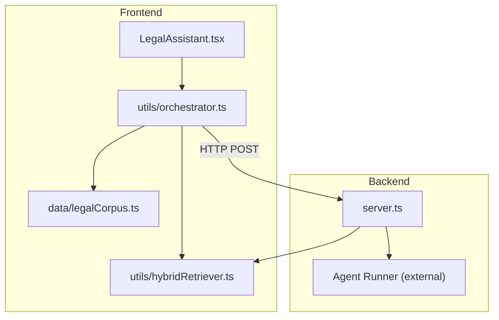
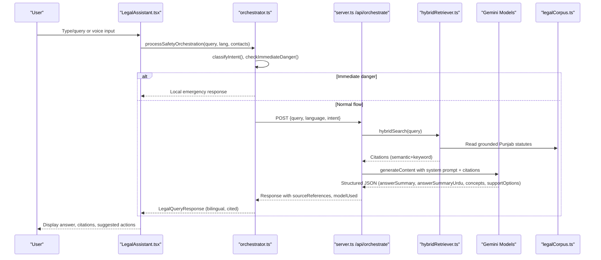
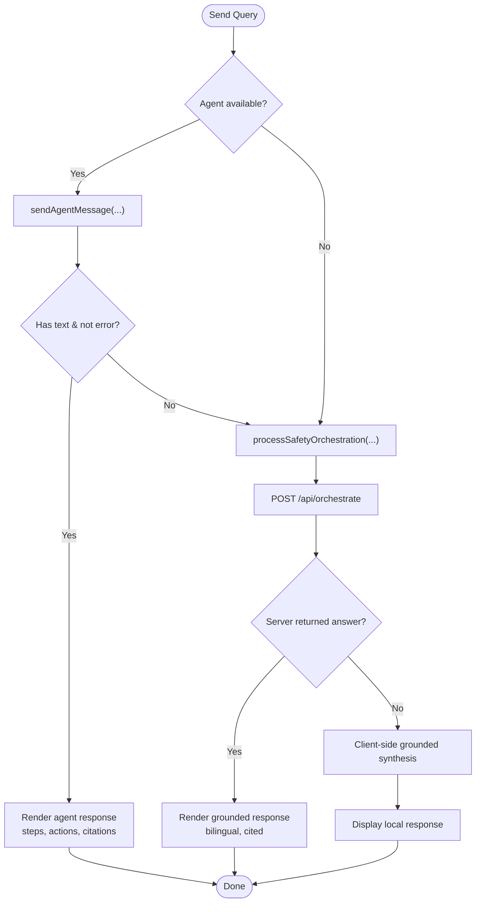
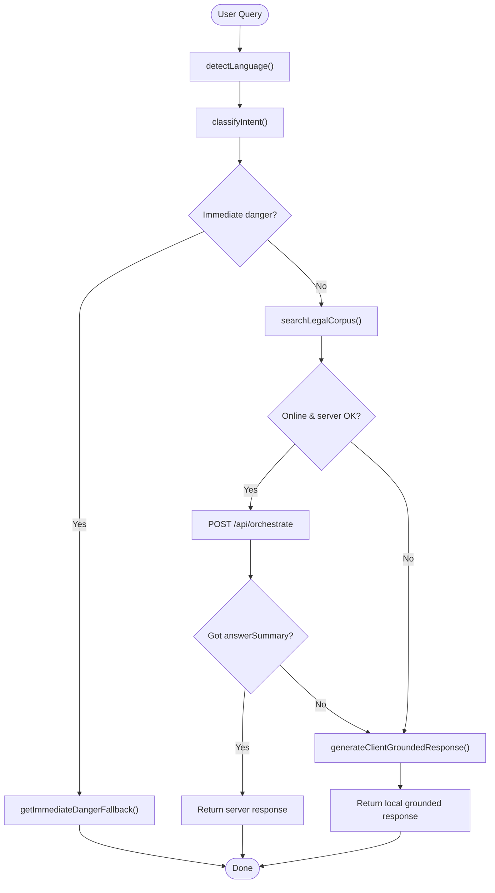
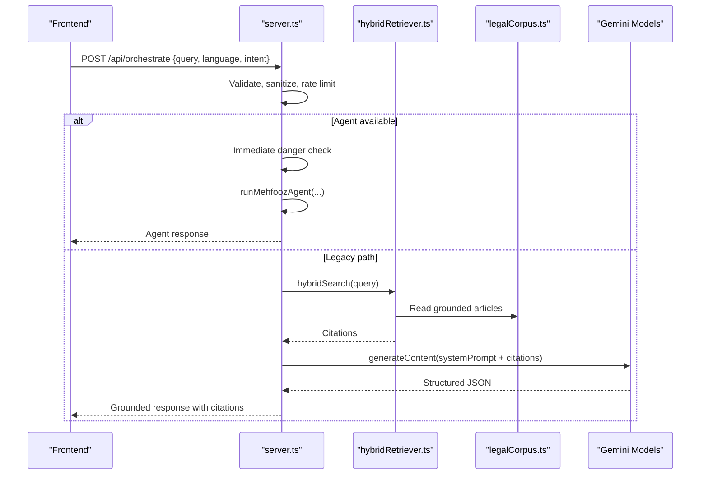
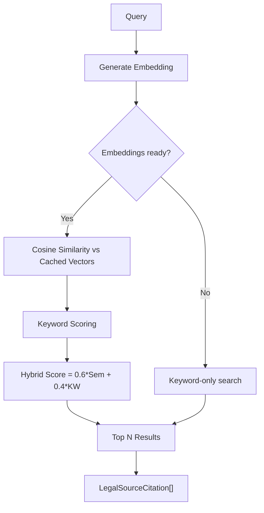
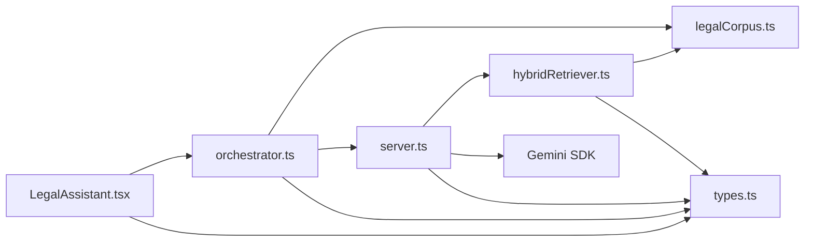

# AI Legal Advisor (RAG) Module

<cite>
**Referenced Files in This Document**
- [LegalAssistant.tsx](file://MehfoozAi/src/components/LegalAssistant.tsx)
- [server.ts](file://MehfoozAi/server.ts)
- [legalCorpus.ts](file://MehfoozAi/src/data/legalCorpus.ts)
- [orchestrator.ts](file://MehfoozAi/src/utils/orchestrator.ts)
- [hybridRetriever.ts](file://MehfoozAi/src/utils/hybridRetriever.ts)
- [types.ts](file://MehfoozAi/src/types.ts)
</cite>

## Table of Contents
1. [Introduction](#introduction)
2. [Project Structure](#project-structure)
3. [Core Components](#core-components)
4. [Architecture Overview](#architecture-overview)
5. [Detailed Component Analysis](#detailed-component-analysis)
6. [Dependency Analysis](#dependency-analysis)
7. [Performance Considerations](#performance-considerations)
8. [Troubleshooting Guide](#troubleshooting-guide)
9. [Conclusion](#conclusion)

## Introduction
This document explains the AI Legal Advisor module that powers grounded Retrieval-Augmented Generation (RAG) for Punjab-specific legal guidance. It covers:
- Grounded RAG pipeline with citation retrieval and bilingual (Urdu/English) response generation
- Gemini model fallback chain on the server
- Prompt injection defense and safety guardrails
- Client-side orchestration, voice input, photo evidence tagging, and location context
- Fallbacks to deterministic local logic when offline or when LLM calls fail

The system is designed to be privacy-preserving, zero-knowledge where possible, and resilient under network or API failures.

## Project Structure
The module spans UI, server endpoints, data corpus, and utilities:
- Frontend component: LegalAssistant.tsx handles chat UX, voice, attachments, language switching, and orchestrator calls
- Server: server.ts exposes /api/orchestrate with rate limiting, sanitization, agent fast path, hybrid retriever, and Gemini fallback chain
- Data: legalCorpus.ts contains Punjab statutes and summaries used for grounding
- Utilities: orchestrator.ts routes queries through client-side intent detection, immediate danger checks, and server/local synthesis; hybridRetriever.ts provides semantic + keyword retrieval
- Types: types.ts defines shared contracts for responses, citations, agents, and flows

**Diagram sources**
- [LegalAssistant.tsx:450-604](file://MehfoozAi/src/components/LegalAssistant.tsx#L450-L604)
- [orchestrator.ts:78-273](file://MehfoozAi/src/utils/orchestrator.ts#L78-L273)
- [server.ts:227-406](file://MehfoozAi/server.ts#L227-L406)
- [hybridRetriever.ts:157-206](file://MehfoozAi/src/utils/hybridRetriever.ts#L157-L206)
- [legalCorpus.ts:1-200](file://MehfoozAi/src/data/legalCorpus.ts#L1-L200)

**Section sources**
- [LegalAssistant.tsx:1-120](file://MehfoozAi/src/components/LegalAssistant.tsx#L1-L120)
- [server.ts:1-120](file://MehfoozAi/server.ts#L1-L120)
- [orchestrator.ts:1-77](file://MehfoozAi/src/utils/orchestrator.ts#L1-L77)
- [hybridRetriever.ts:1-20](file://MehfoozAi/src/utils/hybridRetriever.ts#L1-L20)
- [legalCorpus.ts:1-100](file://MehfoozAi/src/data/legalCorpus.ts#L1-L100)
- [types.ts:1-82](file://MehfoozAi/src/types.ts#L1-L82)

## Core Components
- LegalAssistant.tsx: React component providing chat interface, voice input, photo/location tagging, bilingual UI, conversation history, and integration with both agent and legacy orchestrator paths
- orchestrator.ts: Client-side flow control including intent classification, immediate danger detection, server call, and deterministic fallback synthesis
- server.ts: Express endpoint /api/orchestrate with strict validation, sanitization, rate limits, agent fast path, hybrid retriever, Gemini fallback chain, and structured JSON responses
- hybridRetriever.ts: Hybrid search combining Gemini embeddings with keyword scoring over the legal corpus
- legalCorpus.ts: Grounded Punjab legal articles, sections, summaries, and metadata used for citations
- types.ts: Shared interfaces for responses, citations, agent steps, and actions

**Section sources**
- [LegalAssistant.tsx:450-604](file://MehfoozAi/src/components/LegalAssistant.tsx#L450-L604)
- [orchestrator.ts:78-273](file://MehfoozAi/src/utils/orchestrator.ts#L78-L273)
- [server.ts:227-406](file://MehfoozAi/server.ts#L227-L406)
- [hybridRetriever.ts:157-206](file://MehfoozAi/src/utils/hybridRetriever.ts#L157-L206)
- [legalCorpus.ts:1-200](file://MehfoozAi/src/data/legalCorpus.ts#L1-L200)
- [types.ts:29-82](file://MehfoozAi/src/types.ts#L29-L82)

## Architecture Overview
End-to-end flow from user query to grounded, cited, bilingual response:

**Diagram sources**
- [LegalAssistant.tsx:450-604](file://MehfoozAi/src/components/LegalAssistant.tsx#L450-L604)
- [orchestrator.ts:78-273](file://MehfoozAi/src/utils/orchestrator.ts#L78-L273)
- [server.ts:227-406](file://MehfoozAi/server.ts#L227-L406)
- [hybridRetriever.ts:157-206](file://MehfoozAi/src/utils/hybridRetriever.ts#L157-L206)
- [legalCorpus.ts:1-200](file://MehfoozAi/src/data/legalCorpus.ts#L1-L200)

## Detailed Component Analysis

### LegalAssistant.tsx: Chat UX, Orchestration Entry, Bilingual UI
- Manages conversation state, message rendering, quick prompts, voice recording, photo attachment, GPS tagging, and language toggle
- On send:
  - Attempts agent path via sendAgentMessage if available
  - Falls back to processSafetyOrchestration for deterministic or server-backed RAG
  - Displays agent steps, pending actions, citations, confidence badges, and suggested actions
  - Integrates with vault, complaint builder, directory, and crisis modal via callbacks
- Safety and privacy:
  - Photos attached are saved into encrypted local vault
  - Location tags can be included in queries for jurisdictional grounding
  - Auto voice readout supports accessibility

**Diagram sources**
- [LegalAssistant.tsx:450-604](file://MehfoozAi/src/components/LegalAssistant.tsx#L450-L604)
- [LegalAssistant.tsx:800-1078](file://MehfoozAi/src/components/LegalAssistant.tsx#L800-L1078)

**Section sources**
- [LegalAssistant.tsx:104-152](file://MehfoozAi/src/components/LegalAssistant.tsx#L104-L152)
- [LegalAssistant.tsx:450-604](file://MehfoozAi/src/components/LegalAssistant.tsx#L450-L604)
- [LegalAssistant.tsx:800-1078](file://MehfoozAi/src/components/LegalAssistant.tsx#L800-L1078)

### orchestrator.ts: Intent Classification, Danger Detection, RAG Routing
- Detects language and classifies intent using keyword heuristics
- Immediate danger detection triggers deterministic emergency response
- For normal queries:
  - Searches grounded legal corpus locally
  - Calls server /api/orchestrate with query, language, intent, and optional citations
  - If server fails or no key present, synthesizes a grounded response locally based on matched laws
- Returns structured LegalQueryResponse with bilingual summaries, legal concepts, support options, citations, confidence, and suggested actions

**Diagram sources**
- [orchestrator.ts:37-76](file://MehfoozAi/src/utils/orchestrator.ts#L37-L76)
- [orchestrator.ts:78-273](file://MehfoozAi/src/utils/orchestrator.ts#L78-L273)
- [orchestrator.ts:275-372](file://MehfoozAi/src/utils/orchestrator.ts#L275-L372)

**Section sources**
- [orchestrator.ts:10-76](file://MehfoozAi/src/utils/orchestrator.ts#L10-L76)
- [orchestrator.ts:78-273](file://MehfoozAi/src/utils/orchestrator.ts#L78-L273)
- [orchestrator.ts:275-372](file://MehfoozAi/src/utils/orchestrator.ts#L275-L372)

### server.ts: /api/orchestrate Endpoint, Rate Limits, Sanitization, Gemini Chain
- Security: Helmet headers, input sanitization, strict query length limit, global and per-route rate limits
- Agent fast path: When authenticated and agent available, runs function-calling loop with immediate danger check
- Legacy path:
  - Uses hybrid retriever to fetch grounded citations
  - Builds system prompt with safety rules and prompt injection defense
  - Tries candidate models in order (cheapest first), returns structured JSON with bilingual answers
  - Falls back to deterministic local engine if all models fail
- Additional endpoints: confirm/cancel actions, conversations list/messages, channel recommendation

**Diagram sources**
- [server.ts:86-111](file://MehfoozAi/server.ts#L86-L111)
- [server.ts:113-159](file://MehfoozAi/server.ts#L113-L159)
- [server.ts:227-406](file://MehfoozAi/server.ts#L227-L406)
- [hybridRetriever.ts:157-206](file://MehfoozAi/src/utils/hybridRetriever.ts#L157-L206)

**Section sources**
- [server.ts:86-111](file://MehfoozAi/server.ts#L86-L111)
- [server.ts:113-159](file://MehfoozAi/server.ts#L113-L159)
- [server.ts:227-406](file://MehfoozAi/server.ts#L227-L406)

### hybridRetriever.ts: Semantic + Keyword Retrieval
- Precomputes embeddings for corpus articles at startup
- Computes cosine similarity between query embedding and cached article vectors
- Blends semantic score (weight 0.6) with keyword score (weight 0.4)
- Falls back to keyword-only search when embeddings unavailable
- Returns normalized citations with relevance scores and URLs

**Diagram sources**
- [hybridRetriever.ts:66-106](file://MehfoozAi/src/utils/hybridRetriever.ts#L66-L106)
- [hybridRetriever.ts:108-155](file://MehfoozAi/src/utils/hybridRetriever.ts#L108-L155)
- [hybridRetriever.ts:157-206](file://MehfoozAi/src/utils/hybridRetriever.ts#L157-L206)

**Section sources**
- [hybridRetriever.ts:1-20](file://MehfoozAi/src/utils/hybridRetriever.ts#L1-L20)
- [hybridRetriever.ts:66-106](file://MehfoozAi/src/utils/hybridRetriever.ts#L66-L106)
- [hybridRetriever.ts:108-155](file://MehfoozAi/src/utils/hybridRetriever.ts#L108-L155)
- [hybridRetriever.ts:157-206](file://MehfoozAi/src/utils/hybridRetriever.ts#L157-L206)

### legalCorpus.ts: Grounded Punjab Statutes
- Contains authoritative articles, sections, summaries, and keywords for PPWVA 2016, PECA 2016, PPC, and Workplace Harassment Act 2010
- Used by both client-side orchestrator and server-side hybrid retriever to ensure grounded, jurisdiction-specific responses
- Provides searchLegalCorpus for keyword-based retrieval when embeddings are unavailable

**Section sources**
- [legalCorpus.ts:1-200](file://MehfoozAi/src/data/legalCorpus.ts#L1-L200)

### types.ts: Contracts and Data Models
- Defines LegalQueryResponse, LegalSourceCitation, OrchestratorIntent, RiskLevel, AgentResponse, and related structures
- Ensures consistent payloads across frontend, orchestrator, and server components

**Section sources**
- [types.ts:18-82](file://MehfoozAi/src/types.ts#L18-L82)
- [types.ts:479-557](file://MehfoozAi/src/types.ts#L479-L557)

## Dependency Analysis
Key dependencies and coupling:
- LegalAssistant.tsx depends on orchestrator.ts for query processing and on agent client for function-calling path
- orchestrator.ts depends on legalCorpus.ts for grounding and on server.ts via HTTP for RAG
- server.ts depends on hybridRetriever.ts and legalCorpus.ts for retrieval, and on Gemini SDK for generation
- hybridRetriever.ts depends on legalCorpus.ts and Gemini embeddings
- All components share types.ts for consistent contracts

**Diagram sources**
- [LegalAssistant.tsx:450-604](file://MehfoozAi/src/components/LegalAssistant.tsx#L450-L604)
- [orchestrator.ts:78-273](file://MehfoozAi/src/utils/orchestrator.ts#L78-L273)
- [server.ts:227-406](file://MehfoozAi/server.ts#L227-L406)
- [hybridRetriever.ts:157-206](file://MehfoozAi/src/utils/hybridRetriever.ts#L157-L206)
- [types.ts:18-82](file://MehfoozAi/src/types.ts#L18-L82)

**Section sources**
- [LegalAssistant.tsx:450-604](file://MehfoozAi/src/components/LegalAssistant.tsx#L450-L604)
- [orchestrator.ts:78-273](file://MehfoozAi/src/utils/orchestrator.ts#L78-L273)
- [server.ts:227-406](file://MehfoozAi/server.ts#L227-L406)
- [hybridRetriever.ts:157-206](file://MehfoozAi/src/utils/hybridRetriever.ts#L157-L206)
- [types.ts:18-82](file://MehfoozAi/src/types.ts#L18-L82)

## Performance Considerations
- Model fallback chain prioritizes cheaper, token-efficient models to conserve quota and reduce latency
- Hybrid retriever blends semantic and keyword signals to improve relevance while minimizing expensive embedding calls
- Rate limiting protects backend and LLM quotas:
  - Global API: 120 requests per 15 minutes
  - AI orchestrator: 30 requests per 5 minutes
  - Complaint handoff: 20 requests per 10 minutes
- Input sanitization and size limits prevent abuse and reduce payload overhead
- Offline fallback ensures responsiveness without network or API availability

[No sources needed since this section provides general guidance]

## Troubleshooting Guide
Common issues and mitigations:
- No GEMINI_API_KEY configured:
  - Server returns graceful fallback indicating local grounded engine will be used
- All candidate models fail:
  - Server falls back to deterministic local grounding with clear messaging
- Network errors during speech recognition:
  - UI surfaces localized error messages and logs audit events
- Immediate danger detected:
  - Deterministic emergency response displayed with actionable next steps
- Rate limit exceeded:
  - 429 responses include retry guidance; advise users to wait briefly

**Section sources**
- [server.ts:302-308](file://MehfoozAi/server.ts#L302-L308)
- [server.ts:393-406](file://MehfoozAi/server.ts#L393-L406)
- [LegalAssistant.tsx:328-353](file://MehfoozAi/src/components/LegalAssistant.tsx#L328-L353)
- [orchestrator.ts:275-308](file://MehfoozAi/src/utils/orchestrator.ts#L275-L308)

## Conclusion
The AI Legal Advisor module delivers a robust, grounded RAG experience tailored to Punjab law with strong safety, privacy, and resilience characteristics:
- Grounded citations from authoritative statutes ensure accuracy and trustworthiness
- Bilingual outputs enhance accessibility for Urdu-speaking users
- A layered fallback strategy guarantees continuity under failures
- Prompt injection defenses and strict input handling protect system integrity
- The modular design separates concerns across UI, orchestration, retrieval, and generation layers

[No sources needed since this section summarizes without analyzing specific files]