# Frontend Application Layer

<cite>
**Referenced Files in This Document**
- [App.tsx](file://src/App.tsx)
- [main.tsx](file://src/main.tsx)
- [types.ts](file://src/types.ts)
- [WeatherCover.tsx](file://src/components/WeatherCover.tsx)
- [SafeNavigation.tsx](file://src/components/SafeNavigation.tsx)
- [LegalAssistant.tsx](file://src/components/LegalAssistant.tsx)
- [IncidentVault.tsx](file://src/components/IncidentVault.tsx)
- [SilentCheckIn.tsx](file://src/components/SilentCheckIn.tsx)
- [CrisisModal.tsx](file://src/components/CrisisModal.tsx)
- [chatState.tsx](file://src/utils/chatState.tsx)
</cite>

## Table of Contents
1. [Introduction](#introduction)
2. [Project Structure](#project-structure)
3. [Core Components](#core-components)
4. [Architecture Overview](#architecture-overview)
5. [Detailed Component Analysis](#detailed-component-analysis)
6. [Dependency Analysis](#dependency-analysis)
7. [Performance Considerations](#performance-considerations)
8. [Troubleshooting Guide](#troubleshooting-guide)
9. [Conclusion](#conclusion)

## Introduction
This document explains how the frontend composes a single-page application (SPA) around six safety pillars: Stealth Weather Cover, Safe Corridor Navigation, Punjab AI Legal Advisor (RAG), Zero-Knowledge Incident Vault, Silent Destination Check-In, and Crisis SOS Engine. It focuses on App.tsx routing, state management, component tree composition, and module switching logic that binds these pillars into one cohesive SPA.

## Project Structure
At runtime, React mounts via main.tsx, wraps App with an error boundary, and renders App.tsx as the root. App.tsx owns global UI state (unlock status, active tab, user profile, modals, language/theme) and conditionally renders either the stealth Weather cover or the authenticated app shell. Inside the shell, a top-level Navigation bar drives a simple tab-based router that switches between pillar views.

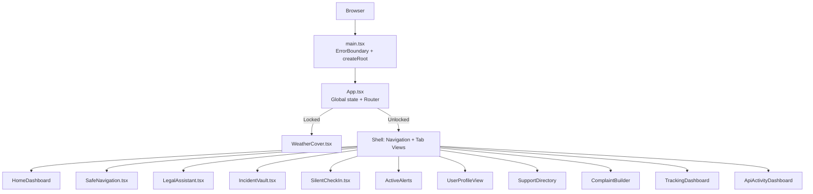

**Diagram sources**
- [main.tsx:1-49](file://src/main.tsx#L1-L49)
- [App.tsx:43-660](file://src/App.tsx#L43-L660)

**Section sources**
- [main.tsx:1-49](file://src/main.tsx#L1-L49)
- [App.tsx:43-660](file://src/App.tsx#L43-L660)

## Core Components
- App.tsx: Central orchestrator for routing, authentication flow, stealth unlock, modals, and cross-pillar data handoffs.
- types.ts: Shared TypeScript contracts for tabs, profiles, legal responses, vault records, complaints, and agent messages.
- ChatStateProvider (chatState.tsx): Global chat conversation context to preserve state across navigation.
- Pillar components: WeatherCover, SafeNavigation, LegalAssistant, IncidentVault, SilentCheckIn, CrisisModal.

Key responsibilities:
- Routing: Conditional rendering based on activeTab and isUnlocked.
- State: Local state for UI; shared state via ChatStateProvider for conversations; auth/session via utils/auth.
- Cross-module flows: Pre-populating complaint builder from legal assistant or vault; opening crisis modal from any view.

**Section sources**
- [App.tsx:43-660](file://src/App.tsx#L43-L660)
- [types.ts:1-557](file://src/types.ts#L1-L557)
- [chatState.tsx:35-90](file://src/utils/chatState.tsx#L35-L90)

## Architecture Overview
The SPA uses a hybrid “tab router” pattern inside a single React tree. There is no client-side history library; instead, App.tsx maintains an activeTab string and renders the corresponding view. Authentication and stealth gating are handled at the root level before the tabbed shell appears.

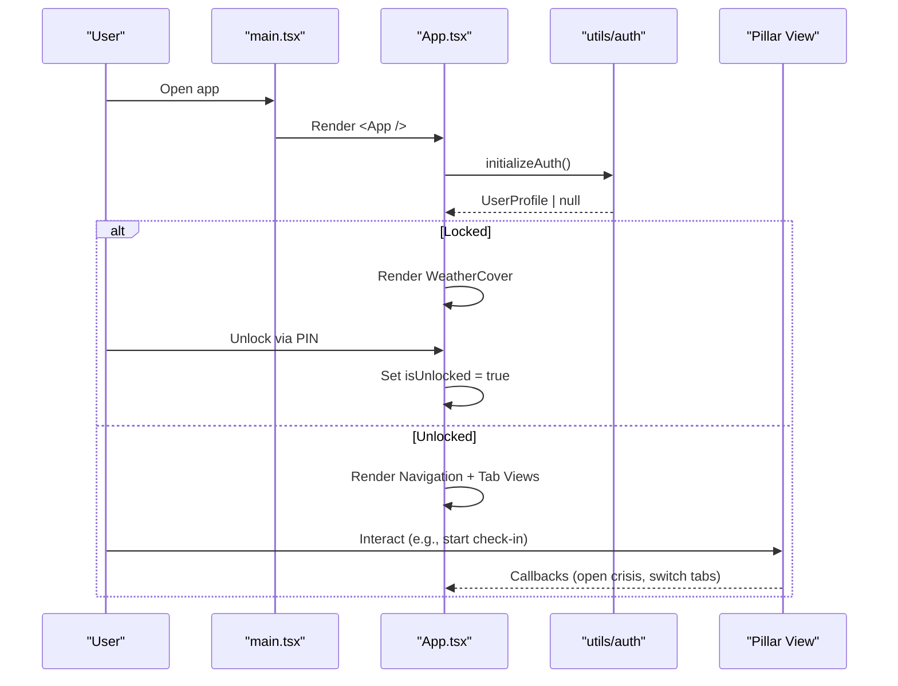

**Diagram sources**
- [main.tsx:42-48](file://src/main.tsx#L42-L48)
- [App.tsx:122-190](file://src/App.tsx#L122-L190)
- [App.tsx:309-385](file://src/App.tsx#L309-L385)
- [App.tsx:387-550](file://src/App.tsx#L387-L550)

## Detailed Component Analysis

### App.tsx: Routing, State, and Module Switching
- Global state includes:
  - isUnlocked: controls whether the weather cover or the app shell is shown.
  - activeTab: drives conditional rendering of each pillar view.
  - user/profile: loaded asynchronously; used by many views.
  - Modal flags: crisis, auth, onboarding, inspector, offline corpus.
  - Language and theme: persisted and propagated to children.
- Routing strategy:
  - If not unlocked: render WeatherCover only.
  - If unlocked but landing tab and no user: show LandingPage with auth modal.
  - If unlocked and user exists or explicit landing: show LandingPage or shell.
  - Otherwise: render Navigation plus a large if-block per activeTab mapping to a pillar component.
- Cross-pillar handoffs:
  - Legal Assistant → Incident Vault or Complaint Builder via callbacks.
  - Any view can open CrisisModal via onOpenCrisis.
  - Quick exit sets isUnlocked false to return to WeatherCover.

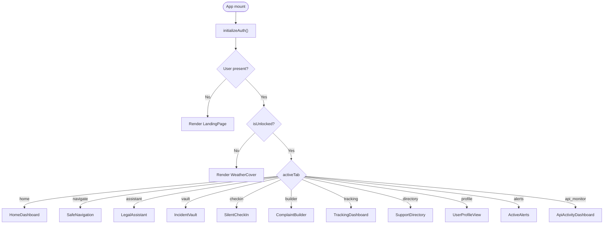

**Diagram sources**
- [App.tsx:122-190](file://src/App.tsx#L122-L190)
- [App.tsx:309-385](file://src/App.tsx#L309-L385)
- [App.tsx:387-550](file://src/App.tsx#L387-L550)

**Section sources**
- [App.tsx:43-660](file://src/App.tsx#L43-L660)

### WeatherCover: Stealth Entry Gate
- Acts as the public face of the app.
- Double-tap temperature or use settings help to enter PIN verification.
- On success, calls onUnlock to reveal the real app.
- Supports direct SOS trigger without unlocking.

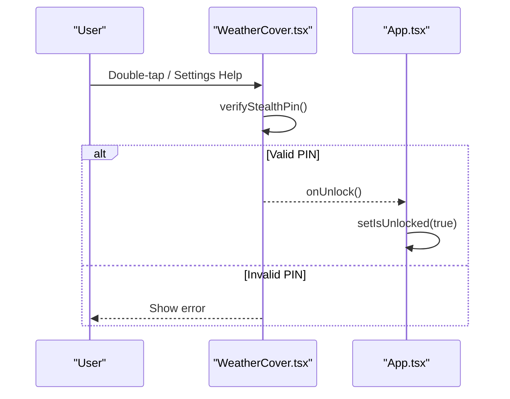

**Diagram sources**
- [WeatherCover.tsx:367-385](file://src/components/WeatherCover.tsx#L367-L385)
- [App.tsx:309-323](file://src/App.tsx#L309-L323)

**Section sources**
- [WeatherCover.tsx:320-447](file://src/components/WeatherCover.tsx#L320-L447)
- [App.tsx:309-323](file://src/App.tsx#L309-L323)

### SafeNavigation: Safe Corridor Module
- Presents search, route selection, active trip simulation, and arrival feedback.
- Integrates with Lahore locations data to generate safe routes and features.
- Can open CrisisModal when user feels unsafe.

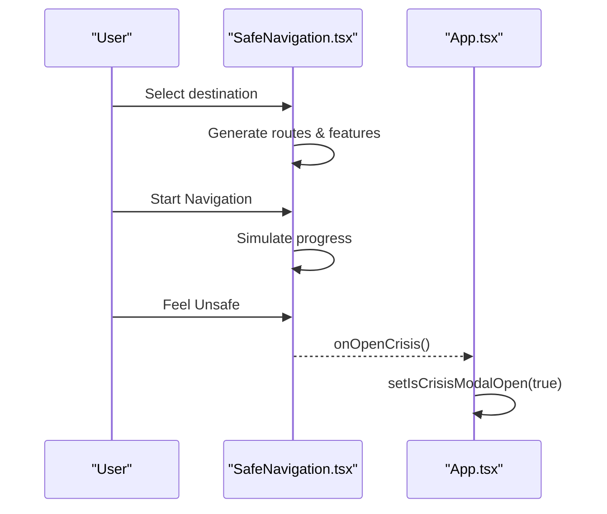

**Diagram sources**
- [SafeNavigation.tsx:49-173](file://src/components/SafeNavigation.tsx#L49-L173)
- [App.tsx:432-438](file://src/App.tsx#L432-L438)

**Section sources**
- [SafeNavigation.tsx:42-173](file://src/components/SafeNavigation.tsx#L42-L173)
- [App.tsx:432-438](file://src/App.tsx#L432-L438)

### LegalAssistant: RAG-Grounded Legal Advisor
- Uses ChatStateProvider to persist conversations across navigation.
- Sends queries to server-side agent with fallback to local orchestrator.
- Handles voice input, photo attachments, location tagging, and auto-readout.
- Bridges to Incident Vault and Complaint Builder via callbacks.

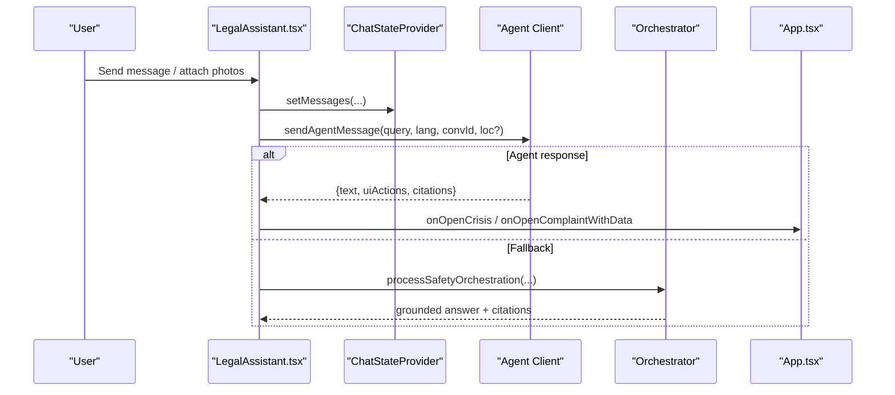

**Diagram sources**
- [LegalAssistant.tsx:114-120](file://src/components/LegalAssistant.tsx#L114-L120)
- [LegalAssistant.tsx:451-583](file://src/components/LegalAssistant.tsx#L451-L583)
- [App.tsx:495-506](file://src/App.tsx#L495-L506)

**Section sources**
- [LegalAssistant.tsx:104-120](file://src/components/LegalAssistant.tsx#L104-L120)
- [LegalAssistant.tsx:451-583](file://src/components/LegalAssistant.tsx#L451-L583)
- [App.tsx:495-506](file://src/App.tsx#L495-L506)

### IncidentVault: Zero-Knowledge Evidence Locker
- Loads encrypted records from storage; persists new records through dataService which encrypts client-side.
- Supports batch export to PDF and export to Complaint Builder.
- Accepts pre-filled draft notes from Legal Assistant.

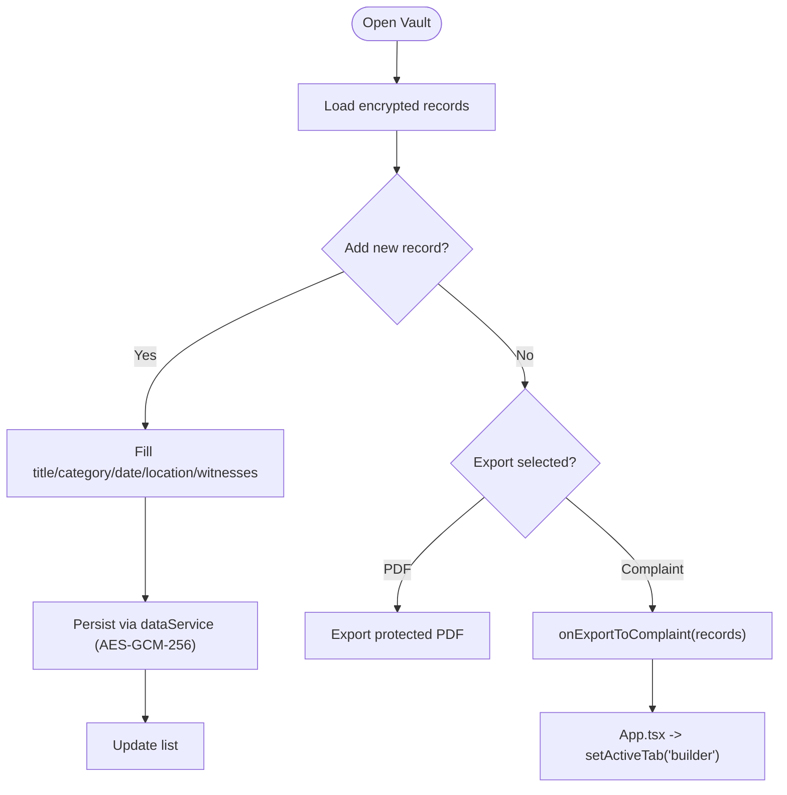

**Diagram sources**
- [IncidentVault.tsx:92-125](file://src/components/IncidentVault.tsx#L92-L125)
- [IncidentVault.tsx:148-185](file://src/components/IncidentVault.tsx#L148-L185)
- [IncidentVault.tsx:202-207](file://src/components/IncidentVault.tsx#L202-L207)
- [App.tsx:250-257](file://src/App.tsx#L250-L257)

**Section sources**
- [IncidentVault.tsx:58-125](file://src/components/IncidentVault.tsx#L58-L125)
- [IncidentVault.tsx:148-207](file://src/components/IncidentVault.tsx#L148-L207)
- [App.tsx:250-257](file://src/App.tsx#L250-L257)

### SilentCheckIn: Destination Safety Timer
- Configures destination, duration, and contacts.
- Starts session with GPS and OSM integration; simulates time progression.
- Can open CrisisModal if needed.

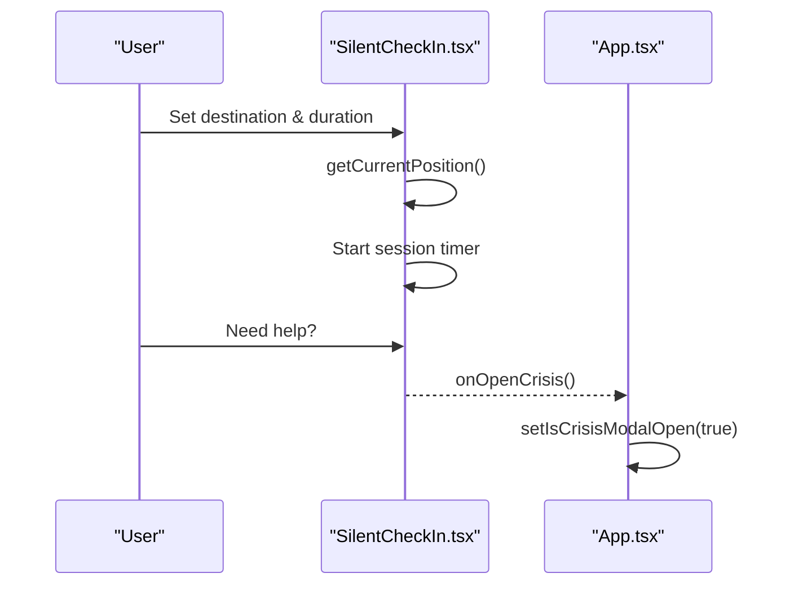

**Diagram sources**
- [SilentCheckIn.tsx:68-77](file://src/components/SilentCheckIn.tsx#L68-L77)
- [SilentCheckIn.tsx:156-200](file://src/components/SilentCheckIn.tsx#L156-L200)
- [App.tsx:448-455](file://src/App.tsx#L448-L455)

**Section sources**
- [SilentCheckIn.tsx:79-200](file://src/components/SilentCheckIn.tsx#L79-L200)
- [App.tsx:448-455](file://src/App.tsx#L448-L455)

### CrisisModal: Immediate Safety Channels
- Provides quick call actions and SOS SMS burst to trusted contacts with live GPS and battery info.
- Communicates with server endpoint for dispatch; handles sign-in requirements and errors.

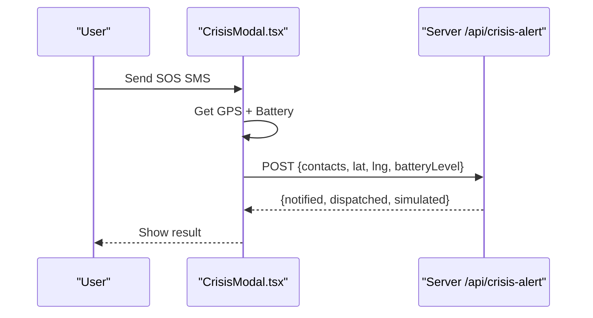

**Diagram sources**
- [CrisisModal.tsx:33-55](file://src/components/CrisisModal.tsx#L33-L55)
- [CrisisModal.tsx:81-114](file://src/components/CrisisModal.tsx#L81-L114)

**Section sources**
- [CrisisModal.tsx:57-114](file://src/components/CrisisModal.tsx#L57-L114)

### ChatStateProvider: Conversation Persistence
- Maintains messages, currentConversationId, and conversationList at app scope.
- Ensures chat survives navigation and remounts; only explicit “New Chat” resets.

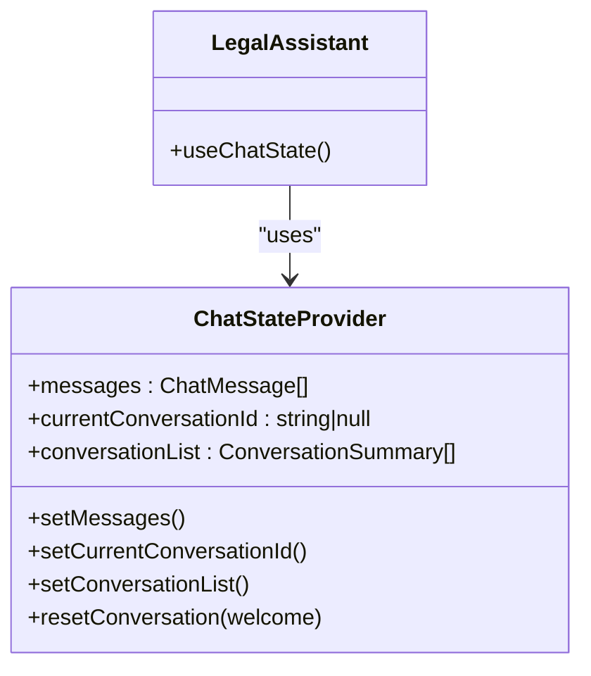

**Diagram sources**
- [chatState.tsx:35-90](file://src/utils/chatState.tsx#L35-L90)
- [LegalAssistant.tsx:114-120](file://src/components/LegalAssistant.tsx#L114-L120)

**Section sources**
- [chatState.tsx:35-90](file://src/utils/chatState.tsx#L35-L90)
- [LegalAssistant.tsx:114-120](file://src/components/LegalAssistant.tsx#L114-L120)

## Dependency Analysis
- App.tsx depends on:
  - types.ts for all shared contracts (ActiveTab, UserProfile, VaultRecord, etc.).
  - Pillar components for each feature surface.
  - ChatStateProvider for conversation state.
  - Auth utilities for session and profile restoration.
- Pillars depend on:
  - App.tsx callbacks to navigate or open modals.
  - Data services and utilities (e.g., dataService, orchestrator, agentClient).
  - External APIs (Supabase, Gemini via server proxy, geolocation, speech APIs).

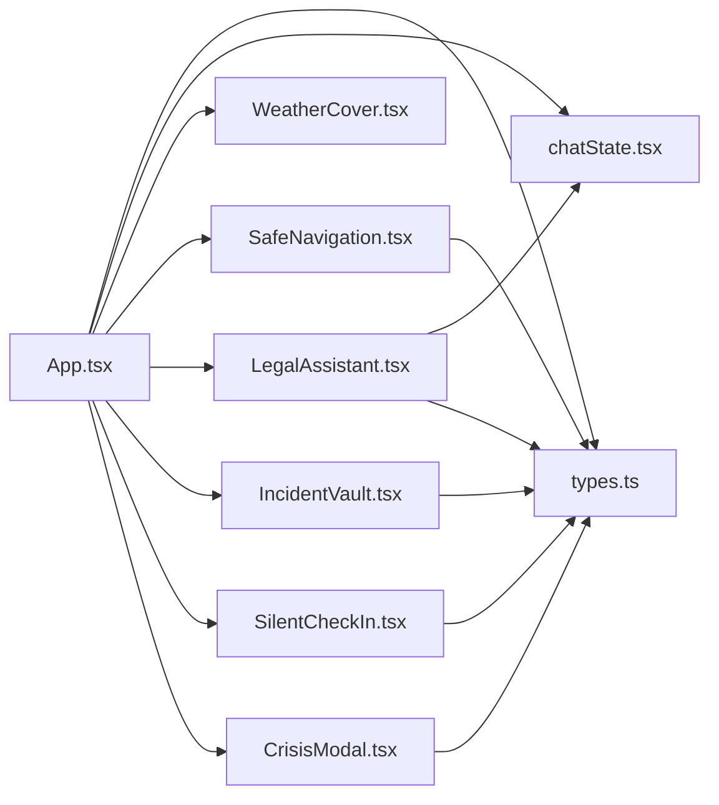

**Diagram sources**
- [App.tsx:6-41](file://src/App.tsx#L6-L41)
- [types.ts:1-557](file://src/types.ts#L1-L557)
- [chatState.tsx:35-90](file://src/utils/chatState.tsx#L35-L90)

**Section sources**
- [App.tsx:6-41](file://src/App.tsx#L6-L41)
- [types.ts:1-557](file://src/types.ts#L1-L557)
- [chatState.tsx:35-90](file://src/utils/chatState.tsx#L35-L90)

## Performance Considerations
- Conditional rendering avoids mounting unused pillars until needed.
- ChatStateProvider centralizes conversation state to prevent unnecessary re-renders and data loss during navigation.
- Offline emergency cache initialization runs once on boot to reduce latency during network outages.
- Voice recognition and speech synthesis are cleaned up on unmount to avoid background processes.

[No sources needed since this section provides general guidance]

## Troubleshooting Guide
- Auth session not restored:
  - Ensure initializeAuth completes and Supabase auth listener fires SIGNED_IN events.
  - Verify needsOnboardingAfterAuth triggers onboarding when appropriate.
- Chat state lost on navigation:
  - Confirm ChatStateProvider is mounted at App level and LegalAssistant uses useChatState.
  - Avoid resetting messages on mount; only reset on explicit “New Chat”.
- Weather cover does not unlock:
  - Verify PIN verification flow and that onUnlock is called on success.
- Crisis SMS fails:
  - Check server availability and authentication headers; handle 401 sign-in required path.

**Section sources**
- [App.tsx:122-190](file://src/App.tsx#L122-L190)
- [LegalAssistant.tsx:114-120](file://src/components/LegalAssistant.tsx#L114-L120)
- [WeatherCover.tsx:367-385](file://src/components/WeatherCover.tsx#L367-L385)
- [CrisisModal.tsx:81-114](file://src/components/CrisisModal.tsx#L81-L114)

## Conclusion
App.tsx acts as the SPA’s nucleus: it gates access via the Weather cover, manages authentication and onboarding, and routes users to the correct pillar using a simple activeTab mechanism. Shared state (user, language, theme, audit logs) and cross-pillar callbacks enable seamless transitions between modules. The ChatStateProvider ensures conversation continuity, while each pillar encapsulates its own domain logic and integrates back into the central shell via well-defined props and callbacks. This design yields a cohesive, privacy-first SPA that composes six distinct safety pillars into one unified experience.