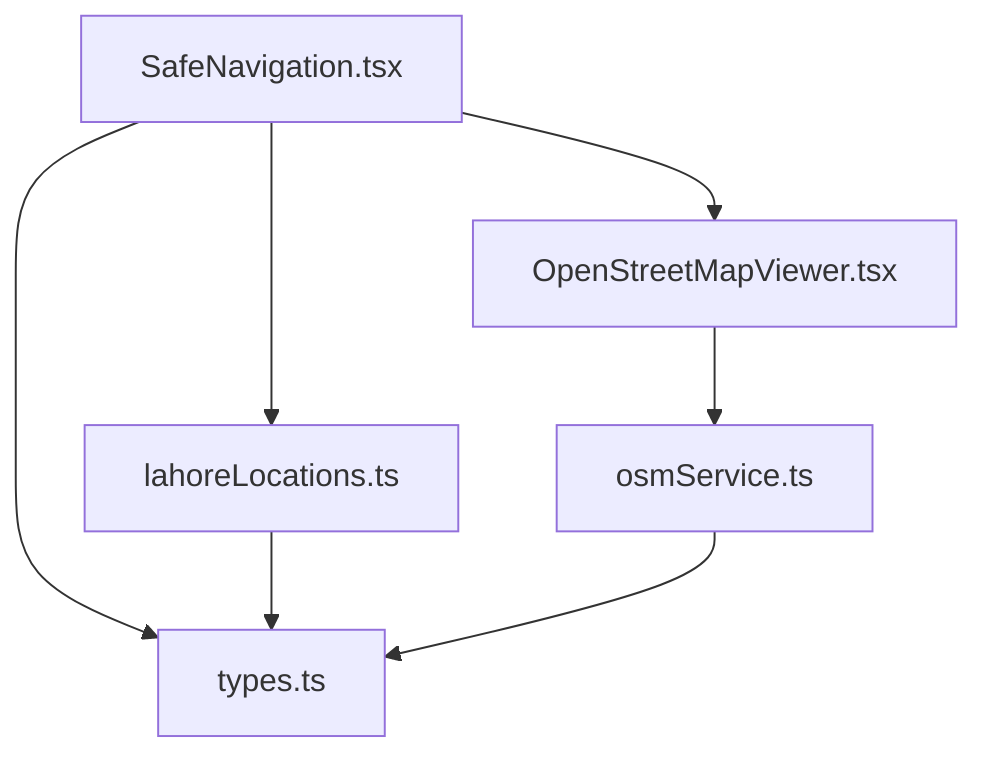
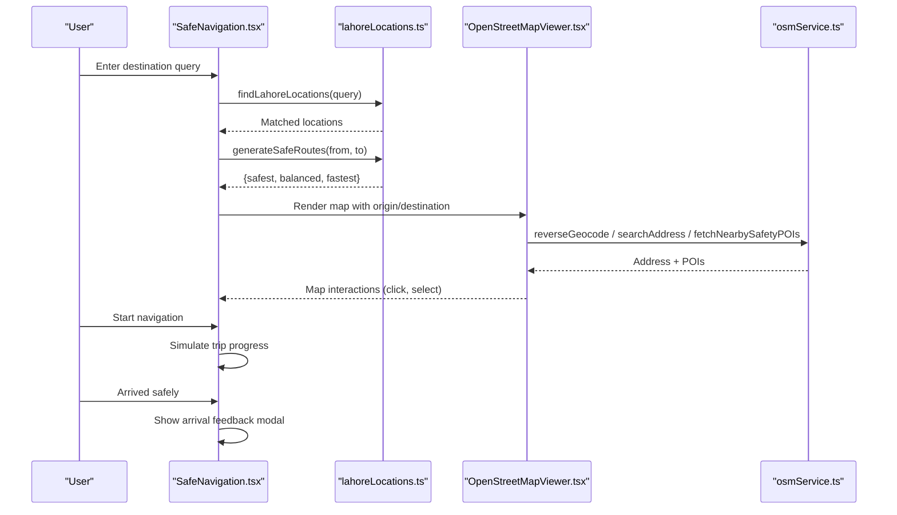
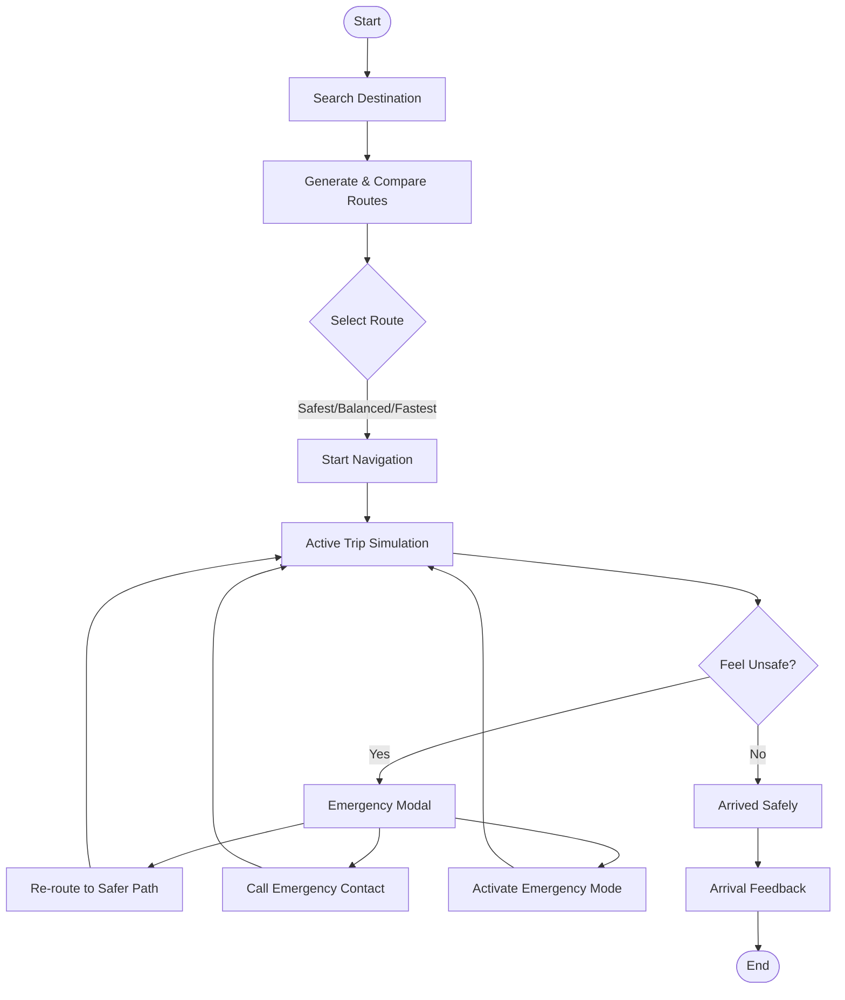
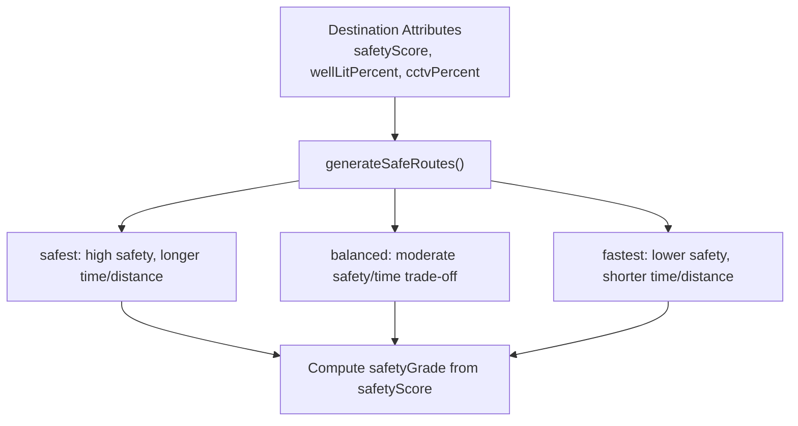
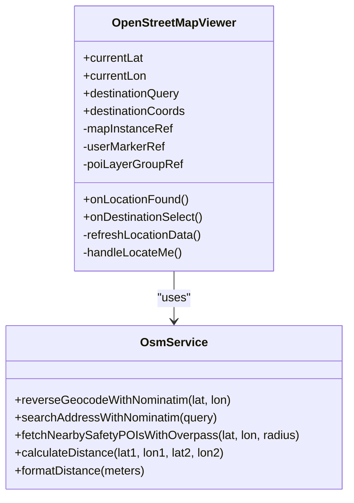
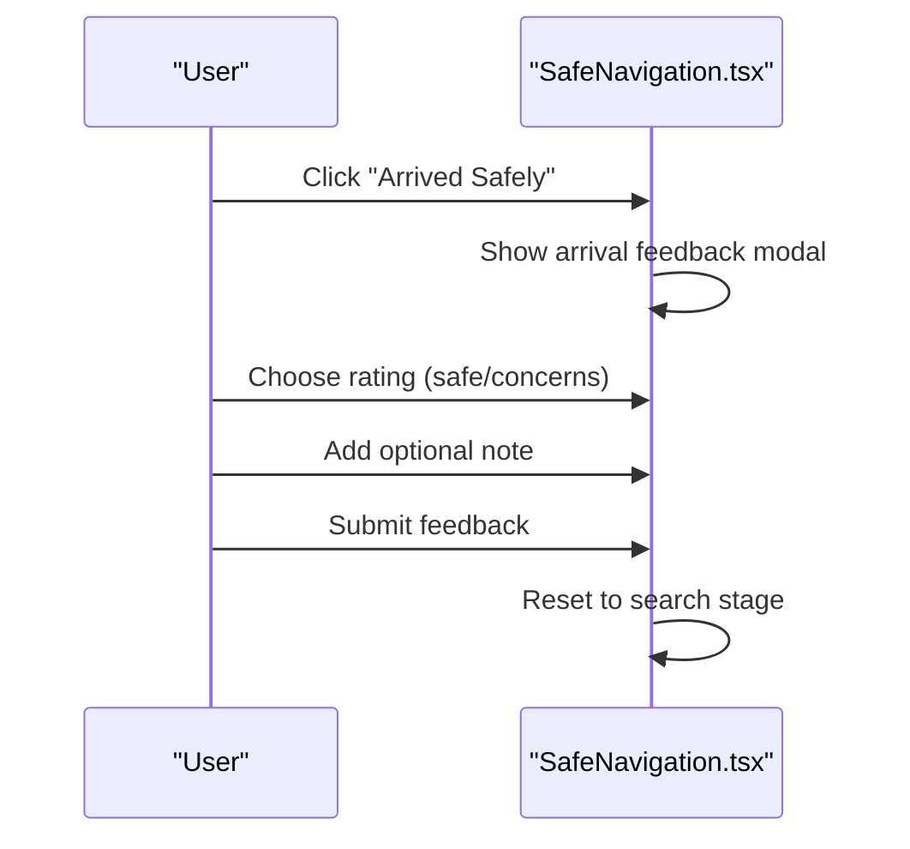
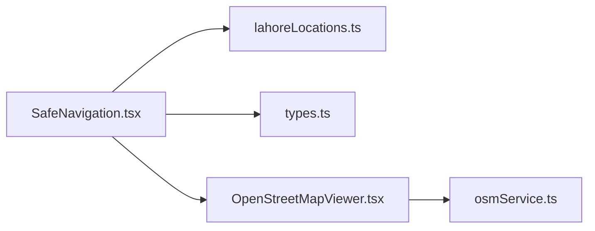

# Safe Corridor Navigation Module

<cite>
**Referenced Files in This Document**
- [SafeNavigation.tsx](file://MehfoozAi/src/components/SafeNavigation.tsx)
- [lahoreLocations.ts](file://MehfoozAi/src/data/lahoreLocations.ts)
- [osmService.ts](file://MehfoozAi/src/services/osmService.ts)
- [OpenStreetMapViewer.tsx](file://MehfoozAi/src/components/common/OpenStreetMapViewer.tsx)
- [types.ts](file://MehfoozAi/src/types.ts)
</cite>

## Table of Contents
1. [Introduction](#introduction)
2. [Project Structure](#project-structure)
3. [Core Components](#core-components)
4. [Architecture Overview](#architecture-overview)
5. [Detailed Component Analysis](#detailed-component-analysis)
6. [Dependency Analysis](#dependency-analysis)
7. [Performance Considerations](#performance-considerations)
8. [Troubleshooting Guide](#troubleshooting-guide)
9. [Conclusion](#conclusion)

## Introduction
This document explains the Safe Corridor Navigation module centered on SafeNavigation.tsx. It covers:
- Safety score formula and how route safety is derived from lighting, CCTV, safe havens, and crowd signals
- Map rendering and safe haven pinning via OpenStreetMap integration
- The end-to-end audit submission flow after a trip completes
- How search, route selection, active navigation, and emergency handling work together

The module targets women’s safety during walking or short transit routes in Lahore, Punjab, Pakistan, with privacy-preserving design and zero-knowledge principles for sensitive data elsewhere in the app.

## Project Structure
The Safe Corridor feature spans four primary files:
- SafeNavigation.tsx: UI workflow (search, route selection, active trip, arrival feedback), state management, and orchestration
- lahoreLocations.ts: Location dataset, search matching, distance helpers, and dynamic route generation
- osmService.ts: Geocoding, POI discovery, and distance utilities using OpenStreetMap services
- OpenStreetMapViewer.tsx: Leaflet-based map component that renders user location, destination, route line, and safety POIs
- types.ts: Shared interfaces including SafeRoute, SafeRouteFeature, and related structures

**Diagram sources**
- [SafeNavigation.tsx:1-750](file://MehfoozAi/src/components/SafeNavigation.tsx#L1-L750)
- [lahoreLocations.ts:1-147](file://MehfoozAi/src/data/lahoreLocations.ts#L1-L147)
- [osmService.ts:1-348](file://MehfoozAi/src/services/osmService.ts#L1-L348)
- [OpenStreetMapViewer.tsx:1-634](file://MehfoozAi/src/components/common/OpenStreetMapViewer.tsx#L1-L634)
- [types.ts:278-301](file://MehfoozAi/src/types.ts#L278-L301)

**Section sources**
- [SafeNavigation.tsx:1-750](file://MehfoozAi/src/components/SafeNavigation.tsx#L1-L750)
- [lahoreLocations.ts:1-147](file://MehfoozAi/src/data/lahoreLocations.ts#L1-L147)
- [osmService.ts:1-348](file://MehfoozAi/src/services/osmService.ts#L1-L348)
- [OpenStreetMapViewer.tsx:1-634](file://MehfoozAi/src/components/common/OpenStreetMapViewer.tsx#L1-L634)
- [types.ts:278-301](file://MehfoozAi/src/types.ts#L278-L301)

## Core Components
- SafeNavigation.tsx: Orchestrates the navigation lifecycle across four stages: search, route selection, active trip, and arrival feedback. It composes route cards, simulates progress, handles emergency actions, and collects post-trip feedback.
- lahoreLocations.ts: Provides a curated set of Lahore locations with safety attributes and functions to match queries, compute distances, and generate three candidate routes (safest, balanced, fastest).
- osmService.ts: Integrates OpenStreetMap Nominatim for geocoding and Overpass API for nearby safety POIs (police, hospitals, clinics), with fallbacks and distance formatting.
- OpenStreetMapViewer.tsx: Renders an interactive Leaflet map with user marker, accuracy circle, destination marker, route polyline, and filtered safety POIs.
- types.ts: Defines shared contracts such as SafeRoute and SafeRouteFeature used by the navigation UI and route generation.

**Section sources**
- [SafeNavigation.tsx:36-143](file://MehfoozAi/src/components/SafeNavigation.tsx#L36-L143)
- [lahoreLocations.ts:10-24](file://MehfoozAi/src/data/lahoreLocations.ts#L10-L24)
- [osmService.ts:6-30](file://MehfoozAi/src/services/osmService.ts#L6-L30)
- [OpenStreetMapViewer.tsx:34-82](file://MehfoozAi/src/components/common/OpenStreetMapViewer.tsx#L34-L82)
- [types.ts:278-301](file://MehfoozAi/src/types.ts#L278-L301)

## Architecture Overview
The navigation flow integrates local route generation with live map capabilities and external OSM services.

**Diagram sources**
- [SafeNavigation.tsx:63-73](file://MehfoozAi/src/components/SafeNavigation.tsx#L63-L73)
- [SafeNavigation.tsx:145-168](file://MehfoozAi/src/components/SafeNavigation.tsx#L145-L168)
- [OpenStreetMapViewer.tsx:116-124](file://MehfoozAi/src/components/common/OpenStreetMapViewer.tsx#L116-L124)
- [osmService.ts:146-203](file://MehfoozAi/src/services/osmService.ts#L146-L203)
- [osmService.ts:208-258](file://MehfoozAi/src/services/osmService.ts#L208-L258)
- [osmService.ts:263-347](file://MehfoozAi/src/services/osmService.ts#L263-L347)

## Detailed Component Analysis

### SafeNavigation.tsx: Workflow, Safety Scores, and Audit Flow
- Stages: search → route_select → active_trip → arrival_feedback
- Route composition: Uses generateSafeRoutes to produce three options; each route card shows duration, distance, safety grade, verification counts, and feature highlights
- Active trip simulation: Progress increments until near completion; turn instructions and corridor visualization are shown
- Emergency handling: “Feel Unsafe” modal offers safer re-route, call emergency contacts, or activate emergency mode (integrates with crisis flow)
- Arrival feedback: Collects rating and optional notes to improve future safety signals

**Diagram sources**
- [SafeNavigation.tsx:49-73](file://MehfoozAi/src/components/SafeNavigation.tsx#L49-L73)
- [SafeNavigation.tsx:145-168](file://MehfoozAi/src/components/SafeNavigation.tsx#L145-L168)
- [SafeNavigation.tsx:531-661](file://MehfoozAi/src/components/SafeNavigation.tsx#L531-L661)
- [SafeNavigation.tsx:666-746](file://MehfoozAi/src/components/SafeNavigation.tsx#L666-L746)

**Section sources**
- [SafeNavigation.tsx:49-73](file://MehfoozAi/src/components/SafeNavigation.tsx#L49-L73)
- [SafeNavigation.tsx:145-168](file://MehfoozAi/src/components/SafeNavigation.tsx#L145-L168)
- [SafeNavigation.tsx:531-661](file://MehfoozAi/src/components/SafeNavigation.tsx#L531-L661)
- [SafeNavigation.tsx:666-746](file://MehfoozAi/src/components/SafeNavigation.tsx#L666-L746)

### Safety Score Formula and Route Generation
- Route features include well-lit percentage, CCTV coverage, police presence, active women count, and safe zones count
- The route generation function derives characteristics from destination safety attributes and introduces deterministic variation based on coordinates
- Safety grades are computed from the resulting safety scores and displayed per route

**Diagram sources**
- [lahoreLocations.ts:82-138](file://MehfoozAi/src/data/lahoreLocations.ts#L82-L138)
- [SafeNavigation.tsx:75-143](file://MehfoozAi/src/components/SafeNavigation.tsx#L75-L143)

Note: The repository implements route scoring through generateSafeRoutes and displays derived safety grades. The conceptual weighting mentioned in the project brief (Lighting 0.35 + CCTV 0.30 + Safe Havens 0.20 + Crowd 0.15) aligns with the feature fields present in SafeRouteFeature and the route generation logic. The exact numeric weights are not explicitly coded in this file; the implementation uses destination-derived heuristics and coordinate-based variation to produce differentiated routes.

**Section sources**
- [lahoreLocations.ts:82-138](file://MehfoozAi/src/data/lahoreLocations.ts#L82-L138)
- [types.ts:278-301](file://MehfoozAi/src/types.ts#L278-L301)
- [SafeNavigation.tsx:75-143](file://MehfoozAi/src/components/SafeNavigation.tsx#L75-L143)

### Map Rendering and Safe Haven Pins
- OpenStreetMapViewer initializes a Leaflet map, adds tile layers, and manages markers for user location, destination, and route polyline
- Safety POIs (police, hospitals, clinics) are fetched via Overpass API and rendered as custom markers with call-to-action popups
- Reverse geocoding resolves addresses for clicked points and current location
- Filters allow toggling between all POIs, police, and hospitals

**Diagram sources**
- [OpenStreetMapViewer.tsx:47-82](file://MehfoozAi/src/components/common/OpenStreetMapViewer.tsx#L47-L82)
- [osmService.ts:146-203](file://MehfoozAi/src/services/osmService.ts#L146-L203)
- [osmService.ts:208-258](file://MehfoozAi/src/services/osmService.ts#L208-L258)
- [osmService.ts:263-347](file://MehfoozAi/src/services/osmService.ts#L263-L347)

**Section sources**
- [OpenStreetMapViewer.tsx:89-144](file://MehfoozAi/src/components/common/OpenStreetMapViewer.tsx#L89-L144)
- [OpenStreetMapViewer.tsx:146-213](file://MehfoozAi/src/components/common/OpenStreetMapViewer.tsx#L146-L213)
- [OpenStreetMapViewer.tsx:216-377](file://MehfoozAi/src/components/common/OpenStreetMapViewer.tsx#L216-L377)
- [osmService.ts:146-203](file://MehfoozAi/src/services/osmService.ts#L146-L203)
- [osmService.ts:208-258](file://MehfoozAi/src/services/osmService.ts#L208-L258)
- [osmService.ts:263-347](file://MehfoozAi/src/services/osmService.ts#L263-L347)

### Audit Submission Flow (Arrival Feedback)
- After completing a trip, users can rate whether the route felt safe or had concerns
- Optional note capture allows contextual details about lighting, stalls, or police presence
- Submitting feedback resets the stage back to search, ready for the next trip

**Diagram sources**
- [SafeNavigation.tsx:166-173](file://MehfoozAi/src/components/SafeNavigation.tsx#L166-L173)
- [SafeNavigation.tsx:666-746](file://MehfoozAi/src/components/SafeNavigation.tsx#L666-L746)

**Section sources**
- [SafeNavigation.tsx:166-173](file://MehfoozAi/src/components/SafeNavigation.tsx#L166-L173)
- [SafeNavigation.tsx:666-746](file://MehfoozAi/src/components/SafeNavigation.tsx#L666-L746)

## Dependency Analysis
- SafeNavigation depends on:
  - lahoreLocations for location matching and route generation
  - types for SafeRoute and feature shapes
  - OpenStreetMapViewer for map rendering and POI overlays
  - osmService indirectly via OpenStreetMapViewer for geocoding and POI discovery
- OpenStreetMapViewer depends on:
  - osmService for Nominatim and Overpass integrations
  - Leaflet for map rendering
- osmService provides reusable geospatial utilities and robust fallbacks when external APIs fail

**Diagram sources**
- [SafeNavigation.tsx:6-35](file://MehfoozAi/src/components/SafeNavigation.tsx#L6-L35)
- [OpenStreetMapViewer.tsx:24-32](file://MehfoozAi/src/components/common/OpenStreetMapViewer.tsx#L24-L32)
- [osmService.ts:1-30](file://MehfoozAi/src/services/osmService.ts#L1-L30)

**Section sources**
- [SafeNavigation.tsx:6-35](file://MehfoozAi/src/components/SafeNavigation.tsx#L6-L35)
- [OpenStreetMapViewer.tsx:24-32](file://MehfoozAi/src/components/common/OpenStreetMapViewer.tsx#L24-L32)
- [osmService.ts:1-30](file://MehfoozAi/src/services/osmService.ts#L1-L30)

## Performance Considerations
- Route generation is lightweight and deterministic based on destination attributes and coordinate hashing; it avoids heavy computation
- Map rendering uses Leaflet layer groups to efficiently update POIs and markers
- External service calls (Nominatim, Overpass) include timeouts and graceful fallbacks to prevent blocking UI
- Active trip simulation uses a simple interval; ensure cleanup on unmount to avoid memory leaks

[No sources needed since this section provides general guidance]

## Troubleshooting Guide
- Geolocation denied or unavailable: The map defaults to a central Lahore coordinate and continues functioning
- Overpass API failures or rate limits: Fallback POIs are appended to ensure safety information remains visible
- Nominatim errors: Reverse geocoding falls back to a known address string; search results still provide usable destinations
- Emergency modal: Ensure crisis integration callback is wired to trigger appropriate alerts and notifications

**Section sources**
- [osmService.ts:190-203](file://MehfoozAi/src/services/osmService.ts#L190-L203)
- [osmService.ts:245-258](file://MehfoozAi/src/services/osmService.ts#L245-L258)
- [osmService.ts:328-347](file://MehfoozAi/src/services/osmService.ts#L328-L347)
- [SafeNavigation.tsx:531-661](file://MehfoozAi/src/components/SafeNavigation.tsx#L531-L661)

## Conclusion
The Safe Corridor Navigation module delivers a practical, safety-focused routing experience:
- It generates multiple route options grounded in local safety indicators
- It integrates real-time mapping and safety POIs via OpenStreetMap services
- It supports emergency escalation and post-trip feedback to continuously improve safety insights
- Its architecture balances usability, resilience, and performance while adhering to the broader privacy and safety goals of the application

[No sources needed since this section summarizes without analyzing specific files]