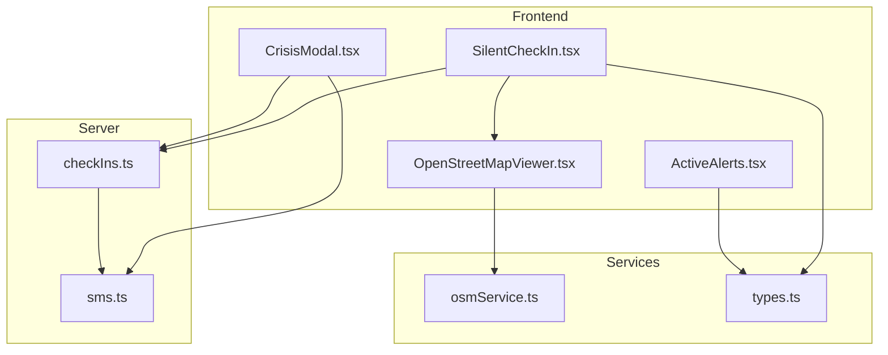
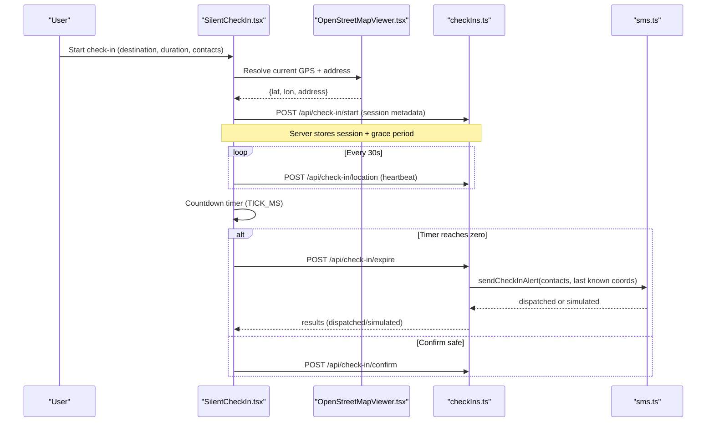
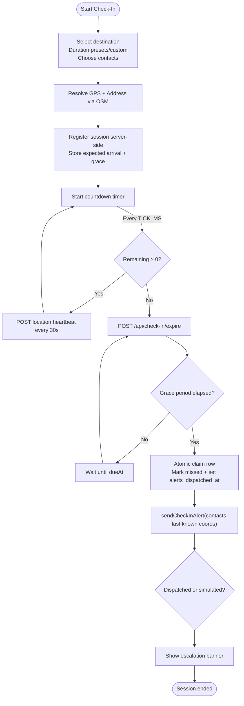
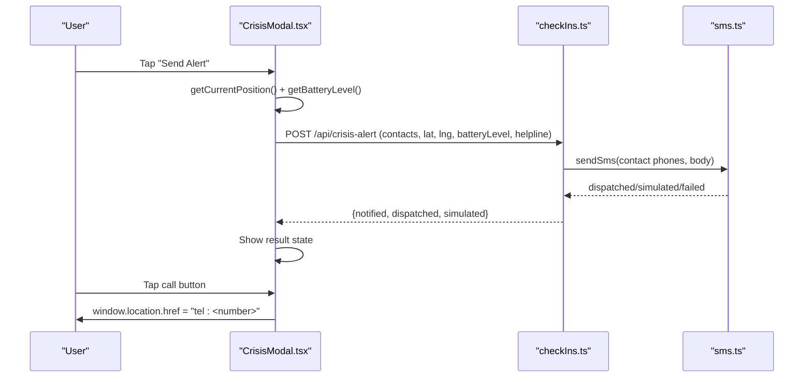
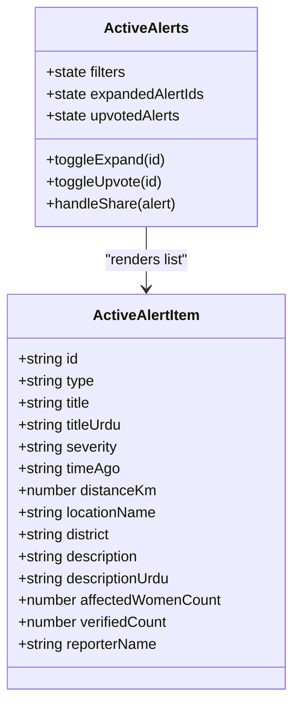
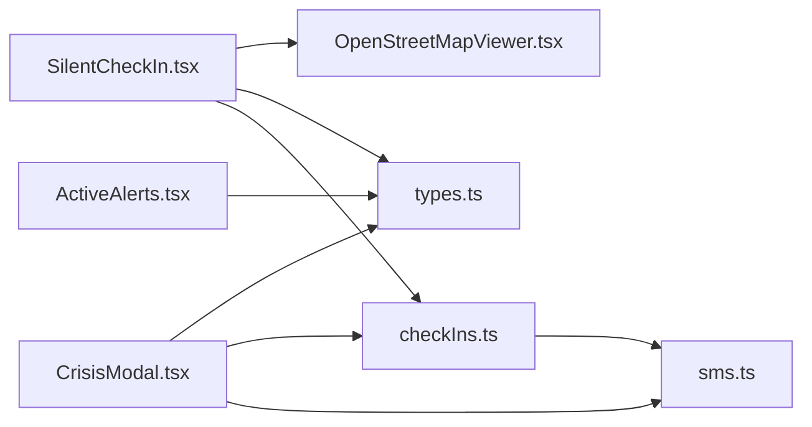

# Silent Check-In & SOS Engine

<cite>
**Referenced Files in This Document**
- [SilentCheckIn.tsx](file://src/components/SilentCheckIn.tsx)
- [CrisisModal.tsx](file://src/components/CrisisModal.tsx)
- [ActiveAlerts.tsx](file://src/components/ActiveAlerts.tsx)
- [types.ts](file://src/types.ts)
- [OpenStreetMapViewer.tsx](file://src/components/common/OpenStreetMapViewer.tsx)
- [osmService.ts](file://src/services/osmService.ts)
- [checkIns.ts](file://server/checkIns.ts)
- [sms.ts](file://server/sms.ts)
</cite>

## Table of Contents
1. [Introduction](#introduction)
2. [Project Structure](#project-structure)
3. [Core Components](#core-components)
4. [Architecture Overview](#architecture-overview)
5. [Detailed Component Analysis](#detailed-component-analysis)
6. [Dependency Analysis](#dependency-analysis)
7. [Performance Considerations](#performance-considerations)
8. [Troubleshooting Guide](#troubleshooting-guide)
9. [Conclusion](#conclusion)

## Introduction
This document explains the Silent Check-In and SOS Engine implemented across three core components: SilentCheckIn.tsx, CrisisModal.tsx, and ActiveAlerts.tsx. It covers journey timer countdown with grace period logic, automatic SMS dispatch with GPS coordinates, one-tap SOS hold-to-activate flows, and helpline telephony integration. The system integrates live OpenStreetMap tracking, server-side monitoring, and Twilio-based SMS (with graceful simulated fallback), while keeping user privacy and safety as priorities.

## Project Structure
The engine spans UI components, shared map utilities, type definitions, and server endpoints:
- UI layer: SilentCheckIn.tsx (journey timer, parent notifications, session controls), CrisisModal.tsx (SOS SMS burst and helpline calls), ActiveAlerts.tsx (community alerts and navigation prompts).
- Shared mapping: OpenStreetMapViewer.tsx and osmService.ts provide geolocation, reverse geocoding, POI discovery, and distance calculations.
- Types: types.ts defines session states, contacts, and alert models used by all components.
- Server: checkIns.ts implements check-in lifecycle endpoints; sms.ts handles Twilio SMS dispatch with rate limiting and simulation.

**Diagram sources**
- [SilentCheckIn.tsx:1-1034](file://src/components/SilentCheckIn.tsx#L1-L1034)
- [CrisisModal.tsx:1-314](file://src/components/CrisisModal.tsx#L1-L314)
- [ActiveAlerts.tsx:1-491](file://src/components/ActiveAlerts.tsx#L1-L491)
- [OpenStreetMapViewer.tsx:1-568](file://src/components/common/OpenStreetMapViewer.tsx#L1-L568)
- [osmService.ts:173-221](file://src/services/osmService.ts#L173-L221)
- [checkIns.ts:270-469](file://server/checkIns.ts#L270-L469)
- [sms.ts:1-200](file://server/sms.ts#L1-L200)

**Section sources**
- [SilentCheckIn.tsx:1-1034](file://src/components/SilentCheckIn.tsx#L1-L1034)
- [CrisisModal.tsx:1-314](file://src/components/CrisisModal.tsx#L1-L314)
- [ActiveAlerts.tsx:1-491](file://src/components/ActiveAlerts.tsx#L1-L491)
- [types.ts:303-325](file://src/types.ts#L303-L325)
- [OpenStreetMapViewer.tsx:1-568](file://src/components/common/OpenStreetMapViewer.tsx#L1-L568)
- [osmService.ts:173-221](file://src/services/osmService.ts#L173-L221)
- [checkIns.ts:270-469](file://server/checkIns.ts#L270-L469)
- [sms.ts:1-200](file://server/sms.ts#L1-L200)

## Core Components
- SilentCheckIn.tsx: Journey setup, interactive map selection, duration presets/custom input, parent notification payload generation, active session player with countdown, extension, safe confirmation, missed-check-in escalation, periodic GPS heartbeat to server, and server session registration for background monitoring.
- CrisisModal.tsx: One-tap SOS SMS burst to trusted contacts including live GPS and battery level, direct telephony links to emergency numbers, quick exit to weather cover, and status feedback for SMS dispatch outcomes.
- ActiveAlerts.tsx: Community-sourced safety alerts with severity, location, verification signals, expandable details, share/copy actions, and navigation prompts to safer routes.

**Section sources**
- [SilentCheckIn.tsx:156-399](file://src/components/SilentCheckIn.tsx#L156-L399)
- [CrisisModal.tsx:72-114](file://src/components/CrisisModal.tsx#L72-L114)
- [ActiveAlerts.tsx:48-149](file://src/components/ActiveAlerts.tsx#L48-L149)

## Architecture Overview
The engine combines client-side timers and geolocation with server-side persistence and SMS dispatch. A check-in session is created on the client, optionally persisted to the server for background monitoring, and emits periodic GPS heartbeats. If the session expires without confirmation, a grace period is enforced before an atomic claim triggers SMS alerts to selected contacts. The SOS modal provides immediate contact via tel: URIs and a server-dispatched SMS burst.

**Diagram sources**
- [SilentCheckIn.tsx:156-399](file://src/components/SilentCheckIn.tsx#L156-L399)
- [OpenStreetMapViewer.tsx:146-169](file://src/components/common/OpenStreetMapViewer.tsx#L146-L169)
- [checkIns.ts:270-469](file://server/checkIns.ts#L270-L469)
- [sms.ts:106-200](file://server/sms.ts#L106-L200)

## Detailed Component Analysis

### SilentCheckIn.tsx: Journey Timer, Grace Period, Auto-SMS, Heartbeat
- Timer and compression: Uses a compressed tick interval to simulate minutes faster during demo; real-time mode uses a 60-second tick. The countdown decrements per tick until zero.
- Parent notification payload: Builds a message containing timestamp, selected contacts, current GPS, destination, expected arrival time, and OpenStreetMap tracking link. Displays a high-visibility banner and optional modal to confirm dispatch.
- Server session registration: Attempts to register the session server-side with destination, expected minutes, grace period, contacts, and initial GPS. Failure falls back to local-only mode.
- Missed check-in flow: When remaining minutes reach zero, the component calls the expire endpoint. The server enforces grace period, performs an atomic claim to avoid duplicate sends, and dispatches SMS alerts with last known coordinates.
- Location heartbeat: Periodically posts current GPS to the server to keep last known location fresh for alerts.
- Session controls: Extend time (+15 min), confirm safe arrival (clears session and notifies server), cancel session.

**Diagram sources**
- [SilentCheckIn.tsx:259-324](file://src/components/SilentCheckIn.tsx#L259-L324)
- [checkIns.ts:276-341](file://server/checkIns.ts#L276-L341)
- [sms.ts:106-200](file://server/sms.ts#L106-L200)

**Section sources**
- [SilentCheckIn.tsx:62-77](file://src/components/SilentCheckIn.tsx#L62-L77)
- [SilentCheckIn.tsx:156-257](file://src/components/SilentCheckIn.tsx#L156-L257)
- [SilentCheckIn.tsx:259-324](file://src/components/SilentCheckIn.tsx#L259-L324)
- [SilentCheckIn.tsx:326-399](file://src/components/SilentCheckIn.tsx#L326-L399)
- [checkIns.ts:276-341](file://server/checkIns.ts#L276-L341)

### CrisisModal.tsx: One-Tap SOS Hold-to-Activate, Helpline Telephony
- SOS SMS burst: Collects live GPS and battery level, then posts to /api/crisis-alert with contacts and helpline context. Server returns counts for notified/dispatched/simulated messages.
- Telephony integration: Directly initiates calls to Punjab Police 15, Virtual Women Police Station (option 2), and Punjab Women Helpline 1043 using tel: URIs.
- Quick exit: Provides instant escape to weather cover screen for stealth.
- Error handling: Shows sign-in required, error, or success states based on server response and authentication.

**Diagram sources**
- [CrisisModal.tsx:72-114](file://src/components/CrisisModal.tsx#L72-L114)
- [checkIns.ts:450-516](file://server/checkIns.ts#L450-L516)
- [sms.ts:106-200](file://server/sms.ts#L106-L200)

**Section sources**
- [CrisisModal.tsx:33-55](file://src/components/CrisisModal.tsx#L33-L55)
- [CrisisModal.tsx:72-114](file://src/components/CrisisModal.tsx#L72-L114)
- [CrisisModal.tsx:218-290](file://src/components/CrisisModal.tsx#L218-L290)
- [checkIns.ts:450-516](file://server/checkIns.ts#L450-L516)

### ActiveAlerts.tsx: Community Safety Alerts and Navigation Prompts
- Alert cards: Display severity, time ago, distance, location name, verified count, and reporter info. Expandable scenarios include full descriptions and safety guidance.
- Filters and interactions: Filter by nearby radius, expand/collapse all, upvote alerts, copy/share alert text.
- Navigation prompt: Offers “Navigate Safer Route” action to integrate with Safe Corridor Navigation.

**Diagram sources**
- [ActiveAlerts.tsx:48-149](file://src/components/ActiveAlerts.tsx#L48-L149)
- [types.ts:374-403](file://src/types.ts#L374-L403)

**Section sources**
- [ActiveAlerts.tsx:153-489](file://src/components/ActiveAlerts.tsx#L153-L489)
- [types.ts:374-403](file://src/types.ts#L374-L403)

## Dependency Analysis
- SilentCheckIn depends on:
  - OpenStreetMapViewer for GPS acquisition, reverse geocoding, and POI search.
  - types.ts for SilentCheckInSession, UserContact, and related models.
  - Server endpoints in checkIns.ts for start, expire, extend, confirm, cancel, and location updates.
  - sms.ts indirectly via server endpoints for SMS dispatch when sessions expire.
- CrisisModal depends on:
  - types.ts for UserContact.
  - Server endpoint /api/crisis-alert in checkIns.ts and sms.ts for SMS dispatch.
  - Browser telephony via tel: URIs for helpline calls.
- ActiveAlerts depends on:
  - types.ts for ActiveAlertItem and UserProfile.
  - Optional integration with Safe Corridor Navigation via callback props.

**Diagram sources**
- [SilentCheckIn.tsx:1-1034](file://src/components/SilentCheckIn.tsx#L1-L1034)
- [CrisisModal.tsx:1-314](file://src/components/CrisisModal.tsx#L1-L314)
- [ActiveAlerts.tsx:1-491](file://src/components/ActiveAlerts.tsx#L1-L491)
- [types.ts:303-325](file://src/types.ts#L303-L325)
- [checkIns.ts:270-469](file://server/checkIns.ts#L270-L469)
- [sms.ts:1-200](file://server/sms.ts#L1-L200)

**Section sources**
- [SilentCheckIn.tsx:1-1034](file://src/components/SilentCheckIn.tsx#L1-L1034)
- [CrisisModal.tsx:1-314](file://src/components/CrisisModal.tsx#L1-L314)
- [ActiveAlerts.tsx:1-491](file://src/components/ActiveAlerts.tsx#L1-L491)
- [types.ts:303-325](file://src/types.ts#L303-L325)
- [checkIns.ts:270-469](file://server/checkIns.ts#L270-L469)
- [sms.ts:1-200](file://server/sms.ts#L1-L200)

## Performance Considerations
- Timer compression: TICK_MS accelerates demo timing; production should use 60,000 ms for real-time behavior to reduce unnecessary network calls and preserve battery.
- GPS heartbeats: 30-second intervals balance freshness with power usage; consider adaptive intervals based on movement detection.
- Rate limiting: SMS dispatch is limited to 5 per hour per user to prevent abuse and manage costs; server logs violations and provides retry-after guidance.
- Map queries: Nominatim and Overpass requests are bounded by timeouts and retries; offline or rate-limited conditions fall back gracefully to cached or default addresses.

[No sources needed since this section provides general guidance]

## Troubleshooting Guide
- Missing GPS: Ensure browser permissions allow geolocation; if unavailable, components fall back to default coordinates and addresses.
- Authentication errors: Crisis SMS requires sign-in; if 401 is returned, prompt user to sign in before sending alerts.
- SMS not delivered: If Twilio credentials are not configured, messages are simulated; verify environment variables and server configuration for real delivery.
- Grace period not triggering: Verify server’s grace_period_minutes and expected_arrival timestamps; ensure session remains active and unalerted.
- Map loading issues: Network failures or rate limits may delay POI data; refresh location or retry later.

**Section sources**
- [CrisisModal.tsx:96-113](file://src/components/CrisisModal.tsx#L96-L113)
- [sms.ts:56-76](file://server/sms.ts#L56-L76)
- [checkIns.ts:276-341](file://server/checkIns.ts#L276-L341)
- [OpenStreetMapViewer.tsx:146-169](file://src/components/common/OpenStreetMapViewer.tsx#L146-L169)

## Conclusion
The Silent Check-In & SOS Engine provides a robust, privacy-preserving safety workflow: users initiate journeys with transparent parent notifications, receive timely escalation if they miss check-ins after a grace period, and can trigger immediate SOS alerts with GPS and battery context. Helpline telephony integration offers direct access to emergency services. The architecture balances client-side responsiveness with server-side reliability, ensuring alerts are dispatched even if the app closes, while maintaining strict rate limits and audit trails.

[No sources needed since this section summarizes without analyzing specific files]