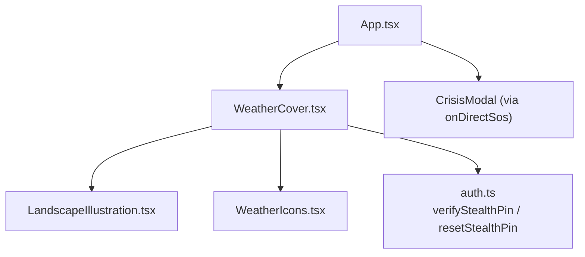
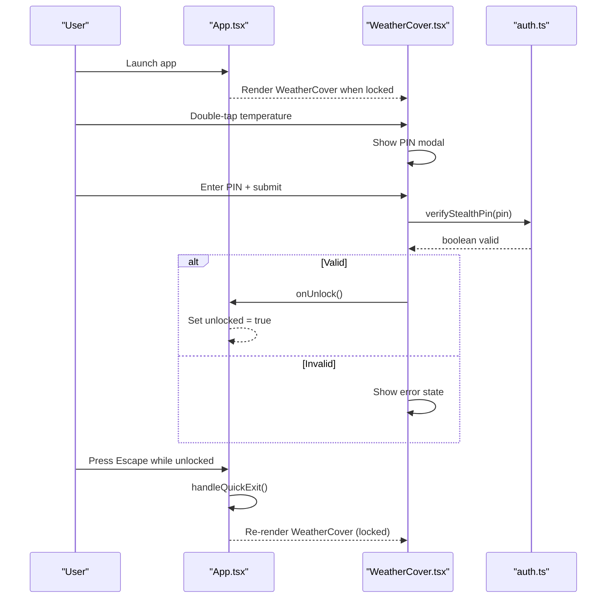
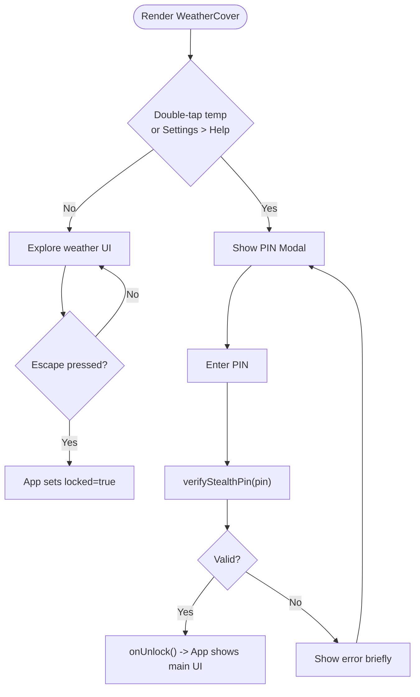
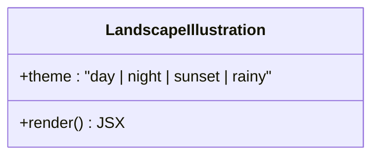
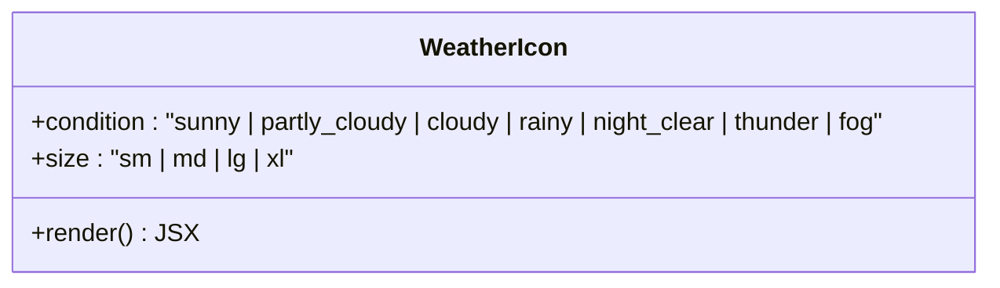
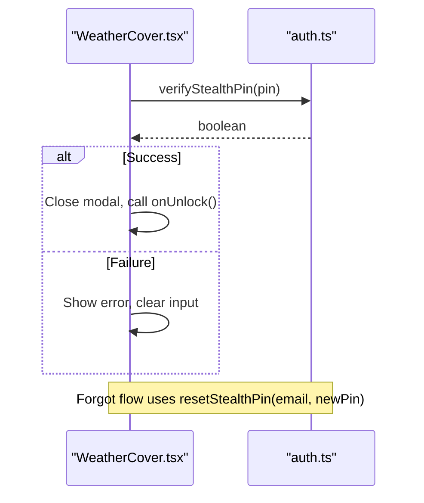
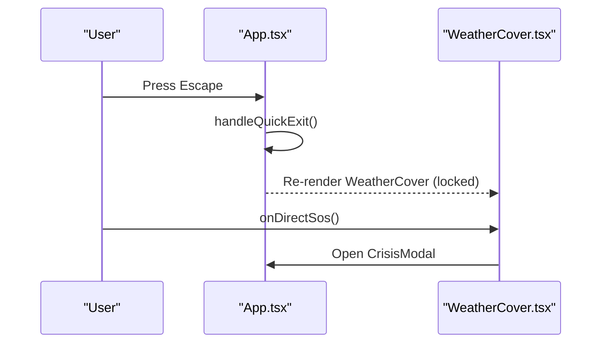
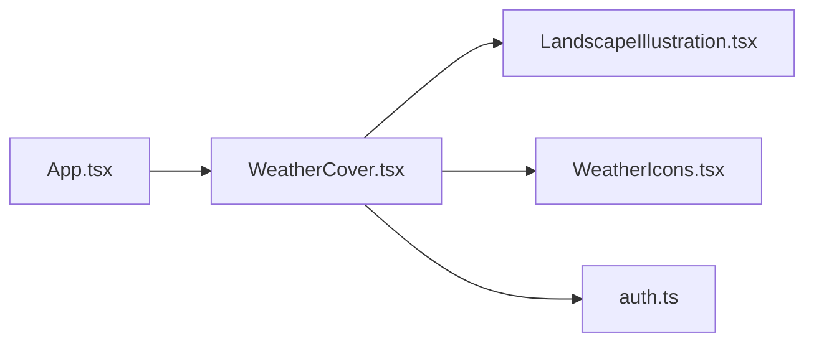

# Stealth Weather Cover Module

<cite>
**Referenced Files in This Document**
- [WeatherCover.tsx](file://src/components/WeatherCover.tsx)
- [LandscapeIllustration.tsx](file://src/components/weather/LandscapeIllustration.tsx)
- [WeatherIcons.tsx](file://src/components/weather/WeatherIcons.tsx)
- [auth.ts](file://src/utils/auth.ts)
- [App.tsx](file://src/App.tsx)
</cite>

## Table of Contents
1. [Introduction](#introduction)
2. [Project Structure](#project-structure)
3. [Core Components](#core-components)
4. [Architecture Overview](#architecture-overview)
5. [Detailed Component Analysis](#detailed-component-analysis)
6. [Dependency Analysis](#dependency-analysis)
7. [Performance Considerations](#performance-considerations)
8. [Troubleshooting Guide](#troubleshooting-guide)
9. [Conclusion](#conclusion)

## Introduction
This document explains the Stealth Weather Cover module that disguises the application as a Tuscany meteorological station. It covers rendering, stealth triggers (double-tap on temperature, long-press removed per note), Escape key panic escape, PIN pad with forgot-password recovery, and station switching across multiple cities. The module is the first layer users see when the app is locked; unlocking reveals the real SafePath interface.

## Project Structure
The weather cover consists of:
- A primary component that renders the disguise UI and handles all stealth interactions.
- A landscape illustration component for atmospheric backgrounds and themes.
- A reusable weather icon set used throughout the cover UI.
- An authentication utility that verifies the stealth PIN and supports reset flows.
- The root App controller that mounts the weather cover when the app is locked and routes to it via quick exit.

**Diagram sources**
- [App.tsx:309-323](file://src/App.tsx#L309-L323)
- [WeatherCover.tsx:320-351](file://src/components/WeatherCover.tsx#L320-L351)
- [WeatherCover.tsx:40-42](file://src/components/WeatherCover.tsx#L40-L42)
- [LandscapeIllustration.tsx:11-14](file://src/components/weather/LandscapeIllustration.tsx#L11-L14)
- [WeatherIcons.tsx:10-14](file://src/components/weather/WeatherIcons.tsx#L10-L14)
- [auth.ts:394-425](file://src/utils/auth.ts#L394-L425)

**Section sources**
- [App.tsx:309-323](file://src/App.tsx#L309-L323)
- [WeatherCover.tsx:320-351](file://src/components/WeatherCover.tsx#L320-L351)

## Core Components
- WeatherCover: Disguised weather UI, city selector, theme switcher, bottom sheet details, PIN modal, and stealth triggers.
- LandscapeIllustration: SVG-based scenic background with day/sunset/night/rainy themes.
- WeatherIcons: Reusable SVG icons for weather conditions.
- auth utilities: verifyStealthPin and resetStealthPin for secure unlock and recovery.

Key responsibilities:
- Render a plausible weather app at all times when locked.
- Provide covert access to the real app via PIN verification.
- Offer quick panic return to weather via Escape or direct SOS from cover.
- Allow switching between multiple “stations” (cities) to enhance realism.

**Section sources**
- [WeatherCover.tsx:44-88](file://src/components/WeatherCover.tsx#L44-L88)
- [WeatherCover.tsx:90-318](file://src/components/WeatherCover.tsx#L90-L318)
- [LandscapeIllustration.tsx:16-361](file://src/components/weather/LandscapeIllustration.tsx#L16-L361)
- [WeatherIcons.tsx:16-119](file://src/components/weather/WeatherIcons.tsx#L16-L119)
- [auth.ts:394-486](file://src/utils/auth.ts#L394-L486)

## Architecture Overview
The weather cover is mounted by the root App whenever the app is not unlocked. It listens for user interactions to trigger unlock or panic behaviors. Unlocking calls into the authentication layer to validate the PIN against stored hashes. Panic behavior returns the app to the weather cover immediately.

**Diagram sources**
- [App.tsx:215-232](file://src/App.tsx#L215-L232)
- [App.tsx:309-323](file://src/App.tsx#L309-L323)
- [WeatherCover.tsx:544-556](file://src/components/WeatherCover.tsx#L544-L556)
- [WeatherCover.tsx:367-385](file://src/components/WeatherCover.tsx#L367-L385)
- [auth.ts:394-425](file://src/utils/auth.ts#L394-L425)

## Detailed Component Analysis

### WeatherCover: Disguise Rendering and Triggers
- Disguise surface: Full-screen weather display with header, hero temperature, condition text, and an expandable bottom sheet showing hourly/daily forecasts and metrics.
- Station switching: Side drawer menu lists multiple cities (including Tuscany variants and Pakistan locations). Selecting a city updates displayed data and theme.
- Theme switching: Quick pill controls switch between Day, Night, and Sunrise layouts/themes.
- Temperature unit toggle: Celsius/Fahrenheit conversion applied across the UI.
- Stealth triggers:
  - Double-tap on the temperature area opens the PIN modal.
  - Settings → Help entry opens the PIN modal.
  - Note: Long-press unlock was removed per comment; access is via Settings → Help → Password.
  - Global Escape key handler in App forces quick exit back to weather cover.
- PIN modal:
  - Text input with show/hide visibility.
  - Submit validates via verifyStealthPin; success unlocks the app.
  - Forgot password flow: email validation against cached profile, then new PIN creation with resetStealthPin.
- Direct SOS: Optional callback to open crisis modal directly from the cover.

**Diagram sources**
- [WeatherCover.tsx:544-556](file://src/components/WeatherCover.tsx#L544-L556)
- [WeatherCover.tsx:367-385](file://src/components/WeatherCover.tsx#L367-L385)
- [App.tsx:215-232](file://src/App.tsx#L215-L232)

**Section sources**
- [WeatherCover.tsx:320-351](file://src/components/WeatherCover.tsx#L320-L351)
- [WeatherCover.tsx:453-645](file://src/components/WeatherCover.tsx#L453-L645)
- [WeatherCover.tsx:647-821](file://src/components/WeatherCover.tsx#L647-L821)
- [WeatherCover.tsx:823-950](file://src/components/WeatherCover.tsx#L823-L950)
- [WeatherCover.tsx:952-1148](file://src/components/WeatherCover.tsx#L952-L1148)
- [App.tsx:215-232](file://src/App.tsx#L215-L232)

### Landscape Illustration: Themed Backgrounds
- Provides layered SVG backgrounds with gradients for sky, hills, and foreground elements.
- Supports themes: day, night, sunset, rainy.
- Night mode includes stars and moon glow; day modes include sun corona and birds; sunset uses warm gradients.
- Foreground features include rolling hills, terraced fields, cypress trees, and a winding road.

**Diagram sources**
- [LandscapeIllustration.tsx:11-14](file://src/components/weather/LandscapeIllustration.tsx#L11-L14)
- [LandscapeIllustration.tsx:16-361](file://src/components/weather/LandscapeIllustration.tsx#L16-L361)

**Section sources**
- [LandscapeIllustration.tsx:16-361](file://src/components/weather/LandscapeIllustration.tsx#L16-L361)

### Weather Icons: Condition Visualization
- Renders inline SVG icons for sunny, partly cloudy, rainy, night clear, thunder, fog.
- Accepts size props for consistent scaling across the UI.

**Diagram sources**
- [WeatherIcons.tsx:10-14](file://src/components/weather/WeatherIcons.tsx#L10-L14)
- [WeatherIcons.tsx:16-119](file://src/components/weather/WeatherIcons.tsx#L16-L119)

**Section sources**
- [WeatherIcons.tsx:16-119](file://src/components/weather/WeatherIcons.tsx#L16-L119)

### Authentication Integration: Secure Unlock and Recovery
- verifyStealthPin: Compares entered PIN against salted hash stored locally (or migrated legacy). Returns boolean.
- resetStealthPin: Validates email match, enforces minimum length, generates new salt and hash, persists to local cache and optionally Supabase profile.
- Profile caching: getStoredProfile provides cached user info for email checks during recovery.

**Diagram sources**
- [WeatherCover.tsx:367-385](file://src/components/WeatherCover.tsx#L367-L385)
- [WeatherCover.tsx:387-418](file://src/components/WeatherCover.tsx#L387-L418)
- [auth.ts:394-486](file://src/utils/auth.ts#L394-L486)

**Section sources**
- [auth.ts:394-486](file://src/utils/auth.ts#L394-L486)
- [WeatherCover.tsx:387-418](file://src/components/WeatherCover.tsx#L387-L418)

### App Integration: Lock State and Panic Escape
- When isUnlocked is false, App renders WeatherCover with onUnlock and optional onDirectSos callbacks.
- Global Escape listener calls handleQuickExit to lock the app instantly.
- Onboarding completion transitions to locked weather cover state.

**Diagram sources**
- [App.tsx:215-232](file://src/App.tsx#L215-L232)
- [App.tsx:309-323](file://src/App.tsx#L309-L323)

**Section sources**
- [App.tsx:215-232](file://src/App.tsx#L215-L232)
- [App.tsx:309-323](file://src/App.tsx#L309-L323)

## Dependency Analysis
- WeatherCover depends on:
  - LandscapeIllustration for themed backgrounds.
  - WeatherIcons for condition visuals.
  - auth utilities for PIN verification and reset.
- App orchestrates mounting WeatherCover based on lock state and provides global panic escape.

**Diagram sources**
- [App.tsx:309-323](file://src/App.tsx#L309-L323)
- [WeatherCover.tsx:40-42](file://src/components/WeatherCover.tsx#L40-L42)

**Section sources**
- [WeatherCover.tsx:40-42](file://src/components/WeatherCover.tsx#L40-L42)
- [App.tsx:309-323](file://src/App.tsx#L309-L323)

## Performance Considerations
- Static weather datasets are embedded in the component; no network calls for disguise rendering, ensuring instant load.
- SVG backgrounds are lightweight and theme-driven; avoid excessive re-renders by keeping theme changes minimal.
- PIN verification is asynchronous but fast due to local hashing; keep UI responsive by disabling submit during verification.
- Avoid heavy animations in the cover to maintain low power usage on mobile devices.

[No sources needed since this section provides general guidance]

## Troubleshooting Guide
- PIN always fails:
  - Ensure a stealth PIN has been set during onboarding or via settings. Without a stored hash, verification will fail.
  - Check that the email in the forgot flow matches the cached profile email.
- Forgot password does not work:
  - Requires a matching email against the cached profile; ensure correct email casing and trimming.
  - Minimum PIN length enforced; use at least 6 characters.
- Escape does not return to weather:
  - Confirm the app is unlocked; Escape only triggers quick exit when unlocked.
- Station switching not updating:
  - Verify selection in the side drawer; ensure search query is not filtering out the target city.

**Section sources**
- [auth.ts:394-486](file://src/utils/auth.ts#L394-L486)
- [WeatherCover.tsx:387-418](file://src/components/WeatherCover.tsx#L387-L418)
- [WeatherCover.tsx:854-900](file://src/components/WeatherCover.tsx#L854-L900)
- [App.tsx:215-232](file://src/App.tsx#L215-L232)

## Conclusion
The Stealth Weather Cover provides a realistic, offline-first disguise with robust security through salted PIN verification and a safe panic escape. It integrates seamlessly with the root app’s lock state and offers multiple ways to unlock or quickly hide the application. Station switching and thematic backgrounds enhance believability, while the PIN modal and recovery flow ensure secure access control.

[No sources needed since this section summarizes without analyzing specific files]