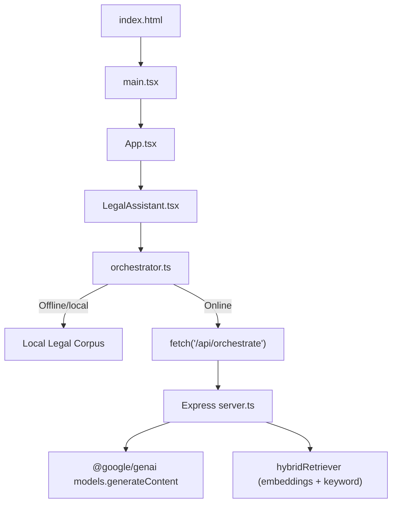
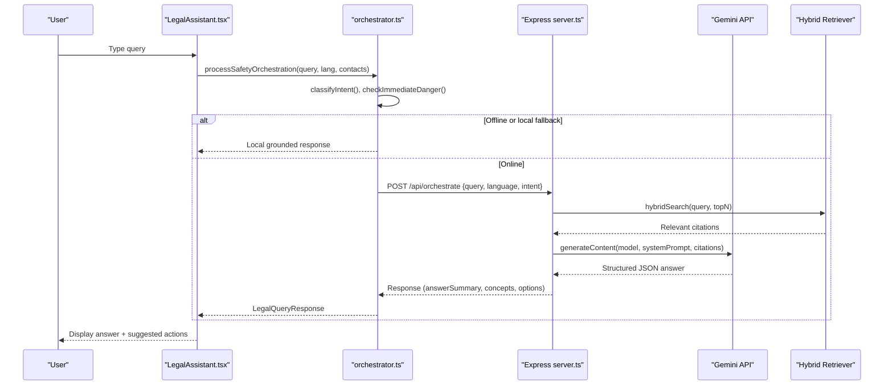
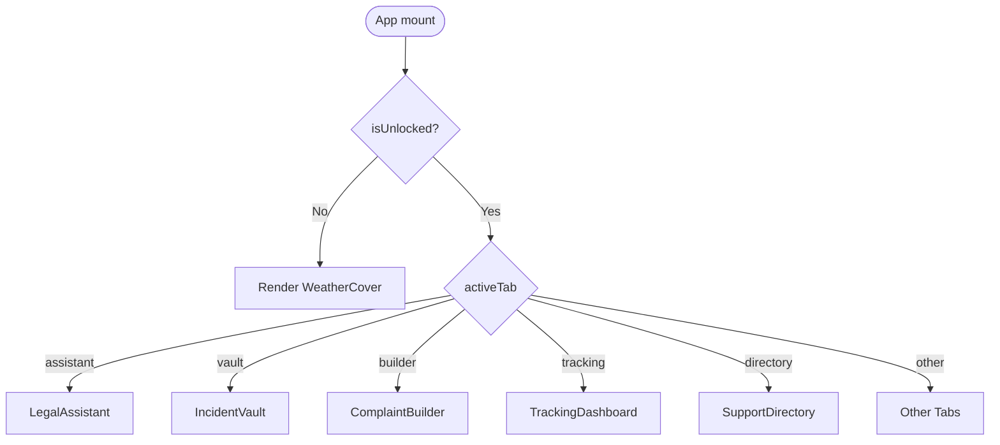
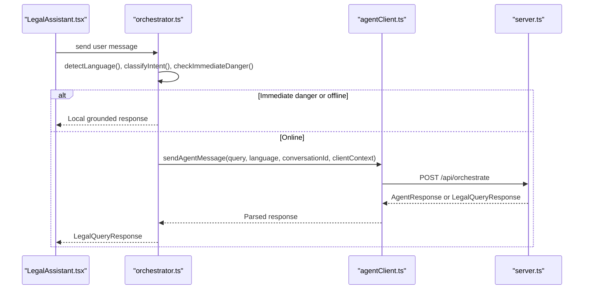
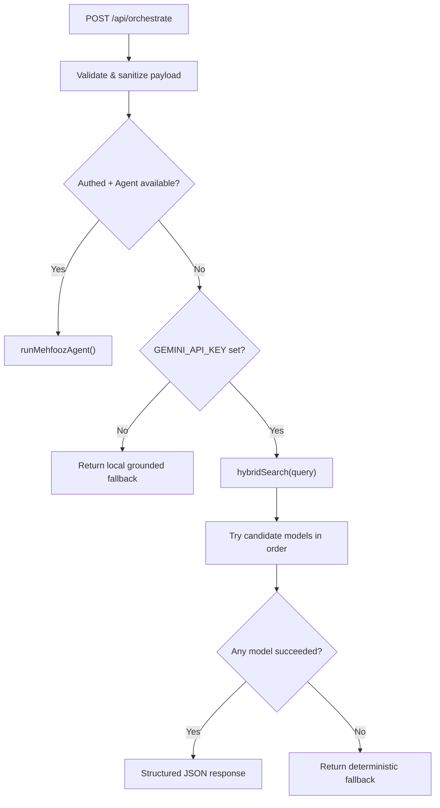
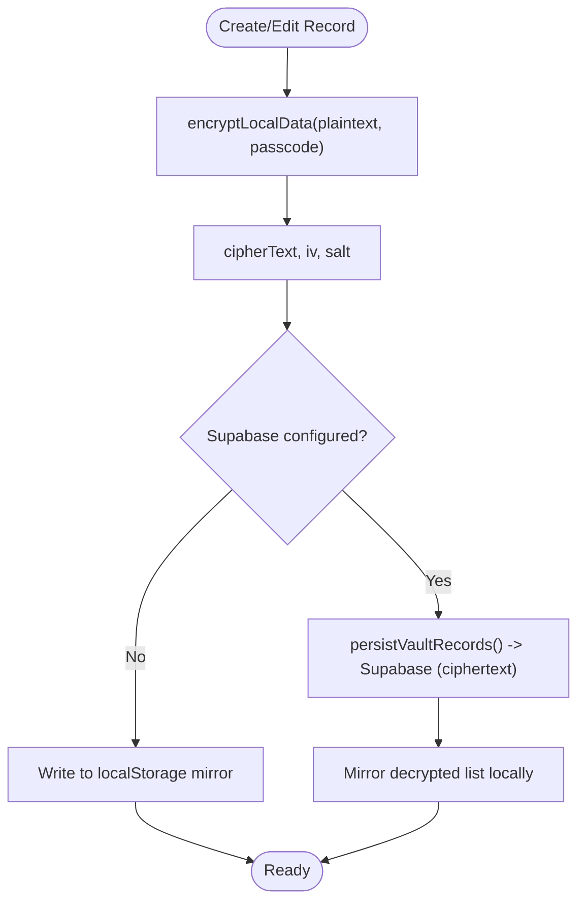
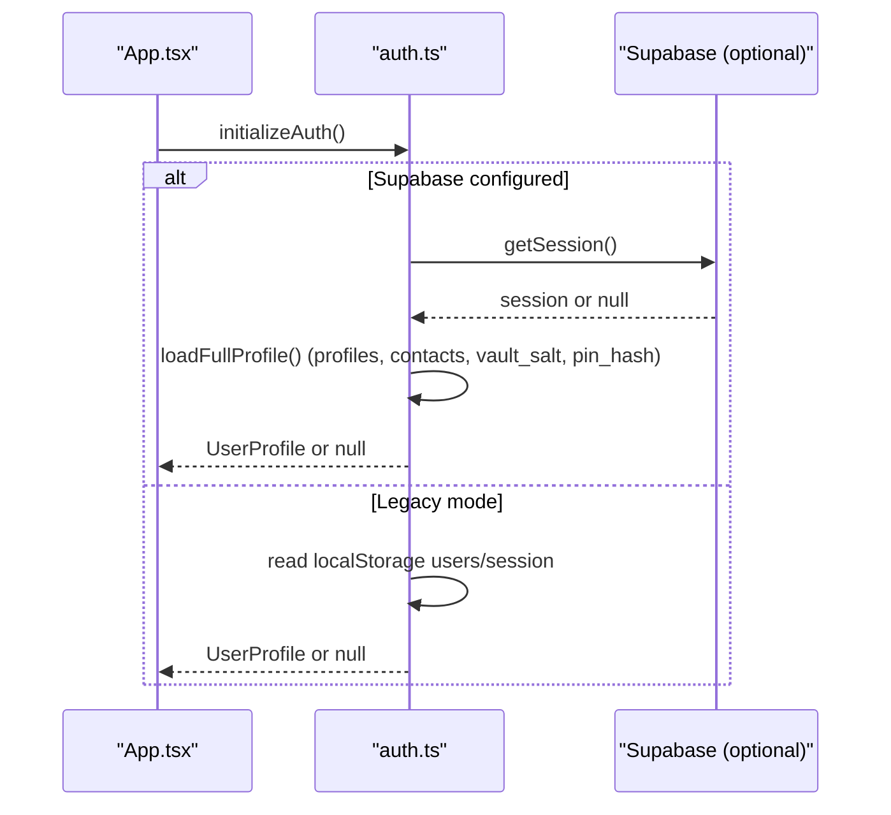
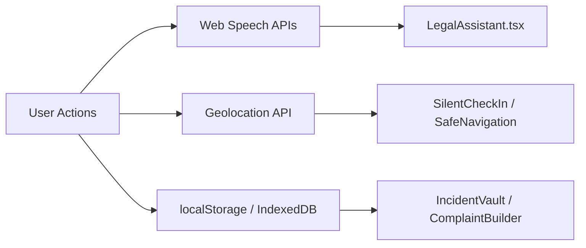
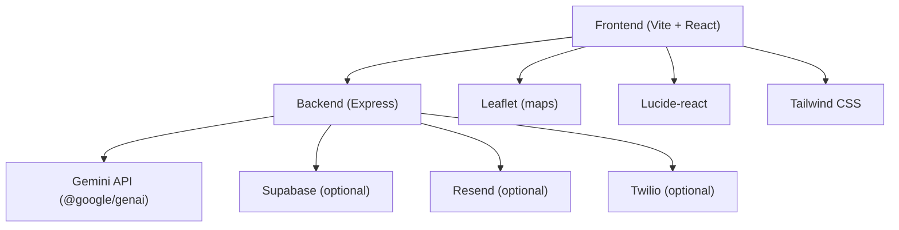

# System Architecture Overview

<cite>
**Referenced Files in This Document**
- [server.ts](file://server.ts)
- [App.tsx](file://src/App.tsx)
- [main.tsx](file://src/main.tsx)
- [package.json](file://package.json)
- [index.html](file://index.html)
- [orchestrator.ts](file://src/utils/orchestrator.ts)
- [agentClient.ts](file://src/utils/agentClient.ts)
- [crypto.ts](file://src/utils/crypto.ts)
- [dataService.ts](file://src/utils/dataService.ts)
- [auth.ts](file://src/utils/auth.ts)
- [LegalAssistant.tsx](file://src/components/LegalAssistant.tsx)
</cite>

## Table of Contents
1. [Introduction](#introduction)
2. [Project Structure](#project-structure)
3. [Core Components](#core-components)
4. [Architecture Overview](#architecture-overview)
5. [Detailed Component Analysis](#detailed-component-analysis)
6. [Dependency Analysis](#dependency-analysis)
7. [Performance Considerations](#performance-considerations)
8. [Troubleshooting Guide](#troubleshooting-guide)
9. [Conclusion](#conclusion)

## Introduction
This document explains the high-level architecture and data flow for Mehfooz (محفوظ), a privacy-preserving women’s safety SPA that disguises itself as a weather app until unlocked via a stealth PIN. The system comprises:
- Client SPA (React + Vite) with zero-knowledge encryption for incident evidence using Web Crypto API.
- Express server that proxies Gemini API calls for grounded legal RAG, enforces rate limits, and provides agent orchestration endpoints.
- Browser APIs for voice input/output, geolocation, and local storage.
- Optional Supabase integration for authenticated sessions, encrypted vault sync, and conversation persistence.

The core request path is: client SPA → Express server → Gemini API, with robust fallbacks to deterministic local engines when offline or when LLM calls fail.

## Project Structure
At runtime:
- index.html loads the React entry point.
- main.tsx mounts the App inside an error boundary.
- App.tsx manages routing, stealth cover, auth, and feature tabs.
- Feature components call orchestrator utilities which either respond locally or call /api/orchestrate on the server.
- The server uses Helmet, sanitization, and rate limiting, then calls Gemini with model fallbacks and returns structured responses.

**Diagram sources**
- [index.html:25-28](file://index.html#L25-L28)
- [main.tsx:42-48](file://src/main.tsx#L42-L48)
- [App.tsx:43-49](file://src/App.tsx#L43-L49)
- [LegalAssistant.tsx:44-49](file://src/components/LegalAssistant.tsx#L44-L49)
- [orchestrator.ts:220-273](file://src/utils/orchestrator.ts#L220-L273)
- [server.ts:161-179](file://server.ts#L161-L179)
- [server.ts:310-398](file://server.ts#L310-L398)

**Section sources**
- [index.html:1-32](file://index.html#L1-L32)
- [main.tsx:1-49](file://src/main.tsx#L1-L49)
- [App.tsx:43-661](file://src/App.tsx#L43-L661)
- [package.json:1-45](file://package.json#L1-L45)

## Core Components
- Client SPA shell: Error boundary, theme, stealth cover, navigation, and tab routing.
- Legal Assistant UI: Chat interface with quick prompts, voice, location, and attachments; integrates with orchestrator and agent client.
- Orchestrator: Detects intent/risk, runs immediate danger checks, performs local grounded synthesis, and calls server when online.
- Agent client: Thin HTTP wrapper for /api/orchestrate and related endpoints.
- Server: Security headers, input sanitization, rate limits, Gemini proxy with model fallback, hybrid retriever, deterministic channel recommendation, and mock handoff.
- Crypto vault: AES-GCM-256 encryption with PBKDF2 key derivation; zero-knowledge design ensures plaintext never leaves the browser unencrypted.
- Data service: Dual-mode persistence (Supabase ciphertext-only with local mirror vs localStorage), including vault records and complaint drafts.
- Auth: Dual-mode authentication (Supabase or legacy localStorage), stealth PIN hashing, session handling, and profile sync.

**Section sources**
- [App.tsx:51-661](file://src/App.tsx#L51-L661)
- [LegalAssistant.tsx:104-200](file://src/components/LegalAssistant.tsx#L104-L200)
- [orchestrator.ts:37-76](file://src/utils/orchestrator.ts#L37-L76)
- [orchestrator.ts:78-273](file://src/utils/orchestrator.ts#L78-L273)
- [agentClient.ts:14-79](file://src/utils/agentClient.ts#L14-L79)
- [server.ts:42-130](file://server.ts#L42-L130)
- [server.ts:227-406](file://server.ts#L227-L406)
- [crypto.ts:20-93](file://src/utils/crypto.ts#L20-L93)
- [dataService.ts:94-225](file://src/utils/dataService.ts#L94-L225)
- [auth.ts:488-543](file://src/utils/auth.ts#L488-L543)

## Architecture Overview
The end-to-end flow for a legal query:

**Diagram sources**
- [LegalAssistant.tsx:44-49](file://src/components/LegalAssistant.tsx#L44-L49)
- [orchestrator.ts:78-273](file://src/utils/orchestrator.ts#L78-L273)
- [server.ts:227-406](file://server.ts#L227-L406)
- [server.ts:310-398](file://server.ts#L310-L398)

## Detailed Component Analysis

### Client SPA Shell and Routing
- Entry points: index.html loads main.tsx, which renders App within an error boundary.
- App manages stealth cover (weather disguise), onboarding, auth state, and tab routing to features like Legal Assistant, Vault, Complaint Builder, Tracking, Directory, and more.
- Quick exit to weather cover is supported via Escape key or logo interactions.

**Diagram sources**
- [index.html:25-28](file://index.html#L25-L28)
- [main.tsx:42-48](file://src/main.tsx#L42-L48)
- [App.tsx:51-661](file://src/App.tsx#L51-L661)

**Section sources**
- [index.html:1-32](file://index.html#L1-L32)
- [main.tsx:1-49](file://src/main.tsx#L1-L49)
- [App.tsx:43-661](file://src/App.tsx#L43-L661)

### Legal Assistant and Orchestration
- LegalAssistant composes chat messages, supports voice input/output, location selection, and photo attachments.
- It delegates query processing to orchestrator, which classifies intent, detects immediate danger, and either responds locally or calls the server.
- When online, it sends a POST to /api/orchestrate with query, language, and intent; server returns structured answers with legal concepts and support options.

**Diagram sources**
- [LegalAssistant.tsx:44-49](file://src/components/LegalAssistant.tsx#L44-L49)
- [orchestrator.ts:78-273](file://src/utils/orchestrator.ts#L78-L273)
- [agentClient.ts:14-79](file://src/utils/agentClient.ts#L14-L79)
- [server.ts:227-406](file://server.ts#L227-L406)

**Section sources**
- [LegalAssistant.tsx:104-200](file://src/components/LegalAssistant.tsx#L104-L200)
- [orchestrator.ts:37-76](file://src/utils/orchestrator.ts#L37-L76)
- [orchestrator.ts:78-273](file://src/utils/orchestrator.ts#L78-L273)
- [agentClient.ts:14-79](file://src/utils/agentClient.ts#L14-L79)

### Server-Side Proxy and Model Fallback
- The server configures security headers, input sanitization, and rate limits.
- On /api/orchestrate, it validates inputs, optionally runs an agent loop, performs hybrid retrieval, and calls Gemini with a model fallback chain.
- If no Gemini key is present or all models fail, it returns a deterministic local fallback.

**Diagram sources**
- [server.ts:83-130](file://server.ts#L83-L130)
- [server.ts:227-406](file://server.ts#L227-L406)
- [server.ts:310-398](file://server.ts#L310-L398)

**Section sources**
- [server.ts:42-130](file://server.ts#L42-L130)
- [server.ts:227-406](file://server.ts#L227-L406)
- [server.ts:310-398](file://server.ts#L310-L398)

### Client-Side Crypto Vault and Zero-Knowledge Design
- Encryption uses AES-GCM-256 with PBKDF2 key derivation (100k iterations).
- Salt is per-user and stored locally; passcode is required for every encrypt/decrypt operation.
- Data service persists encrypted ciphertext to Supabase when configured and mirrors decrypted data locally for instant offline access.
- Plaintext never leaves the device unencrypted; server stores only ciphertext.

**Diagram sources**
- [crypto.ts:20-93](file://src/utils/crypto.ts#L20-L93)
- [crypto.ts:99-169](file://src/utils/crypto.ts#L99-L169)
- [dataService.ts:94-225](file://src/utils/dataService.ts#L94-L225)

**Section sources**
- [crypto.ts:20-192](file://src/utils/crypto.ts#L20-L192)
- [dataService.ts:94-225](file://src/utils/dataService.ts#L94-L225)

### Authentication and Session Handling
- Dual-mode auth: Supabase mode with JWT-based sessions and profile sync; legacy mode with localStorage.
- Stealth PIN verification uses per-user salted SHA-256 hashes; PINs are never stored in plaintext.
- App initializes auth on mount, restores sessions, and triggers onboarding if needed.

**Diagram sources**
- [App.tsx:122-190](file://src/App.tsx#L122-L190)
- [auth.ts:488-543](file://src/utils/auth.ts#L488-L543)
- [auth.ts:394-425](file://src/utils/auth.ts#L394-L425)

**Section sources**
- [App.tsx:122-190](file://src/App.tsx#L122-L190)
- [auth.ts:394-543](file://src/utils/auth.ts#L394-L543)

### Browser APIs Integration
- Voice input/output: SpeechRecognition and speechSynthesis used in LegalAssistant for hands-free interaction.
- Geolocation: Location detection and sharing integrated into check-in flows and context passed to agent.
- Local storage: Used for offline mirrors of vault records, complaint drafts, contacts, and theme/language preferences.

**Diagram sources**
- [LegalAssistant.tsx:169-200](file://src/components/LegalAssistant.tsx#L169-L200)
- [dataService.ts:412-430](file://src/utils/dataService.ts#L412-L430)

**Section sources**
- [LegalAssistant.tsx:169-200](file://src/components/LegalAssistant.tsx#L169-L200)
- [dataService.ts:412-430](file://src/utils/dataService.ts#L412-L430)

## Dependency Analysis
Key runtime dependencies:
- Frontend: React, Motion, Lucide icons, Leaflet (maps), Tailwind CSS via Vite.
- Backend: Express, Helmet, express-rate-limit, @google/genai, dotenv.
- Optional integrations: Supabase (auth, DB), Resend (email), Twilio (SMS).

**Diagram sources**
- [package.json:14-32](file://package.json#L14-L32)
- [server.ts:6-28](file://server.ts#L6-L28)

**Section sources**
- [package.json:1-45](file://package.json#L1-L45)
- [server.ts:6-28](file://server.ts#L6-L28)

## Performance Considerations
- Rate limiting: Global API limiter (120 req/15 min), AI orchestrator limiter (30 req/5 min), handoff limiter (20 req/10 min).
- Model fallback chain: Tries multiple Gemini models to conserve quota and improve resilience.
- Hybrid retriever: Combines embeddings and keyword scoring to reduce token usage and improve relevance.
- Client-side caching: Local mirrors for vault records and complaints enable fast offline reloads.
- Input size limits: Strict validation prevents oversized payloads and protects against abuse.

[No sources needed since this section provides general guidance]

## Troubleshooting Guide
Common issues and mitigations:
- No GEMINI_API_KEY: Server returns a deterministic local fallback; ensure environment variable is set for AI features.
- All Gemini models fail: Server falls back to local engine; verify network connectivity and quotas.
- Web Crypto unavailable: Encryption fails closed; vault operations require a secure context with crypto.subtle.
- Supabase not configured: Auth and sync fall back to localStorage; some features remain local-only.
- Rate limit exceeded: Respect retry-after hints; adjust client-side request frequency.

**Section sources**
- [server.ts:161-179](file://server.ts#L161-L179)
- [server.ts:393-406](file://server.ts#L393-L406)
- [crypto.ts:26-32](file://src/utils/crypto.ts#L26-L32)
- [auth.ts:488-543](file://src/utils/auth.ts#L488-L543)

## Conclusion
Mehfooz implements a resilient, privacy-first architecture where the client SPA handles sensitive data entirely in-browser using zero-knowledge encryption, while the Express server securely proxies Gemini API calls for grounded legal assistance. Robust fallbacks ensure continuity under offline conditions or API failures, and strict security measures protect users from abuse and exposure.

[No sources needed since this section summarizes without analyzing specific files]