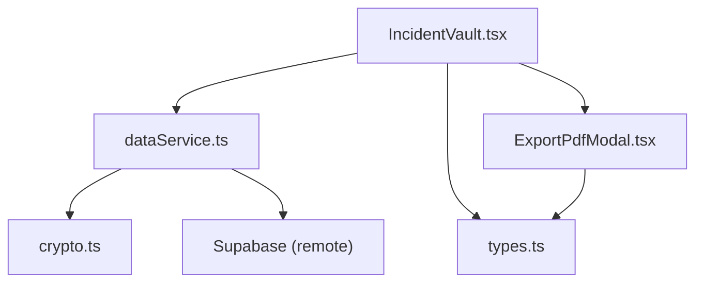
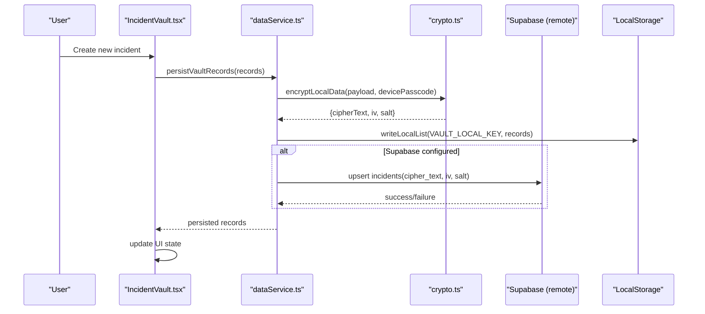
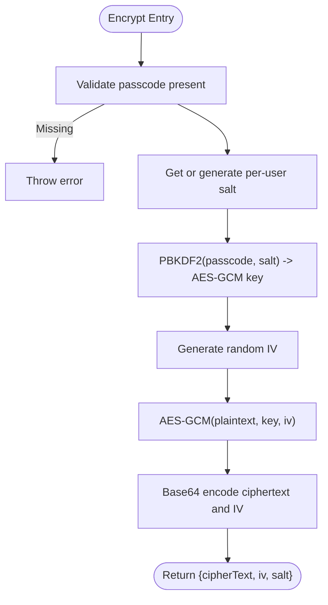
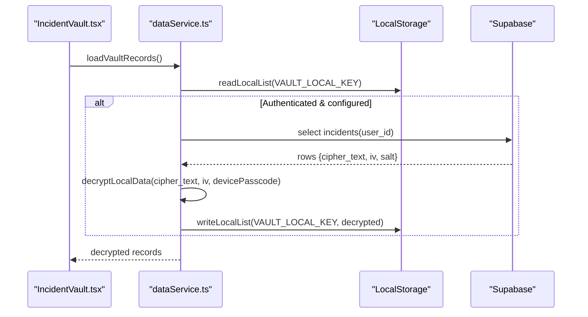
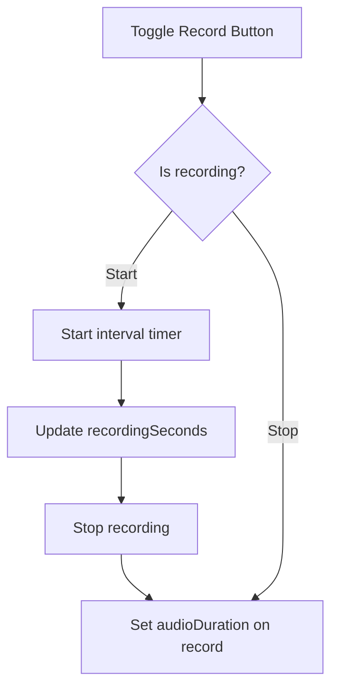
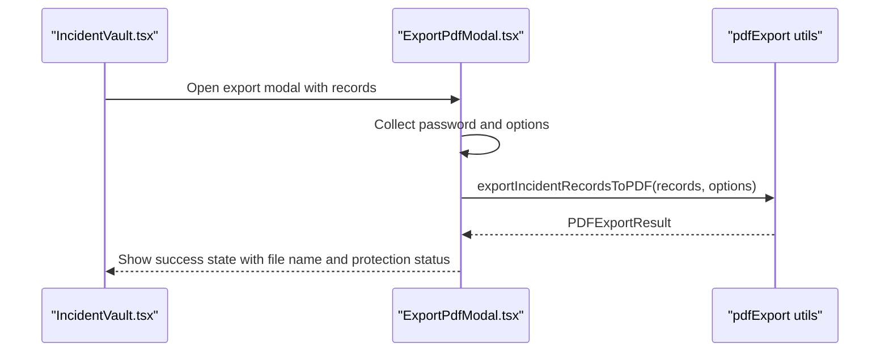
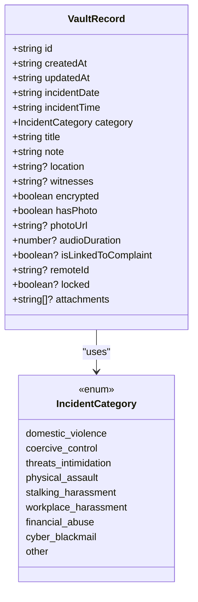
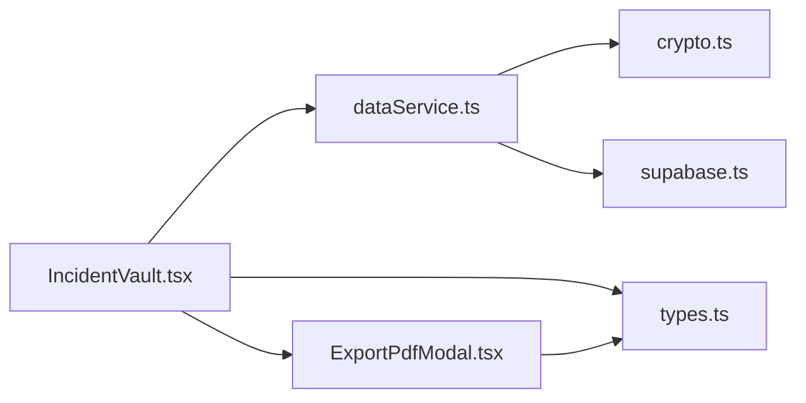

# Zero-Knowledge Incident Vault Module

<cite>
**Referenced Files in This Document**
- [IncidentVault.tsx](file://src/components/IncidentVault.tsx)
- [crypto.ts](file://src/utils/crypto.ts)
- [dataService.ts](file://src/utils/dataService.ts)
- [ExportPdfModal.tsx](file://src/components/ExportPdfModal.tsx)
- [types.ts](file://src/types.ts)
</cite>

## Table of Contents
1. [Introduction](#introduction)
2. [Project Structure](#project-structure)
3. [Core Components](#core-components)
4. [Architecture Overview](#architecture-overview)
5. [Detailed Component Analysis](#detailed-component-analysis)
6. [Dependency Analysis](#dependency-analysis)
7. [Performance Considerations](#performance-considerations)
8. [Troubleshooting Guide](#troubleshooting-guide)
9. [Conclusion](#conclusion)

## Introduction
This document explains the Zero-Knowledge Incident Vault module, focusing on how incidents are recorded, encrypted client-side with AES-GCM-256 using PBKDF2 key derivation, persisted locally and optionally to a remote store as ciphertext only, and exported as password-protected PDFs for legal use. The design ensures plaintext never leaves the browser unencrypted and that decryption keys are device-bound.

## Project Structure
The vault feature spans UI, cryptography, persistence, and export utilities:
- UI layer: IncidentVault.tsx renders the vault interface, manages recording state, and triggers save/export flows.
- Cryptography: crypto.ts implements Web Crypto API-based AES-GCM-256 encryption and PBKDF2 key derivation with per-user salt and device passcode.
- Persistence: dataService.ts orchestrates local mirror (localStorage) and optional Supabase sync, always encrypting payloads before upload.
- Export: ExportPdfModal.tsx generates printer-friendly, optionally password-protected PDFs from vault records or complaint drafts.
- Types: types.ts defines shared interfaces such as VaultRecord and IncidentCategory used across components.

**Diagram sources**
- [IncidentVault.tsx:92-125](file://src/components/IncidentVault.tsx#L92-L125)
- [dataService.ts:94-157](file://src/utils/dataService.ts#L94-L157)
- [crypto.ts:63-124](file://src/utils/crypto.ts#L63-L124)
- [ExportPdfModal.tsx:69-110](file://src/components/ExportPdfModal.tsx#L69-L110)
- [types.ts:84-116](file://src/types.ts#L84-L116)

**Section sources**
- [IncidentVault.tsx:1-653](file://src/components/IncidentVault.tsx#L1-L653)
- [crypto.ts:1-192](file://src/utils/crypto.ts#L1-L192)
- [dataService.ts:1-430](file://src/utils/dataService.ts#L1-L430)
- [ExportPdfModal.tsx:1-341](file://src/components/ExportPdfModal.tsx#L1-L341)
- [types.ts:1-557](file://src/types.ts#L1-L557)

## Core Components
- IncidentVault.tsx: React component that manages incident record creation, selection, viewing, deletion, and export workflows. It integrates with dataService for persistence and with ExportPdfModal for generating protected PDFs.
- crypto.ts: Provides AES-GCM-256 encryption/decryption via Web Crypto API, PBKDF2 key derivation with configurable iterations, per-user salt management, and PIN hashing utilities.
- dataService.ts: Unified data layer that mirrors vault records to localStorage and optionally syncs encrypted payloads to Supabase. It handles device-specific passcodes and fallback behavior when remote operations fail.
- ExportPdfModal.tsx: Modal for exporting either complaint drafts or vault records into PDFs, with optional password protection and inclusion of attached records.
- types.ts: Defines core shapes like VaultRecord, IncidentCategory, and other domain models consumed by the vault and related features.

**Section sources**
- [IncidentVault.tsx:58-222](file://src/components/IncidentVault.tsx#L58-L222)
- [crypto.ts:20-175](file://src/utils/crypto.ts#L20-L175)
- [dataService.ts:23-225](file://src/utils/dataService.ts#L23-L225)
- [ExportPdfModal.tsx:27-110](file://src/components/ExportPdfModal.tsx#L27-L110)
- [types.ts:84-116](file://src/types.ts#L84-L116)

## Architecture Overview
The vault follows a zero-knowledge model:
- User creates an incident note in the UI.
- dataService serializes the payload and encrypts it with AES-GCM-256 using a device-derived key.
- Encrypted data is mirrored to localStorage and optionally synced to Supabase as ciphertext only.
- On load, dataService fetches ciphertext from Supabase (if configured), decrypts on-device, and returns decrypted records to the UI.
- Export modal generates a printer-friendly PDF, optionally password-protected, including selected vault records.

**Diagram sources**
- [IncidentVault.tsx:148-185](file://src/components/IncidentVault.tsx#L148-L185)
- [dataService.ts:164-225](file://src/utils/dataService.ts#L164-L225)
- [crypto.ts:99-124](file://src/utils/crypto.ts#L99-L124)

## Detailed Component Analysis

### Encryption Flow: AES-GCM-256 + PBKDF2
- Key derivation: PBKDF2 uses SHA-256 with 100,000 iterations over a per-user random salt to derive an AES-GCM 256-bit key from a user-supplied passcode. A cached derived key is maintained per session keyed by salt and passcode length fingerprint.
- Encryption: Plaintext is encoded to UTF-8, a fresh IV is generated, and AES-GCM encrypts the buffer. The result is base64-encoded for storage; IV and salt are stored alongside ciphertext.
- Decryption: Requires matching passcode, IV, and salt. Legacy fallback IVs are rejected to prevent insecure legacy data usage.
- Security constraints: No default passcode; Web Crypto availability is asserted; errors throw instead of storing pseudo-encrypted data.

**Diagram sources**
- [crypto.ts:63-124](file://src/utils/crypto.ts#L63-L124)

**Section sources**
- [crypto.ts:20-175](file://src/utils/crypto.ts#L20-L175)

### Persistence: IndexedDB/LocalStorage and Remote Sync
- Local mirror: All vault records are written to localStorage under a dedicated key for fast offline access.
- Remote sync: When authenticated and configured, dataService encrypts each record’s payload and upserts to a remote table, storing only ciphertext, IV, and salt. Removed records are deleted remotely to keep server state aligned with local list.
- Device-bound keys: Each device has its own passcode; records encrypted on one device cannot be decrypted on another, preserving zero-knowledge boundaries.
- Load path: dataService attempts to fetch remote ciphertext rows, decrypts them on-device, and returns decrypted records; if decryption fails (e.g., wrong device key), records are marked locked.

**Diagram sources**
- [dataService.ts:94-157](file://src/utils/dataService.ts#L94-L157)

**Section sources**
- [dataService.ts:23-225](file://src/utils/dataService.ts#L23-L225)

### Audio Recording via MediaRecorder
- Current implementation simulates audio recording within the vault UI: toggling recording updates a timer and sets an audio duration field on the record.
- The UI exposes controls for starting/stopping recording and displays elapsed seconds, but does not capture actual media streams in this component.
- Integration point: The record includes an audioDuration field; future enhancements can attach real MediaRecorder blobs and encrypt them alongside text fields.

**Diagram sources**
- [IncidentVault.tsx:137-146](file://src/components/IncidentVault.tsx#L137-L146)
- [IncidentVault.tsx:214-222](file://src/components/IncidentVault.tsx#L214-L222)

**Section sources**
- [IncidentVault.tsx:137-146](file://src/components/IncidentVault.tsx#L137-L146)
- [IncidentVault.tsx:214-222](file://src/components/IncidentVault.tsx#L214-L222)

### Evidence Export: Protected PDF Generation
- Export modal supports exporting either a complaint draft or vault records to PDF.
- Optional password protection: Users can set a document unlock password; when enabled, the resulting PDF requires the password to open.
- Inclusion of attached records: When exporting a complaint, users can choose to include attached vault records in the generated PDF.
- Audit logging: Exports emit audit events indicating what was exported and whether it was password-protected.

**Diagram sources**
- [IncidentVault.tsx:254-267](file://src/components/IncidentVault.tsx#L254-L267)
- [ExportPdfModal.tsx:69-110](file://src/components/ExportPdfModal.tsx#L69-L110)

**Section sources**
- [ExportPdfModal.tsx:27-110](file://src/components/ExportPdfModal.tsx#L27-L110)

### Data Model: VaultRecord and Categories
- VaultRecord captures incident metadata, timestamps, category, title, notes, location, witnesses, evidence flags, and linkage to complaints.
- IncidentCategory enumerates recognized types of incidents relevant to women’s safety and legal contexts.

**Diagram sources**
- [types.ts:84-116](file://src/types.ts#L84-L116)

**Section sources**
- [types.ts:84-116](file://src/types.ts#L84-L116)

## Dependency Analysis
- IncidentVault.tsx depends on:
  - dataService.ts for loading/persisting records
  - ExportPdfModal.tsx for PDF export
  - types.ts for shared interfaces
- dataService.ts depends on:
  - crypto.ts for encryption/decryption
  - supabase utility for remote operations
  - types.ts for data shapes
- crypto.ts is self-contained except for Web Crypto API availability checks and uses localStorage for salt persistence.
- ExportPdfModal.tsx depends on pdfExport utilities and types.ts.

**Diagram sources**
- [IncidentVault.tsx:32-35](file://src/components/IncidentVault.tsx#L32-L35)
- [dataService.ts:23-25](file://src/utils/dataService.ts#L23-L25)
- [ExportPdfModal.tsx:20-25](file://src/components/ExportPdfModal.tsx#L20-L25)

**Section sources**
- [IncidentVault.tsx:32-35](file://src/components/IncidentVault.tsx#L32-L35)
- [dataService.ts:23-25](file://src/utils/dataService.ts#L23-L25)
- [ExportPdfModal.tsx:20-25](file://src/components/ExportPdfModal.tsx#L20-L25)

## Performance Considerations
- PBKDF2 iterations: 100,000 iterations provide strong key derivation at the cost of CPU time during encryption/decryption. Cache derived keys per session to avoid repeated computation.
- Large payloads: Encrypting large notes or multiple records sequentially may block the UI thread briefly; consider batching or offloading to web workers if needed.
- Storage limits: localStorage has size limits; ensure records remain concise or implement pagination/archival strategies.
- Remote sync overhead: Batch updates and handle network failures gracefully to minimize retries and wasted bandwidth.

[No sources needed since this section provides general guidance]

## Troubleshooting Guide
- Web Crypto unavailable: If Web Crypto API is missing or restricted, encryption utilities throw explicit errors rather than storing insecure data. Ensure the app runs in a secure context (HTTPS).
- Wrong passcode: Decryption throws on mismatched passcode or corrupted ciphertext; verify device passcode integrity and avoid tampering with stored salts or IVs.
- Legacy records: Records created with legacy fallback IVs cannot be decrypted securely; re-save them to migrate to current encryption scheme.
- Cross-device decryption: Records encrypted on one device cannot be decrypted on another due to device-bound passcodes; this is expected behavior for zero-knowledge isolation.
- Export failures: PDF generation errors are logged; ensure required inputs (records or complaint draft) are provided and passwords are set when required.

**Section sources**
- [crypto.ts:26-32](file://src/utils/crypto.ts#L26-L32)
- [crypto.ts:130-169](file://src/utils/crypto.ts#L130-L169)
- [dataService.ts:128-148](file://src/utils/dataService.ts#L128-L148)
- [ExportPdfModal.tsx:69-110](file://src/components/ExportPdfModal.tsx#L69-L110)

## Conclusion
The Incident Vault module delivers a robust zero-knowledge workflow: user input is encrypted client-side with AES-GCM-256 and PBKDF2, persisted locally and optionally to a remote store as ciphertext only, and exported as password-protected PDFs for legal proceedings. The design enforces device-bound keys, rejects insecure legacy data, and maintains clear separation between UI, cryptography, persistence, and export concerns. Future enhancements can integrate real MediaRecorder audio capture and expand attachment handling while preserving the zero-knowledge guarantees.